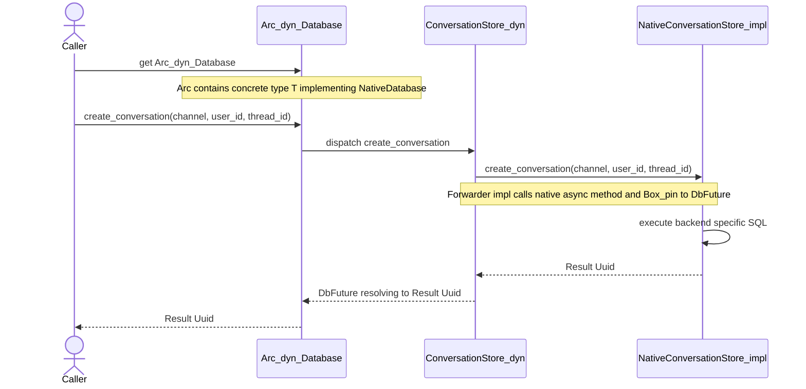

<!-- markdownlint-disable-next-line MD013 -->
# Architectural decision record (ADR) 006: Dual-trait pattern for dyn-backed async interfaces

## Status

Accepted.

## Date

2026-03-21

## Context and problem statement

The repository has already removed `async-trait` from the small set of
interfaces that never participate in dynamic dispatch, notably
`WasmChannelStore` and `SuccessEvaluator`.[^1] The remaining high-value
compile-time targets are the dyn-backed interfaces such as `Tool`,
`Channel`, `LlmProvider`, `Database`, `McpTransport`, and several
smaller internal traits.[^2]

Those interfaces still rely on `Arc<dyn Trait>`, `Box<dyn Trait>`, or
`&dyn Trait` call sites. Native `async fn` in traits do not support
dynamic dispatch today, so those interfaces cannot be migrated by simply
dropping `#[async_trait]`.[^3]

That is not just a theoretical limitation in older toolchains. A direct
check on `rustc 1.92.0` still rejects `&dyn McpTransport` when
`McpTransport` is written with native `async fn` methods, so the dyn
boundary must remain explicitly boxed for this repository's current
minimum toolchain.[^6]

The remaining work therefore needs a design decision, not just a search
and replace. The design must optimize for:

- compilation speed;
- maintainability of implementations and call sites; and
- incremental rollout through the existing codebase.

## Decision drivers

- Remove as much `async-trait` proc-macro expansion as possible from the
  remaining dyn-backed surfaces.
- Preserve existing dynamic-dispatch call sites where practical, because
  `Arc<dyn Tool>`, `Arc<dyn LlmProvider>`, and `Arc<dyn Database>` are
  part of the current architecture.
- Keep implementation bodies readable. Repository maintainers should not
  have to hand-write `Box::pin(async move { ... })` in every adapter and
  business-logic method.
- Support incremental migration trait family by trait family, with a
  small proof point before touching the most coupled interfaces.
- Avoid adding a new dependency unless it clearly improves both
  compilation behaviour and long-term clarity.

## Options considered

- Keep `async-trait` for all dyn-backed traits.
  - This is the lowest-risk path in the short term.
  - It fails the compile-speed goal because the highest-volume macro uses
    remain in place.
- Replace each dyn-backed trait directly with explicit boxed-future
  signatures.
  - This removes the proc macro completely.
  - It pushes verbose `Pin<Box<dyn Future<...>>>` plumbing into every
    implementation and makes the trait surface harder to read and review.
- Adopt `trait_variant`.
  - This works well for choosing between local and `Send` variants of
    native async traits.[^4]
  - It does not solve dynamic dispatch today. The Rust Async Working
    Group explicitly calls out dyn support as future work for the crate.[^5]
  - It therefore does not address the repository's main remaining
    blocker.
- Introduce a local dual-trait pattern for dyn-backed interfaces.
  - One trait stays object-safe and returns boxed futures.
  - A second sibling trait keeps ergonomic native async methods for
    implementors and generic callers.
  - A blanket adapter bridges the native trait into the object-safe
    trait.

## Decision outcome / proposed direction

Choose the **local dual-trait pattern**.

For each remaining dyn-backed async interface that is worth migrating:

- keep the existing public dyn-facing trait name on the object-safe
  surface, so most consumer call sites do not need to change;
- add a sibling `Native*` trait for implementation ergonomics and static
  dispatch;
- define a shared boxed-future alias in one helper module, so object-safe
  signatures are compact and consistent; and
- provide a blanket implementation from `Native*` to the object-safe
  trait, so most implementation code can continue to use `async fn`.

This design removes `async-trait` from both the trait definition and the
implementation blocks while preserving the existing dynamic-dispatch
architecture.

## Design sketch

Sketch 1. Preferred layering for a dyn-backed async interface.

```plaintext
generic/static callers
        │
        ▼
  `NativeMcpTransport`
        │  blanket adapter
        ▼
    `McpTransport`
        │
        ▼
 `Arc<dyn McpTransport>` consumers
```

The boxed-future cost remains at the object-safe boundary, which matches
the current runtime behaviour. The difference is that the boxing becomes
explicit and local rather than being generated through a proc macro.

## Interface conventions

### Boxed-future alias

Use one shared alias for dyn-facing async methods:

```rust,no_run
use core::future::Future;
use core::pin::Pin;

pub type BoxFuture<'a, T> = Pin<Box<dyn Future<Output = T> + Send + 'a>>;
```

This keeps the object-safe trait readable and avoids dozens of repeated
long-form signatures.

### Naming

- Keep the existing trait name, such as `McpTransport` or `Tool`, on the
  dyn-facing object-safe trait.
- Name the ergonomic sibling trait `NativeMcpTransport`,
  `NativeTool`, `NativeLlmProvider`, and so on.

This preserves current consumer vocabulary while making the new
implementation path explicit.

### Default policy

- New implementations should prefer the `Native*` trait.
- Direct implementation of the object-safe trait remains allowed as an
  escape hatch for unusual cases.
- Generic code should prefer bounds on `Native*` when it does not require
  dynamic dispatch.

## Worked example: `McpTransport`

`McpTransport` is the preferred proof point because it has a small async
surface and already sits behind `Arc<dyn McpTransport>` in a narrow part
of the tree.[^2]

### Today

```rust,no_run
#[async_trait]
pub trait McpTransport: Send + Sync {
    async fn send(
        &self,
        request: &McpRequest,
        headers: &HashMap<String, String>,
    ) -> Result<McpResponse, ToolError>;

    async fn shutdown(&self) -> Result<(), ToolError>;

    fn supports_http_features(&self) -> bool {
        false
    }
}
```

### Worked shape

```rust,no_run
pub trait McpTransport: Send + Sync {
    fn send(
        &self,
        request: &McpRequest,
        headers: &HashMap<String, String>,
    ) -> BoxFuture<'_, Result<McpResponse, ToolError>>;

    fn shutdown(&self) -> BoxFuture<'_, Result<(), ToolError>>;

    fn supports_http_features(&self) -> bool {
        false
    }
}

pub trait NativeMcpTransport: Send + Sync {
    fn send(
        &self,
        request: &McpRequest,
        headers: &HashMap<String, String>,
    ) -> impl Future<Output = Result<McpResponse, ToolError>> + Send;

    fn shutdown(&self) -> impl Future<Output = Result<(), ToolError>> + Send;

    fn supports_http_features(&self) -> bool {
        false
    }
}

impl<T> McpTransport for T
where
    T: NativeMcpTransport + Send + Sync,
{
    fn send(
        &self,
        request: &McpRequest,
        headers: &HashMap<String, String>,
    ) -> BoxFuture<'_, Result<McpResponse, ToolError>> {
        Box::pin(NativeMcpTransport::send(self, request, headers))
    }

    fn shutdown(&self) -> BoxFuture<'_, Result<(), ToolError>> {
        Box::pin(NativeMcpTransport::shutdown(self))
    }

    fn supports_http_features(&self) -> bool {
        NativeMcpTransport::supports_http_features(self)
    }
}
```

### Result

- `src/tools/mcp/client.rs` can keep `transport: Arc<dyn McpTransport>`.
- `HttpMcpTransport`, `StdioMcpTransport`, and `UnixMcpTransport` can
  implement `NativeMcpTransport` with ordinary `async fn`.
- The migration removes the proc macro from the transport trait and all
  transport implementations.

## Worked example: `Tool`

`Tool` is a larger and more central surface, so it should not be the
first pilot. It is still the most important worked example because
compilation speed will not materially improve unless large trait families
eventually move.[^1]

### Proposed shape

```rust,no_run
pub trait Tool: Send + Sync {
    fn name(&self) -> &str;
    fn description(&self) -> &str;
    fn parameters_schema(&self) -> serde_json::Value;
    fn execute(
        &self,
        params: serde_json::Value,
        ctx: &JobContext,
    ) -> BoxFuture<'_, Result<ToolOutput, ToolError>>;
}

pub trait NativeTool: Send + Sync {
    fn name(&self) -> &str;
    fn description(&self) -> &str;
    fn parameters_schema(&self) -> serde_json::Value;
    fn execute(
        &self,
        params: serde_json::Value,
        ctx: &JobContext,
    ) -> impl Future<Output = Result<ToolOutput, ToolError>> + Send;
}

impl<T> Tool for T
where
    T: NativeTool + Send + Sync,
{
    fn name(&self) -> &str {
        NativeTool::name(self)
    }

    fn description(&self) -> &str {
        NativeTool::description(self)
    }

    fn parameters_schema(&self) -> serde_json::Value {
        NativeTool::parameters_schema(self)
    }

    fn execute(
        &self,
        params: serde_json::Value,
        ctx: &JobContext,
    ) -> BoxFuture<'_, Result<ToolOutput, ToolError>> {
        Box::pin(NativeTool::execute(self, params, ctx))
    }
}
```

### Why this matters

- `ToolRegistry` can remain `HashMap<String, Arc<dyn Tool>>`.
- Built-in tool implementations can migrate one file at a time from
  `impl Tool for Foo` to `impl NativeTool for Foo`.
- Test doubles can choose either style. A tiny fake may still implement
  `Tool` directly, while production tools use `NativeTool`.

## Database call flow example

Figure 1. Sequence diagram showing how an `Arc<dyn Database>` call reaches a
native database implementation through the dyn-safe forwarding layer. The
diagram highlights that the object-safe trait returns a boxed `DbFuture` while
the concrete backend still executes an ordinary native async method.



## Consequences

### Positive consequences

- Removes the large tail of `#[async_trait]` usage from implementation
  blocks, which is the largest remaining compile-time hotspot in this
  stream.
- Keeps implementation bodies in normal `async fn` form.
- Preserves existing dyn call sites for the most heavily used traits.
- Supports a measured, per-trait migration path instead of demanding a
  disruptive all-at-once rewrite.

### Negative consequences

- Introduces paired traits, which increases conceptual surface area.
- Requires careful naming to avoid confusion between dyn-facing and
  native traits.
- Leaves boxed futures at the object-safe boundary, so runtime allocation
  behaviour does not improve in dyn-heavy paths.

## Rejected direction: `trait_variant` for dyn-backed traits

`trait_variant` is not the selected direction for the remaining work
because it does not currently solve the repository's main blocker:
dynamic dispatch. Its generated traits use `-> impl Future`, which is
still not dyn-compatible, and the Rust blog explicitly frame dynamic
dispatch support as future work for the crate.[^4][^5]

That makes `trait_variant` useful background for native async trait
design, but not the correct tool for the remaining dyn-backed surfaces in
this repository.

## Migration plan

1. Added shared boxed-future aliases inside the migrated trait modules so
   the dyn-facing signatures stay readable without reintroducing
   `#[async_trait]`.
2. Completed the `McpTransport` pilot. The pilot confirmed that
   `Arc<dyn McpTransport>` call sites could stay unchanged, concrete
   transports could move to `NativeMcpTransport` with ordinary `async fn`
   implementations, and the dyn boundary still needs explicit boxing on
   the current compiler.
3. Completed the next two smaller migrations on `SettingsStore` and
   `SoftwareBuilder`. Those follow-on conversions showed that the
   sibling-trait pattern scales beyond the transport layer while keeping
   existing dyn-backed consumers intact.
4. Completed the ADR 006 broad rollout across all remaining dyn-backed
   families via the approval-gated plan in
   `docs/execplans/adr-006-broad-rollout.md`. In order: 7 narrow internal
   traits (Milestone 2), 6 infrastructure extension seams (Milestone 3), and
   the 4 high-fanout core trait families — `Tool`, `LlmProvider`, `Channel`,
   and `Database` — in separate sub-waves (Milestone 4). As of 2026-03-23,
   zero production `#[async_trait]` attribute usages remain in `src/`.
5. Removed `async-trait` from `Cargo.toml` (Milestone 5, 2026-03-24). A
   fresh tree audit confirmed zero attribute usages and zero imports in
   the codebase. The crate remains as a transitive dependency through
   upstream crates.

### Refinements discovered during the broad rollout

**Multi-reference method lifetimes.** When a `NativeTrait` method takes more
than one borrowed argument — `&self` plus another `&T` — both must carry an
explicit named lifetime `'a` and the return type must include `+ 'a`:

```rust,no_run
fn respond<'a>(
    &'a self,
    msg: &'a IncomingMessage,
    response: OutgoingResponse,
) -> impl Future<Output = Result<(), E>> + Send + 'a;
```

Using the shorthand `'_` only captures `&self`, triggering E0477 ("does not
fulfill the required lifetime") because the returned future also captures the
second borrow. This affected `respond`, `send_status`, and `broadcast` in
`NativeChannel`, and any similarly shaped method on other native traits.

**E0034 ambiguity from blanket adapters.** Once a concrete type implements
both `NativeFoo` directly and `Foo` via the blanket adapter, a plain
`self.method()` call is ambiguous. Use fully qualified syntax to resolve it:

```rust,no_run
NativeFoo::method_name(self, arg1, arg2)
```

This was required in `Tool`, `Database` (for `run_migrations`), and in
`EmbeddingProvider`, `SecretsStore`, and `WorkspaceStore` default methods
that call sibling methods on `self`.

**Default method bodies reduce test-double friction.** Providing
`async { Ok(()) }` or equivalent default bodies for optional or no-op
methods (`send_status`, `broadcast`, `shutdown` in `NativeChannel`;
`list_models` and `model_metadata` in `NativeLlmProvider`) allows test
doubles to implement only the methods relevant to their scenario. This is
preferable to requiring boilerplate in every test double.

## Decision summary

For the remaining async-trait work, prefer a local dual-trait pattern
over `trait_variant` or direct boxed-future rewrites. It is the best fit
for the repository's actual blocker, and it balances the two key goals:
compilation speed and maintainability.

## References

[^1]: Execution plan: migrate from `async-trait` to native async traits.
    See `docs/execplans/migrate-async-trait.md`.
[^2]: Current trait definitions and dyn call sites in
    `src/tools/mcp/transport.rs`, `src/tools/tool.rs`,
    `src/llm/provider.rs`, and `src/db/mod.rs`.
[^3]: `async-trait` documentation explains that native async traits are not
    dyn compatible and that the crate works by returning boxed futures.
    See <https://docs.rs/crate/async-trait/latest>.
[^4]: `trait_variant` documentation shows that it generates traits using
    `-> impl Future` and `-> impl Trait`.
    See <https://docs.rs/trait-variant/latest/trait_variant/>.
[^5]: Rust blog: `async fn` and return-position `impl Trait` in traits.
    The blog recommends `trait_variant` for `Send` variants, and notes
    that dynamic dispatch support is future work.
    See <https://blog.rust-lang.org/2023/12/21/async-fn-rpit-in-traits/>.
[^6]: Rust Async Working Group blog post announcing `async fn` in traits.
    It states that traits using `-> impl Trait` and `async fn` are not
    object-safe and therefore do not support dynamic dispatch, and also
    notes that needing dynamic dispatch remains a reason to keep using
    `#[async_trait]`.
    See <https://blog.rust-lang.org/2023/12/21/async-fn-rpit-in-traits/>.
