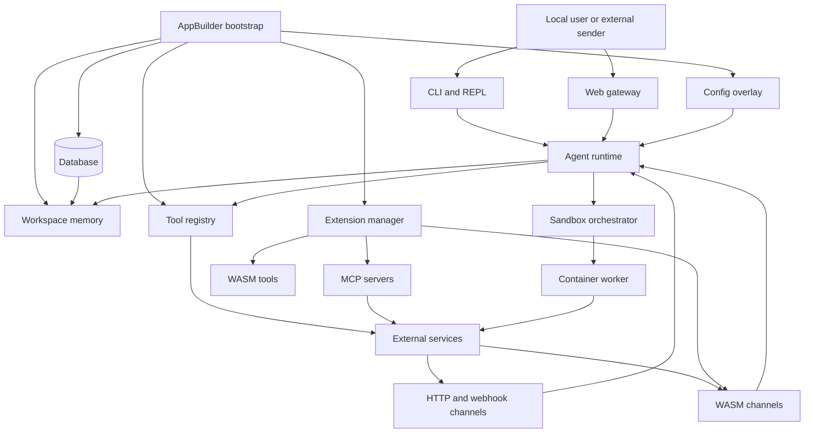

# Axinite architecture overview

## Front matter

- **Status:** Draft architecture overview of the currently implemented system.
- **Scope:** The host application, its runtime services, its persistence
  layers, and its extension model in this repository.
- **Primary audience:** Maintainers and contributors who need a working mental
  model before changing the system.
- **Precedence:** `src/NETWORK_SECURITY.md` is the authoritative reference for
  network-facing security controls. `docs/writing-web-assembly-tools-for-ironclaw.md`
  is the authoritative extension-authoring guide for WebAssembly Interface
  Types (WIT), packaging, and host contracts. `docs/developers-guide.md`
  remains the maintainer workflow guide.

## 1. Design goal

Axinite is a local-first agent runtime that combines interactive channels,
persistent memory, configurable language model providers, and an extension
system that can load both WebAssembly (WASM) components and Model Context
Protocol (MCP) servers at runtime. In the current implementation the code,
binary, package metadata, and many documents still use the `ironclaw` name.
This overview uses `axinite` for the system narrative, but retains
`ironclaw` when referring to commands, APIs, package names, and filenames that
still use that identifier.

The design centres on four requirements that show up repeatedly in the source:

- expose one agent runtime through several interaction surfaces instead of
  splitting separate products by channel
- keep durable state behind backend-agnostic abstractions so PostgreSQL and
  libSQL remain viable
- let the system grow at runtime through WASM tools, WASM channels, and MCP
  servers rather than only through compile-time wiring
- treat safety boundaries, secret handling, and sandbox isolation as
  first-class concerns rather than afterthoughts

## 2. System overview

Axinite starts as a single Rust binary. The synchronous `main()` function loads
environment files before Tokio starts, then hands control to `async_main()`.
`async_main()` divides startup into two broad phases. First, it handles
standalone CLI subcommands such as `ironclaw tool`, `ironclaw mcp`,
`ironclaw config`, `ironclaw memory`, and the hidden worker-oriented
subcommands. Second, for the default `run` path, it builds the shared runtime,
starts optional services, wires channels, and enters the long-running agent
loop.

Table 1. Major runtime layers and their responsibilities.

<!-- markdownlint-disable MD013 MD060 -->
| Layer | Responsibilities | Primary evidence |
|------|------------------|------------------|
| CLI and bootstrap | Parse commands, load early env files, guard single-process startup, and decide whether to run the agent | `src/main.rs`, `src/cli/mod.rs` |
| Application builder | Initialize database, secrets, language model providers, tools, workspace memory, and extension managers | `src/app.rs` |
| Interaction surfaces | Provide REPL, HTTP, Signal, web gateway, webhook, and WASM-backed channel entry points | `src/channels/mod.rs`, `src/main.rs` |
| Agent core | Route messages, schedule jobs, run tools safely, compact context, handle routines, and support self-repair | `src/agent/mod.rs` |
| Persistence and memory | Provide backend-agnostic storage, settings, conversation history, job records, and searchable workspace memory | `src/db/mod.rs`, `src/workspace/mod.rs`, `src/config/mod.rs` |
| Extension runtime | Discover, install, authenticate, and activate WASM tools, WASM channels, MCP servers, and relay-backed integrations | `src/extensions/mod.rs`, `src/registry/mod.rs`, `src/app.rs` |
| Safety and sandbox | Sanitize model inputs and outputs, block secret leakage, and isolate untrusted execution in Docker-backed workers | `src/safety/mod.rs`, `src/sandbox/mod.rs`, `src/orchestrator/mod.rs`, `src/worker/mod.rs` |
<!-- markdownlint-enable MD013 MD060 -->

Figure 1. High-level architecture and trust boundaries.

## 3. Startup and runtime composition

### 3.1 Boot sequence

The host boot sequence is deliberately staged so that early failures happen
before channels and background services start.

1. `main()` loads `.env` files and the per-user `~/.ironclaw/.env` bootstrap
   file before starting Tokio. This avoids mutating process environment after
   worker threads exist.
2. `async_main()` parses `Cli`, routes standalone subcommands, and only falls
   through to the agent runtime for `ironclaw run` or no subcommand.
3. The host acquires a PID lock to prevent accidental double-starts of the main
   process.
4. If onboarding is still required and onboarding has not been suppressed, the
   setup wizard runs before the rest of the runtime is built.
5. `Config::from_env_with_toml()` builds the initial configuration from
   environment variables, optional TOML, and defaults. Internally the config
   layer now captures those inputs into an explicit `EnvContext` snapshot
   before resolving sub-configs, so the runtime can preserve current operator
   behaviour while tests and internal callers use `Config::from_context(...)`
   for deterministic resolution. The database is not yet required at this
   point.
6. `AppBuilder::build_all()` executes the mechanical initialization phases in a
   fixed order: database, secrets, language model providers, tools and
   workspace, then extensions.
7. After core components exist, `async_main()` starts optional tunnel support,
   configures the sandbox orchestrator, wires interaction channels, registers
   hooks, and creates the agent.
8. The process finally enters `agent.run()`, while background tasks such as the
   sandbox reaper and Unix `SIGHUP` config reloader run alongside it.

### 3.2 AppBuilder phases

`AppBuilder` is the mechanical centre of the system. It exists to keep startup
side effects out of `main.rs`, make the sequence testable, and let tests build
fully initialized `AppComponents` without emulating every channel.

Table 2. AppBuilder phases and the state they add.

<!-- markdownlint-disable MD013 MD060 -->
| Phase | Behaviour | Notes |
|------|-----------|-------|
| Database | Connects to PostgreSQL or libSQL, runs migrations, reloads configuration from persisted settings, attaches the session store, and schedules stale sandbox cleanup | Database config is allowed to override env defaults after connection |
| Secrets | Creates the encrypted secrets store when a master key is available, injects stored provider credentials into the config overlay, and falls back to operating system credentials when no encrypted store is available | LLM credential resolution intentionally happens more than once |
| LLM | Builds the provider chain and any recording wrapper used for tracing | The chain is responsible for retry, failover, and routing decorators |
| Tools and workspace | Creates the safety layer, tool registry, embedding provider, workspace memory, and optional image or builder tools | Workspace memory only exists when a database backend is active |
| Extensions | Starts MCP session and process managers, creates the WASM runtime, loads runtime extensions, loads registry metadata, and creates the extension manager | The extension manager is registered back into the tool system so the agent can discover and manage extensions in chat |
<!-- markdownlint-enable MD013 MD060 -->

### 3.3 Long-running services

Once bootstrap succeeds, the host can expose several long-lived services from a
single process:

- the REPL channel for local interactive sessions
- the unified HTTP and webhook server stack for message ingestion
- the authenticated web gateway for browser access
- the orchestrator internal API for Docker-backed workers
- heartbeat and routine infrastructure through the agent runtime
- the sandbox reaper and Unix `SIGHUP` reloader as operational background tasks

This keeps the process model simple for a single-user deployment, but it also
means the main binary is responsible for both synchronous command dispatch and
asynchronous service hosting. It also means HTTP routes from the built-in HTTP
channel and from WASM channels are co-hosted behind one `WebhookServer`, so
newly activated channels can begin handling webhook traffic without a separate
host process. `docs/webhook-server-design.md` documents that unified webhook
architecture in more detail, including the current rollback-focused
`WebhookServer` restart behaviour.

## 4. Core runtime subsystems

### 4.1 Interaction surfaces

The channel system normalizes several ingress modes into one message stream for
the agent. `ChannelManager` multiplexes REPL, HTTP, Signal, web, and
WASM-backed channels, then the agent consumes unified `IncomingMessage`
records. The web gateway is not a separate service: it is just another channel
with extra state such as server-sent events, tool metadata, and runtime logs.
`docs/front-end-architecture.md` is the browser-specific design reference for
how that gateway serves the UI, generates the client-side interface, and
connects browser actions back into the runtime.
The detailed message lifecycle for the browser and other session-backed chat
paths lives in `docs/chat-model.md`, which covers ingress normalization,
attachment mutation, approvals, auth interruptions, persistence, and browser
status sinks in more depth.

The main runtime also supports hot activation of persisted WASM channels.
Startup loads the set of active channels from disk or registry state, wires the
WASM channel runtime into the extension manager, and restores relay channels
separately. This allows the host to treat channels as extensions rather than
static code paths.

### 4.2 Agent runtime

The agent subsystem combines message routing, scheduling, tool execution,
session state, cost guards, routines, heartbeats, self-repair, and context
compaction. The public module layout in `src/agent/mod.rs` shows the intended
responsibility split:

- routing and submission modules classify incoming work
- scheduler and task modules coordinate job execution
- session and undo modules preserve conversational state
- routine and heartbeat modules support proactive execution
- self-repair and job-monitor modules help recover from broken tools and stuck
  work
- compaction and context-monitor modules manage long-running context windows

The main process injects a large `AgentDeps` bundle rather than constructing
dependencies lazily inside the agent. That makes runtime boundaries explicit,
but it also means the boot sequence must assemble most infrastructure before
the agent can start.
`docs/chat-model.md` is the detailed subsystem reference for how those
dependencies are used once a normalized chat message enters the agent loop.
`docs/jobs-and-routines.md` covers the scheduler, job model, routines engine,
heartbeat runner, and the shared jobs and routines control surfaces.
`docs/agent-skills-support.md` covers how skill artifacts are loaded, selected,
attenuated, and injected into model context on the interactive chat path.

### 4.3 Persistence, configuration, and memory

Configuration is layered rather than singular. The config module documents the
effective priority as environment variables, optional TOML overlay, persisted
database settings, then defaults. During startup Axinite first builds config
without the database, then rehydrates it from the settings store after the
database is reachable. The operator-facing reference for the current command
and environment surface lives in `docs/configuration-guide.md`.
The backend-specific reference for PostgreSQL, `pgvector`, and libSQL lives in
`docs/database-integrations.md`. After the database is connected, startup
re-resolves provider credentials after secret injection. The repeated
resolution passes are intentional because some values are only available after
later bootstrap stages.

Persistence is organized behind the `Database` supertrait. The database layer
groups behaviour into narrower traits such as conversation storage, job
storage, sandbox-job storage, routine storage, settings storage, and workspace
document storage. Feature flags choose the backend implementation, but most of
the runtime depends on `Arc<dyn Database>` so backend choice does not leak
widely through the codebase.

Workspace memory sits on top of that database abstraction. It provides a
filesystem-like hierarchy of Markdown documents, chunking, embedding support,
and hybrid search. The workspace is therefore both a user-facing memory system
and the storage layer behind agentic context features such as seeded runbooks
and memory search tools. The same bootstrap path also uses backend-specific
handles to build the encrypted secrets store, because secret persistence still
needs direct access to concrete PostgreSQL or libSQL resources even though the
rest of the host prefers the generic database abstraction. The new database
integration reference is the place to look for backend-specific trade-offs such
as pooled PostgreSQL access, libSQL replica modes, and the current search-path
differences between `pgvector` and libSQL FTS. The provider matrix, config
rules, and workspace-level embedding flow live in
`docs/embedding-integrations.md`.

### 4.4 Extensions and tooling

Axinite treats extensions as a unified product surface even though they map to
three distinct runtime kinds:

- WASM tools for sandboxed capability modules
- WASM channels for messaging and webhook integrations
- MCP servers for externally hosted tool providers

The extension manager exists so the agent can discover, install, authenticate,
and activate these runtime kinds without requiring separate CLI-only workflows.
At bootstrap, `AppBuilder` loads configured MCP servers, scans the WASM tools
directory, optionally loads development build artefacts, loads registry catalog
entries, and constructs the manager with access to hooks, secrets, tool
registration, and optional channel runtime wiring.

The registry catalogue is the metadata bridge between packaged artefacts and
runtime activation. It loads manifests from `registry/`, falls back to embedded
copies when needed, then merges in builtin extension entries so the web gateway
can present one install surface even when some integrations are host-defined
rather than downloaded.

The authoritative packaging and interface contract for WASM extensions lives
outside this overview. New extension work should follow
`docs/writing-web-assembly-tools-for-ironclaw.md`, which names `wit/tool.wit`
and `wit/channel.wit` as the host contracts and requires `0.3.0` WIT metadata
for rebuilt extensions.

### 4.5 Safety and sandbox boundaries

Safety is built into the default runtime path rather than attached as an
optional filter. `SafetyLayer` combines validation, sanitization, policy
checks, and secret-leak detection. The same module exposes wrappers for marking
external content as untrusted before it reaches the language model.

For code execution and high-risk tools, Axinite uses a Docker-backed sandbox
system plus an orchestrator-worker split. The orchestrator runs inside the main
process, owns the worker-facing HTTP API, creates per-job bearer tokens, tracks
credential grants, serves `GET /worker/{job_id}/tools/catalog`, and executes
hosted-visible orchestrator-owned tools through
`POST /worker/{job_id}/tools/execute`. Workers run the same binary through the
hidden `ironclaw worker` or `ironclaw claude-bridge` subcommands, but with a
restricted runtime that proxies language model access, fetches the remote-tool
catalog during startup, and reports status back to the orchestrator.

The worker-orchestrator seam now owns its hosted remote-tool route fragments
and payload shapes in one shared transport module under `src/worker/api/`.
That keeps the worker HTTP adapter and the orchestrator router aligned, while
the canonical hosted-visible catalogue filter now lives with the tool registry
and policy layer instead of in the HTTP adapter. The current source set is
active hosted-visible MCP tools plus active hosted-visible orchestrator-owned
WASM tools. Later roadmap work focuses on richer refresh behaviour.

For those advertised WASM tools, `ToolDefinition.parameters` is the canonical
LLM-facing contract before first execution. Any runtime retry hint is only
fallback diagnostic guidance after a call has already failed.

On the worker side, the merged tool surface is now explicit rather than
incidental. Startup still registers the remote proxies into the worker-local
registry, but both initial reasoning-context construction and later
`before_llm_call` refreshes now read the same sorted registry-backed
`ToolDefinition` list. Hosted `toolset_instructions` remain a context-build
concern: they are injected once as a dedicated system message and are not
re-added during iterative tool refreshes.

The WASM execution path adds another boundary inside the host process. Before
the host injects any credentials into outbound requests, it validates endpoint
allowlists, applies rate limits, and leak-scans the raw WASM-supplied request
payload. On the container side, the sandbox manager can still bypass isolation
for explicit `FullAccess` policies, but the default execution path goes through
containerization, network proxying, allowlists, and resource limits.

The security implications of the network surfaces, bind addresses, token
validation, and webhook authentication are already documented in
`src/NETWORK_SECURITY.md`. This overview relies on that document rather than
duplicating its full inventory.

### 4.6 Dependency and boundary map

The current codebase has a practical layered shape even though it does not use
formal hexagonal vocabulary throughout.

- bootstrap and configuration in `src/bootstrap.rs` and `src/config/`
- composition roots in `src/main.rs` and `src/app.rs`
- runtime services in `src/agent/`, `src/channels/`, `src/extensions/`,
  `src/worker/`, and `src/orchestrator/`
- persistence and memory in `src/db/`, `src/workspace/`, and `src/history/`

Some dependency directions are healthy and worth preserving.

- The runtime still exposes meaningful extensibility seams such as
  `Database`, `Channel`, `Tool`, and `LlmProvider`.
- `AppBuilder` is a reasonable composition root for the mechanical bootstrap
  phases.
- `WebhookServer` isolates listener restart mechanics better than the
  higher-level hot-reload caller in `src/main.rs` that decides when and why a
  restart should happen.

Other edges are more muddled and currently create avoidable maintenance cost.

- `src/main.rs` reaches deep into config reload, secret injection, transport
  restart, and lifecycle mutation during the SIGHUP hot-reload path.
- `ExtensionManager` points outward to many adapters at once, including
  discovery, MCP, WASM runtime, channel activation, secrets, database-backed
  state, and gateway callback machinery.
- The worker-orchestrator seam now shares its hosted remote-tool contract and
  canonical catalogue filter, but later roadmap work still needs to extend that
  filter to WASM tools and add refresh behaviour.
- Job lifecycle semantics are split between in-memory context transitions and
  best-effort persistence paths, which makes cancellation and terminal status
  handling harder to reason about under failure.

## 5. Repository structure that supports the architecture

The repository layout mirrors the runtime split rather than hiding everything
behind one crate root.

Table 3. Top-level paths that matter most for the current architecture.

<!-- markdownlint-disable MD013 MD060 -->
| Path | Purpose |
|------|---------|
| `src/` | Host application code, including the agent, channels, sandbox, database, config, and extension systems |
| `channels-src/` | Source crates for standalone WASM channel integrations such as Telegram, Slack, Discord, and WhatsApp |
| `tools-src/` | Source crates for standalone WASM tools built outside the main crate |
| `registry/` | Embedded extension manifests and bundle metadata used for discovery and installation |
| `wit/` | Shared WIT contracts for WASM tools and channels |
| `migrations/` | Database migrations for the supported backends |
| `docs/` | Maintainer, provider, setup, and architecture-facing documentation |
| `tests/` | Host integration coverage such as WIT compatibility and end-to-end tests |
| `scripts/` | Build, validation, and repository utility scripts |
<!-- markdownlint-enable MD013 MD060 -->

The repository also reflects a practical packaging decision: not every runtime
extension is compiled as part of the main workspace member set. Some channel
and tool artefacts are built from their own source trees and loaded dynamically
later, which is why the documentation and build scripts matter as much as the
host crate for understanding the whole system.

## 6. Current trade-offs and notable divergences

The current implementation makes several deliberate trade-offs that a maintainer
should understand before reshaping the system.

- The naming surface is not yet consistent. The repository and this document
  use `axinite`, but the compiled package, CLI name, and many docs still use
  `ironclaw`.
- The main process owns many responsibilities at once: CLI routing, service
  hosting, channel wiring, worker orchestration, and lifecycle management. This
  reduces deployment complexity for a single-user installation, but increases
  the breadth of startup and shutdown logic in `src/main.rs`.
- Configuration resolution is intentionally multi-pass. That keeps env bootstraps,
  persisted settings, and encrypted secrets compatible, but it makes the
  configuration story harder to explain than a single immutable config load.
- Dynamic extensions are a core strength, but they also create several sources
  of truth: the host runtime, registry metadata, WIT contracts, bundled
  artefacts, and persisted activation state must stay aligned.
- The database abstraction narrows backend leakage, but not all persistence
  behaviours are equally simple across PostgreSQL and libSQL. The codebase
  still carries backend-aware handles where secrets and migrations need them.

## 7. References

- `Cargo.toml`
- `src/main.rs`
- `src/app.rs`
- `src/lib.rs`
- `src/cli/mod.rs`
- `src/config/mod.rs`
- `src/db/mod.rs`
- `src/agent/mod.rs`
- `src/channels/mod.rs`
- `src/extensions/mod.rs`
- `src/orchestrator/mod.rs`
- `src/safety/mod.rs`
- `src/sandbox/mod.rs`
- `src/worker/mod.rs`
- `src/workspace/mod.rs`
- `src/NETWORK_SECURITY.md`
- `docs/developers-guide.md`
- `docs/documentation-style-guide.md`
- `docs/writing-web-assembly-tools-for-ironclaw.md`
