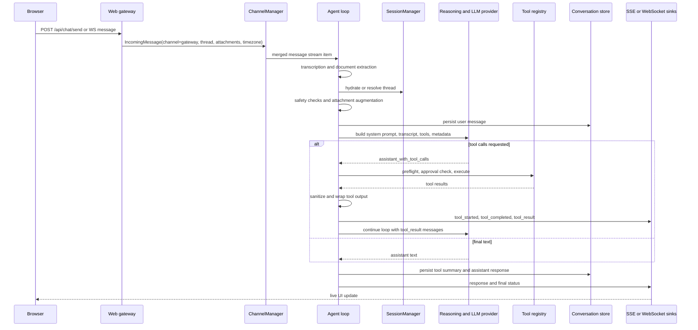

# Axinite chat model

## Front matter

- **Status:** Draft design reference for the currently implemented chat model.
- **Scope:** The session-backed chat path in axinite, including browser
  gateway ingress, normalized channel messages, preprocessing, model context
  assembly, tool actions, approval and auth interruptions, persistence, and
  browser-facing sinks.
- **Primary audience:** Maintainers and contributors who need to change chat
  behaviour without breaking session semantics, safety boundaries, or browser
  integration.
- **Precedence:** `src/NETWORK_SECURITY.md` remains the authoritative
  network-facing security reference. `docs/axinite-architecture-overview.md`
  remains the broader system architecture summary. This document is the
  subsystem reference for the chat path that feeds the agent loop.

## 1. Design scope

Axinite exposes several interaction surfaces, but the implemented chat model is
not "any text sent to any model". It is a specific runtime contract that:

- normalizes channel-specific payloads into `IncomingMessage`
- mutates those messages through transcription and document extraction
- resolves them into session and thread state
- constructs a model transcript from trusted instructions, prior turns,
  attachments, and tool schemas
- loops through tool execution, approvals, and auth interruptions
- persists a lossy but durable conversation record
- fans results back out through channel-specific response and status sinks

The browser gateway is the richest chat surface, so it is the easiest place to
see the full model. The same underlying session-backed path is also used by
other channels once they emit `IncomingMessage` values through
`ChannelManager`.

This document excludes two adjacent areas on purpose:

- background job execution, which shares tool infrastructure but has its own
  memory and orchestration model
- the OpenAI-compatible proxy under `/v1/chat/completions`, which uses the same
  web server and the same `LlmProvider`, but bypasses the session-backed agent
  loop entirely

## 2. Applicability matrix

Table 1. Applicability of chat-model topics in this document.

| Area | Applies | Evidence | Notes |
| ------ | --------- | ---------- | ------- |
| Browser gateway chat | Yes | `src/channels/web/handlers/chat.rs`, `src/channels/web/ws.rs`, `src/channels/web/mod.rs` | This is the canonical end-to-end chat surface. |
| Session-backed agent loop | Yes | `src/agent/agent_loop.rs`, `src/agent/thread_ops.rs`, `src/agent/dispatcher.rs` | This is the core chat execution engine. |
| Conversation persistence | Yes | `src/agent/thread_ops.rs`, `src/history/store.rs`, `src/channels/web/util.rs` | Persistence is durable, but less expressive than the in-memory turn model. |
| Non-web channels | Partly | `src/channels/channel.rs`, `src/channels/manager.rs` | They share the same normalized message contract, but not the same browser-specific sinks. |
| OpenAI-compatible proxy | Partly | `src/channels/web/openai_compat.rs` | It lives beside chat, but does not use sessions, approvals, or thread persistence. |
| Background jobs and routines | Partly | `src/channels/manager.rs`, `src/context/memory.rs` | They can inject messages or emit events, but they are not the primary user-chat path. |

## 3. Canonical data model

### 3.1 Normalized ingress record

Every channel-specific chat input is normalized into `IncomingMessage`. That
record is the contract between ingress code and the agent loop.

Table 2. `IncomingMessage` and attachment fields that shape chat behaviour.

| Type | Important fields | Why they matter | Evidence |
| ------ | ------------------ | ----------------- | ---------- |
| `IncomingMessage` | `channel`, `user_id`, `content`, `thread_id`, `metadata`, `timezone`, `attachments` | Carries the full chat request as far as the session, safety, and reasoning layers. | `src/channels/channel.rs` |
| `IncomingAttachment` | `kind`, `mime_type`, `filename`, `size_bytes`, `source_url`, `storage_key`, `extracted_text`, `data`, `duration_secs` | Supports later mutation steps such as transcription, text extraction, and multimodal image injection. | `src/channels/channel.rs` |
| `AttachmentKind` | `Audio`, `Image`, `Document` | Drives which preprocessing path runs and how the attachment is rendered into prompt content. | `src/channels/channel.rs`, `src/agent/attachments.rs` |

The model is intentionally channel-agnostic. The web gateway fills
`IncomingMessage` from JSON bodies or WebSocket frames, but the agent loop does
not need to know whether the content originally arrived over REST, WebSocket,
Signal, or a hot-loaded channel.

### 3.2 In-memory session and thread model

Axinite does not treat chat as a flat append-only message list in memory. It
uses a structured session model that preserves turn boundaries, tool calls,
interruptibility, and approval state.

Table 3. Session-backed chat structures.

| Type | Important fields | Behavioural role | Evidence |
| ------ | ------------------ | ------------------ | ---------- |
| `Session` | `user_id`, `active_thread`, `threads`, `auto_approved_tools` | Owns all threads for one user and remembers per-session approval decisions. | `src/agent/session.rs` |
| `Thread` | `id`, `state`, `turns`, `metadata`, `pending_approval`, `pending_auth` | Represents one conversation timeline and the current interruption mode. | `src/agent/session.rs` |
| `Turn` | `user_input`, `response`, `tool_calls`, `state`, timestamps, `image_content_parts` | Preserves the model-visible user input and the assistant-side work for one turn. | `src/agent/session.rs` |
| `PendingApproval` | tool name, original parameters, redacted display parameters, `context_messages`, deferred tool calls, timezone | Suspends the loop at a tool boundary and lets the user resume it later. | `src/agent/session.rs`, `src/agent/thread_ops.rs` |
| `PendingAuth` | `extension_name` | Puts the thread into auth mode so the next user message is routed directly to credential handling. | `src/agent/session.rs`, `src/agent/agent_loop.rs` |

The important design choice is that `Thread::messages()` rebuilds the model
transcript from turns, not from raw transport messages. The model sees a
sequence shaped like:

```plaintext
user -> assistant_with_tool_calls -> tool_result* -> assistant
```

That preserves tool causality and reduces the chance that the model replays
work that axinite has already completed.

### 3.3 Durable conversation record

The persisted chat record is simpler than the in-memory thread model. It is
durable enough to reload history after a restart, but it is intentionally lossy.

Table 4. Durable conversation record.

| Record | Stored fields | Notes | Evidence |
| -------- | --------------- | ------- | ---------- |
| `ConversationSummary` | conversation metadata and timestamps | Used to enumerate stored conversations. | `src/history/store.rs` |
| `ConversationMessage` | `id`, `role`, `content`, `created_at` | The durable history format is a flat role-tagged message stream. | `src/history/store.rs` |
| Roles in practice | `user`, `tool_calls`, `assistant` | Tool results are not stored as full transcript messages; tool calls are summarized into one JSON record. | `src/agent/thread_ops.rs`, `src/channels/web/util.rs` |

This means persisted history is strong enough for browser history and thread
hydration, but not identical to the full reasoning transcript held in memory.

### 3.4 Browser sink DTOs

The browser gateway has its own view model over the chat runtime.

Table 5. Browser-facing chat DTOs.

| Type | Purpose | Evidence |
| ------ | --------- | ---------- |
| `SendMessageRequest` | REST request body for `/api/chat/send` | `src/channels/web/types.rs` |
| `ThreadListResponse` | Browser sidebar model for the pinned assistant thread, regular conversations, and the active-thread selection | `src/channels/web/types.rs`, `src/channels/web/handlers/chat_threads.rs` |
| `HistoryResponse`, `TurnInfo`, `ToolCallInfo` | Browser history and thread view model | `src/channels/web/types.rs`, `src/channels/web/util.rs` |
| `PendingApprovalInfo` | Re-renders approval state after a thread switch | `src/channels/web/types.rs`, `src/channels/web/handlers/chat_history.rs` |
| `SseEvent` | Unified live event stream for responses, tool activity, approvals, auth, jobs, and generated images | `src/channels/web/types.rs`, `src/channels/web/mod.rs` |

The browser sidebar is intentionally not a flat list of identical items.
`ThreadListResponse` separates a dedicated `assistant_thread` field from the
ordinary `threads` list. The frontend renders that assistant conversation into
its own pinned `Assistant` row and renders every other stored conversation
under the `Conversations` header. That means `Assistant` is the canonical
gateway chat thread, not just the first item in the same list as user-created
threads.

## 4. End-to-end data flow

### 4.1 Main chat sequence

Figure 1. Main session-backed chat sequence through the browser gateway.



### 4.2 Ingress surfaces and normalization

The main browser entry points are:

- `POST /api/chat/send`, which converts `SendMessageRequest` into
  `IncomingMessage`
- `GET /api/chat/ws`, which accepts `WsClientMessage` frames and converts
  message and approval frames into the same `IncomingMessage` contract
- `POST /api/chat/approval`, which serializes an `ExecApproval` submission into
  an `IncomingMessage`

All of those handlers ultimately write into the gateway channel's internal
`msg_tx`, which becomes one branch of the merged `ChannelManager` stream. That
is the key normalization step: channel-specific request shapes disappear before
the agent loop begins.

The gateway also adds transport-specific metadata before normalization:

- `thread_id` is copied into both `IncomingMessage.thread_id` and
  `metadata.thread_id`
- timezone is taken either from the request body or the `X-Timezone` header
- browser image uploads are converted into `IncomingAttachment` values with
  decoded inline bytes

The same pattern also explains why approvals are modelled as messages rather
than an out-of-band RPC. The REST and WebSocket approval paths both serialize a
`Submission::ExecApproval` value into message content so the same submission
parser can handle them inside the agent loop. That parser is deliberately
text-driven: it distinguishes normal user input, slash-style commands, JSON
approval payloads, and short approval replies such as `yes`, `always`, and
`no`.

### 4.3 Early preprocessing and message mutation

Before a message enters normal turn processing, axinite may mutate it in three
important ways.

First, audio attachments pass through `TranscriptionMiddleware`. If the message
body is empty or exactly `[Voice note]`, the first successful transcription
becomes the message content. The attachment also keeps its `extracted_text`.

Second, document attachments pass through
`DocumentExtractionMiddleware`. Extraction only uses inline `attachment.data`.
It refuses to fetch `source_url`, specifically to avoid Server-Side Request
Forgery (SSRF). Extraction also enforces size limits and truncates oversized
results.

Third, extracted document text is written into the workspace under
`documents/<date>/<filename>` by `store_extracted_documents()`. That creates a
new sink for attachment-derived content outside the live transcript.

After those middleware passes, `process_user_input()` performs one further
transformation: `augment_with_attachments()` appends an `<attachments>` block
to the effective user text and emits multimodal image parts for image
attachments with inline bytes. This means the persisted `user_input` for the
turn is already the augmented form, not the original transport payload. It also
means the inbound secret scan only covers the original `content` string.
Attachment-derived transcripts and extracted document text are appended later,
after that specific gate has already run.

### 4.4 Session resolution and thread hydration

Axinite separates external thread identifiers from internal thread ownership.
`SessionManager::resolve_thread()` maps the tuple
`(user_id, channel, external_thread_id)` to an internal thread UUID.

The browser gateway adds a second wrinkle: its thread identifiers are already
UUID-shaped. Before resolution, `maybe_hydrate_thread()` checks whether the
requested thread exists only in the database. If it does, the agent rebuilds
`ChatMessage` history from durable records, restores an in-memory `Thread` with
the exact same UUID, and registers that mapping with `SessionManager`.

That hydration step matters because otherwise a browser reload or thread switch
would create a fresh in-memory thread and split one logical conversation across
two internal identifiers.

The browser thread list adds another important distinction. The gateway keeps a
dedicated assistant conversation for the `gateway` channel by calling
`get_or_create_assistant_conversation()` when it builds
`/api/chat/threads`. That conversation is removed from the ordinary
conversation summaries and returned separately as `assistant_thread`, while the
remaining persisted conversations are returned as `threads`.

The frontend preserves that split. `loadThreads()` binds
`assistant_thread.id` to a dedicated `assistantThreadId`, hard-codes its
sidebar label to `Assistant`, and defaults to it on first load when no thread
is selected. Ordinary conversations are rendered from `threads`,
switched through `switchThread(thread.id)`, and titled from their stored title,
channel, type, or UUID prefix. Creating a new thread through
`POST /api/chat/thread/new` creates a regular `thread_type = "thread"`
conversation and selects it, but it does not replace the pinned assistant
conversation.

### 4.5 Safety validation and turn start

`process_user_input()` is the gatekeeper for the normal chat path. Before the
LLM sees anything, it:

- rejects work when the thread is already `Processing`, `AwaitingApproval`, or
  `Completed`
- validates raw input structure through `SafetyLayer::validate_input()`
- checks the policy engine for blocking rules
- scans inbound content for secrets and rejects the turn early if it looks like
  a leaked credential
- routes explicit slash commands away from the agentic tool loop
- auto-compacts historical context when the context monitor says the thread is
  approaching the model budget
- checkpoints undo state before mutating the thread

Only after those steps does axinite start a new turn, attach image content
parts, and persist the user message to the conversation store.

### 4.6 Model context assembly

The model transcript is assembled in `run_agentic_loop()`. The inputs are not
just prior user and assistant text. They include several layers with different
trust levels and lifetimes.

Table 6. Inputs injected into `ReasoningContext` before or during the loop.

| Input | Source | Trust level | How it enters | Evidence |
| ------ | -------- | ------------- | --------------- | ---------- |
| Workspace system prompt | workspace identity files such as `AGENTS.md` and `SOUL.md` | Trusted host instruction | Loaded by `system_prompt_for_context_tz()` and inserted as the system prompt | `src/agent/dispatcher.rs` |
| Skill context | selected installed or trusted skills | Mixed; installed skills are explicitly downgraded to suggestions | Wrapped in `<skill>` blocks and injected into the prompt | `src/agent/dispatcher.rs` |
| Channel conversation context | channel-specific metadata projection | Trusted host-side adapter data | Added through `Reasoning::with_conversation_data()` | `src/agent/dispatcher.rs` |
| Prior turns | thread state | Mixed user and assistant history | Rebuilt from `Thread::messages()` | `src/agent/session.rs` |
| Tool schemas | tool registry, optionally attenuated by active skills | Trusted host instruction | Inserted into `ReasoningContext.available_tools` | `src/agent/dispatcher.rs` |
| Thread metadata | thread ID | Trusted host metadata | Stored in `ReasoningContext.metadata` | `src/agent/dispatcher.rs` |
| Tool-result messages | executed tool outputs after sanitization | Untrusted external content after host wrapping | Added as `ChatMessage::tool_result` | `src/agent/dispatcher.rs`, `src/tools/execute.rs` |

The dispatcher builds two cached prompt variants:

- the normal prompt, with tool definitions
- a forced text-only variant, used when the loop reaches the tool-iteration
  limit

This is an important control point. Axinite does not let the model keep calling
tools indefinitely. Near the iteration limit it injects a system nudge, and at
the limit it removes tools from the prompt entirely.

### 4.7 Tool actions inside the chat loop

The shared agentic loop returns either assistant text, a tool-call batch, a
stop signal, or a need-approval outcome. When a tool-call batch arrives,
`ChatDelegate::execute_tool_calls()` handles it in three stages.

1. It appends an `assistant_with_tool_calls` message to the transcript and
   records redacted tool-call parameters in the current turn.
2. It runs sequential preflight checks:
   hook evaluation, hook-driven parameter rewrites, and approval gating.
3. It executes runnable tools, either sequentially or in parallel, emits live
   status updates, sanitizes outputs, and appends `tool_result` messages to the
   reasoning context.

The canonical tool execution path is
`execute_tool_with_safety()`: validate parameters, redact sensitive values in
logs, enforce a timeout, execute, and serialize. The chat loop then runs
`process_tool_result()`, which sanitizes the output and wraps it inside:

```xml
<tool_output name="..." sanitized="true|false">
...
</tool_output>
```

That wrapper is the main structural boundary between trusted instructions and
untrusted tool data when the model continues reasoning. Axinite also keeps one
unsanitized copy of each successful tool result in the job context's
`tool_output_stash` so later tools can refer back to it. That is useful for
workflow continuity, but it is a separate sink from the sanitized model
transcript.

### 4.8 Approval and auth interruption paths

Approval and extension authentication look similar in the user interface, but
they are different control paths in the runtime.

#### Approval flow

If a tool requires approval, the dispatcher captures:

- the original tool parameters
- redacted display parameters
- the tool-call ID
- the exact context messages at the point of suspension
- any deferred tool calls from the same assistant message
- the user's timezone

That becomes `PendingApproval` on the thread, and the agent emits
`StatusUpdate::ApprovalNeeded`. The turn does not receive a normal assistant
text response at that point.

When the user approves or denies the request, the browser sends a serialized
`ExecApproval` message back into the same gateway message pipeline. The agent
then resumes from the suspended context rather than starting a fresh turn.

#### Auth flow

Auth-required tool results take a different path. If a tool result indicates
`awaiting_token`, the thread enters auth mode with `PendingAuth`.

The next user message for that thread is intercepted before the normal chat
pipeline. It is not turned into a new conversational turn, and it is not
persisted as a chat message. Instead, it is routed directly to extension
authentication. The browser can also bypass the message pipeline entirely by
posting to `/api/chat/auth-token` or sending `AuthToken` over WebSocket, which
calls the extension manager directly and broadcasts `AuthCompleted` or
`AuthRequired`.

The resulting design is pragmatic but important to document: approval is part
of the conversational control flow, while auth token submission is an
operational side-channel that can clear thread auth mode without leaving a
normal chat-history record.

### 4.9 Persistence and history reconstruction

Axinite persists conversation data incrementally during the turn lifecycle:

- the user message is written immediately after turn start
- the tool-call batch is persisted as one JSON `tool_calls` message after the
  loop completes successfully
- the assistant text is persisted last

This ordering is defensive. A crash after the user message still leaves a
recoverable record that the user spoke, even if the assistant never completed.

When the browser requests history, the gateway prefers the in-memory thread if
it exists and has turn data. That preserves richer state such as pending
approvals and full per-turn tool-call status. If the thread is not resident, or
if the caller pages backwards with a `before` cursor, the gateway falls back to
the database and reconstructs `TurnInfo` values from flat `user`,
`tool_calls`, and `assistant` records.

That reconstruction is intentionally heuristic. It handles:

- `user -> assistant`
- `user -> tool_calls -> assistant`
- `user` alone, which the browser renders as a failed or incomplete turn
- standalone `assistant` messages, such as routine output

### 4.10 Response and status sinks

The browser-facing chat model has two distinct egress classes.

First, `respond()` sends the final assistant text through `SseEvent::Response`.
This is the main sink for completed turns.

Second, `send_status()` maps internal `StatusUpdate` values into browser
events. That live stream carries:

- thinking notifications
- tool-started and tool-completed updates
- tool result previews
- approval-needed events
- auth-required and auth-completed events
- image-generated events
- job-related events that share the same event bus

The WebSocket transport does not have its own independent event producer. It
subscribes to the same underlying broadcast source as Server-Sent Events (SSE)
and simply re-encodes each `SseEvent` into a WebSocket frame.

## 5. Sources, sinks, and content-injection boundaries

### 5.1 Source inventory

Table 7. Primary chat sources, trust levels, and guards.

| Source | Trust level | Example path | Guard or wrapper |
| -------- | ------------- | -------------- | ------------------ |
| User text | Untrusted | `/api/chat/send`, `WsClientMessage::Message` | input validation, policy checks, inbound secret scan |
| Audio transcript | Untrusted derivative of user data | `TranscriptionMiddleware` | attachment-kind gating and provider-specific transcription |
| Document extraction | Untrusted derivative of attachment data | `DocumentExtractionMiddleware` | inline-data-only rule, size caps, truncation |
| Image content | Untrusted user data | `augment_with_attachments()` | metadata block plus multimodal image part |
| Workspace system prompt | Trusted host instruction | workspace identity files | loaded by runtime, not user supplied |
| Skill content | Mixed | skill registry | installed skills are marked as suggestions |
| Tool output | Untrusted external data | tool execution path | sanitization, leak detection, policy checks, `<tool_output>` wrapper |
| Other external content | Untrusted external data | fetched pages, emails, webhook payloads | `wrap_external_content()` when explicitly used |

### 5.2 Injection boundaries

The chat model has three important content-injection boundaries.

The first boundary sits between the host runtime and the model. The system
prompt, conversation metadata, tool schemas, and skill wrappers are trusted
host-authored inputs that define the model's operating frame.

The second boundary sits between untrusted external data and the model. Tool
outputs are never reinserted raw when they go through the canonical execution
path. They are sanitized, possibly redacted or blocked, and wrapped in
`<tool_output>` delimiters. Large outputs are truncated with a pointer to the
JSON tool for later retrieval.

The third boundary sits between user transport payloads and the normalized turn
input. Attachments are transformed before the model sees them. That is useful,
but it means debugging a strange model response requires checking the augmented
turn input rather than only the original REST or WebSocket payload. It also
means the raw-body inbound secret scan is not the only place where user-derived
sensitive content can appear. Attachment extraction and transcription are later
mutation steps with their own risk profile.

### 5.3 Sink inventory

The chat model writes user-derived or model-derived data to several sinks:

- in-memory thread state
- durable conversation history in the database
- workspace document storage for extracted document text
- browser SSE and WebSocket event streams
- logs and hook events, with redaction for sensitive tool parameters

That spread is why secret-handling rules have to exist in more than one place.
Blocking secrets only at the outbound browser response boundary would be too
late because data may already have reached logs, history, or workspace storage.

## 6. Actions and state transitions

### 6.1 Thread state machine

Table 8. Thread states and how chat actions move between them.

| State | Meaning | Entered by | Exited by |
| ------- | --------- | ------------ | ----------- |
| `Idle` | Ready for a new turn | new thread creation, completed turn, cleared approval, resumed interrupt | new user turn |
| `Processing` | A turn is actively running | `start_turn()` | completed turn, failed turn, interrupt |
| `AwaitingApproval` | Tool execution is suspended pending user choice | approval-gated tool call | approval handling or interrupt |
| `Completed` | No more turns expected | explicit completion workflows | uncommon in normal interactive chat; successful turns usually return to `Idle` |
| `Interrupted` | Current work was cancelled | `/interrupt` path | resume or later user action |

### 6.2 Action catalogue

Table 9. High-value actions in the chat path.

| Action | Input | Output | Evidence |
| -------- | ------- | -------- | ---------- |
| Send chat message | `SendMessageRequest` or `WsClientMessage::Message` | `IncomingMessage` | `src/channels/web/handlers/chat.rs`, `src/channels/web/ws.rs` |
| Start turn | normalized message plus resolved thread | in-memory turn plus durable user record | `src/agent/thread_ops.rs` |
| Run model iteration | `ReasoningContext` | assistant text or tool-call batch | `src/agent/dispatcher.rs` |
| Execute tool batch | tool calls | status events plus `tool_result` messages | `src/agent/dispatcher.rs`, `src/tools/execute.rs` |
| Suspend for approval | approval-required tool call | `PendingApproval` plus SSE event | `src/agent/dispatcher.rs`, `src/agent/thread_ops.rs` |
| Submit approval | approval REST or WebSocket message | resumed suspended context | `src/channels/web/handlers/chat_auth.rs`, `src/channels/web/ws.rs` |
| Enter auth mode | auth-required tool result | `PendingAuth` plus auth event | `src/agent/dispatcher.rs`, `src/agent/session.rs` |
| Submit auth token | auth REST or WebSocket request | extension activation attempt and auth broadcast | `src/channels/web/handlers/chat_auth.rs`, `src/channels/web/ws.rs` |
| Load history | thread query | `HistoryResponse` | `src/channels/web/handlers/chat_history.rs` |

## 7. Constraints, trade-offs, and risks

The current implementation makes a few explicit trade-offs.

First, the in-memory transcript is richer than the durable transcript. That is
good for runtime behaviour, but it means a rehydrated thread is a reconstructed
approximation rather than a byte-for-byte copy of the original reasoning
context.

Second, pending approvals live in memory only. The browser can recover them
when the process is still running, but a restart clears that state.

Third, auth-token submission deliberately bypasses the normal conversational
pipeline. That reduces the chance of credentials leaking into chat history, but
it also means auth interactions are only partially visible in the durable
conversation record.

Fourth, extracted document text is stored in the workspace as a side effect of
chat ingress. That improves later recall, but it also creates a long-lived sink
for user-supplied content that maintainers need to remember during privacy and
retention work.

Fifth, attachment-derived text is appended after the inbound secret scan on the
raw message body. That does not remove the later output-sanitization defences,
but it does mean attachment content follows a different early-validation path
than plain typed text.

Sixth, the OpenAI-compatible proxy shares the same web gateway and LLM provider
but not the same session model. Treating it as "the same chat path" would be a
documentation error. It is an adjacent API surface, not the canonical axinite
chat loop.

## 8. References

- `src/channels/channel.rs`
- `src/channels/manager.rs`
- `src/channels/web/mod.rs`
- `src/channels/web/handlers/chat.rs`
- `src/channels/web/handlers/chat_auth.rs`
- `src/channels/web/handlers/chat_history.rs`
- `src/channels/web/openai_compat.rs`
- `src/channels/web/types.rs`
- `src/channels/web/util.rs`
- `src/channels/web/ws.rs`
- `src/agent/agent_loop.rs`
- `src/agent/attachments.rs`
- `src/agent/dispatcher.rs`
- `src/agent/session.rs`
- `src/agent/session_manager.rs`
- `src/agent/thread_ops.rs`
- `src/document_extraction/mod.rs`
- `src/history/store.rs`
- `src/safety/mod.rs`
- `src/tools/execute.rs`
- `src/transcription/mod.rs`
