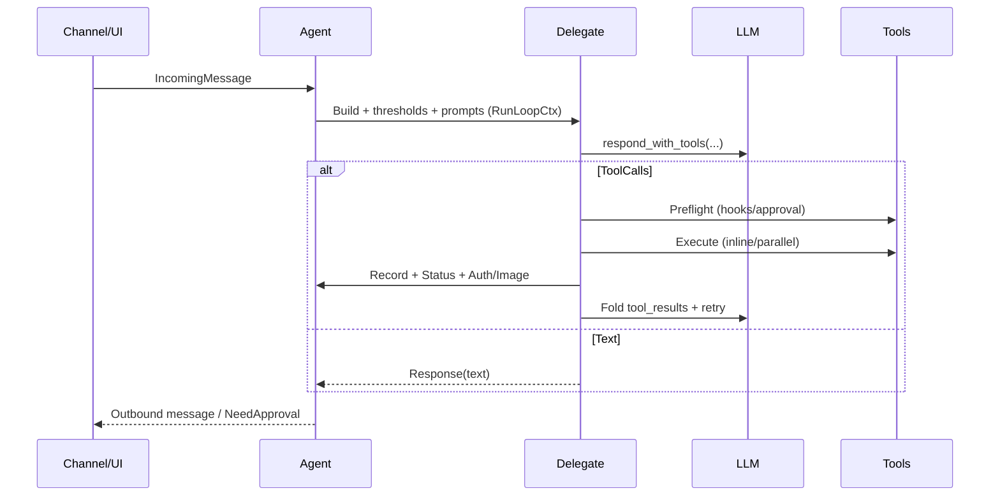

# Developer's Guide

This guide explains the local prerequisites for working on IronClaw and
reproducing the build and test workflows on this branch.

For the current system architecture and subsystem boundaries, see
[`docs/axinite-architecture-overview.md`](axinite-architecture-overview.md).


## 1. Purpose

Linux continuous integration (CI) on this branch now uses `mold` to
reduce linker time. The
compile-time reduction plan assumes local contributors can reproduce
that setup before they measure anything or change build defaults.

This guide documents the required and optional tools for common
workflows so contributors do not discover missing prerequisites halfway
through a build.

## 1. Purpose

Linux continuous integration (CI) on this branch now uses `mold` to
reduce linker time. The
compile-time reduction plan assumes local contributors can reproduce
that setup before they measure anything or change build defaults.

This guide documents the required and optional tools for common
workflows so contributors do not discover missing prerequisites halfway
through a build.

## 1. Purpose

Linux continuous integration (CI) on this branch now uses `mold` to
reduce linker time. The
compile-time reduction plan assumes local contributors can reproduce
that setup before they measure anything or change build defaults.

This guide documents the required and optional tools for common
workflows so contributors do not discover missing prerequisites halfway
through a build.

## 1. Purpose

Linux continuous integration (CI) on this branch now uses `mold` to
reduce linker time. The
compile-time reduction plan assumes local contributors can reproduce
that setup before they measure anything or change build defaults.

This guide documents the required and optional tools for common
workflows so contributors do not discover missing prerequisites halfway
through a build.

## 1. Purpose

Linux continuous integration (CI) on this branch now uses `mold` to
reduce linker time. The
compile-time reduction plan assumes local contributors can reproduce
that setup before they measure anything or change build defaults.

This guide documents the required and optional tools for common
workflows so contributors do not discover missing prerequisites halfway
through a build.

## 2. Supported environments

The repository builds on Linux, macOS, Windows, and Windows Subsystem
for Linux (WSL). The fastest documented path today is Linux or WSL
because the current branch already uses `mold` in Linux CI.

For compile-time or CI changes, prefer Linux or WSL so local results
line up with the current CI setup.


## 3. Required tools

Install these tools before running the standard repository commands:

1. Rust `1.92` via `rustup`.
2. `clang` on Linux or WSL.
3. `mold` on Linux or WSL.
4. The `wasm32-wasip2` Rust target.
5. `wasm-tools`.
6. `cargo-component`.
7. `cargo-nextest`.
8. `jq`.
9. `make`.
10. Git.

The root crate declares `rust-version = "1.92"` in `Cargo.toml`. The
repository also includes standalone WebAssembly (WASM) tool and channel
crates, so WASM tooling is required for more than release-only
workflows.


## 4. Extra tools for the compile-time reduction effort

Install these extra tools for work on the compile-time reduction plan:

1. `/usr/bin/time` or an equivalent timing tool.

`cargo-nextest` is now part of the standard local test path on this
branch because `make test` uses it for the root crate. The timing tool
remains specific to the compile-time reduction work.


## 5. CI build environment

CI jobs in this repository set `CARGO_INCREMENTAL="0"` at the job environment
level for the `test`, `coverage`, and `mutation-testing` workflows. Incremental
compilation writes per-crate fingerprint and dependency files into
`target/debug/incremental` and `target/debug/.fingerprint`. Those artefacts grow
quickly across builds and are rarely reused across cache boundaries in CI, so
disabling them keeps the action cache compact and prevents "No space left on
device" failures on hosted runners.

Disk space is also managed explicitly before each build with the
`jlumbroso/free-disk-space` action. That action removes large optional packages
(Android SDK, .NET, and Haskell toolchains) before the compile step begins. After
the build, an `if: always()` trimming step deletes
`target/debug/incremental`, `target/debug/.fingerprint`, and `target/**/*.d`
dependency files before the cache is written back to the action store.

The `gag` crate appears as a `[dev-dependencies]` entry in `Cargo.toml`.
It provides `gag::BufferRedirect::stdout()` to capture standard output
in tests that assert on printed startup or boot-screen content — for
example, the
`print_startup_info_matches_snapshot` test in `src/startup/boot.rs`. The crate
is compiled only when running tests and has no effect on the production binary.


## 6. Optional tools by workflow

These tools are not required for every contributor, but they are needed
for specific work:

- PostgreSQL 15 or newer with `pgvector` for work on the default
  feature set, integration tests, or coverage jobs that use the
  PostgreSQL-backed configuration.
- Docker for container builds, worker-mode changes,
  or Docker-based validation.
- Python 3.12 plus Playwright for work on `tests/e2e` or the end-to-end
  (E2E) coverage workflow.
- `cargo-llvm-cov` for local coverage work.


## 7. Linux and WSL setup

On Linux or WSL, install the required system packages first. The exact
package manager varies by distribution, but the important pieces are:

- `clang`
- `mold`
- `pkg-config`
- OpenSSL development headers
- `cmake`
- `gcc` and `g++`
- `jq`
- `make`

After the system packages are present, install the Rust-side tooling:

```bash
rustup toolchain install stable
rustup default stable
rustup target add wasm32-wasip2
cargo install wasm-tools --locked
cargo install cargo-component --locked
cargo install cargo-nextest --locked
```

For local coverage support:

```bash
cargo install cargo-llvm-cov --locked
```


## 8. Local mold configuration

The repository now checks in Linux linker settings in
`.cargo/config.toml`:

```toml
[target.x86_64-unknown-linux-gnu]
linker = "clang"
rustflags = ["-C", "link-arg=-fuse-ld=mold"]
```

That means Linux and WSL contributors only need to install `clang` and
`mold` locally. Cargo will pick up the linker configuration
automatically for `x86_64-unknown-linux-gnu`.

Matching shell exports are only needed to override the checked-in
defaults. Do not assume this setting applies on macOS or Windows.

A quick verification command is:

```bash
sed -n '1,40p' .cargo/config.toml
```


## 9. Repository bootstrap

From the repository root:

```bash
git branch --show-current
make check-fmt
make typecheck
make lint
make test
```

The current `Makefile` also includes:

- `make build-github-tool-wasm` to build the GitHub WASM tool used by
  schema and metadata tests.
- `make test-matrix` to run the broader host test combinations.
- `make test-cargo` and `make test-matrix-cargo` to keep the old
  `cargo test` path available when a harness comparison is needed for
  the root crate.
- `./scripts/build-wasm-extensions.sh --channels` to rebuild all
  registered channels into the shared `target/wasm-extensions/` cache.
- `make clean` to remove Cargo build outputs for the root crate and the
  GitHub tool crate.


## 10. Integration test fixture wiring

Integration test harnesses should load fixture-only helpers at the
harness boundary, instead of routing them through the shared
`tests/support` facade.

For example, `tests/e2e_traces.rs` wires fixture helpers like this:

```rust
#[path = "support/fixtures.rs"]
mod fixtures;
```

Use `#[path]` when a helper module belongs to one integration harness,
or to a small subset of harnesses, and including it through
`tests/support/mod.rs` would cause unrelated test binaries to compile
dead code. This keeps the compiled module graph honest and avoids
reintroducing lint-suppression scaffolding for selectively used helper
items.

Follow these rules when wiring fixtures into integration tests:

- Place harness-specific fixture helpers under `tests/support/` so they
  stay near the rest of the shared test support code, even when a
  single harness owns the module.
- Declare the `#[path = "support/<file>.rs"] mod <name>;` include in the
  top-level harness file such as `tests/e2e_traces.rs`, not in nested
  test modules.
- Import those helpers through `crate::<name>` inside the harness's
  submodules, so the harness boundary remains the only place that wires
  the file into the test binary.
- Keep visibility narrow. Expose only the constants and functions the
  harness submodules actually consume, and prefer private internal
  constants when a value exists only to support a helper function.
- Leave a short comment near the `#[path]` declaration when the reason
  is non-obvious, especially when the module could otherwise be mistaken
  for a candidate for the shared `support` facade.

Maintenance note: if multiple integration harnesses genuinely need the
same fixture helper, first confirm that the helper is shared in real
use, then move it into `tests/support/mod.rs`. Do not promote
harness-local fixture modules into the shared facade merely to make the
import path look more uniform.

## 11. Configuration snapshots with EnvContext

The configuration system now supports an explicit snapshot model through
`crate::config::EnvContext`. Use it whenever a caller already knows the
exact environment inputs that should participate in config resolution.

The intended call pattern is:

1. Capture ambient inputs once at the application boundary with
   `EnvContext::capture_ambient()`.
2. Optionally inject secret overlays into that snapshot with
   `inject_llm_keys_into_context(...)` and
   `inject_os_credentials_into_context(...)`.
3. Build config through `Config::from_context(...)` or
   `Config::from_context_with_toml(...)`.

This keeps config resolution deterministic because the policy layer reads
from an explicit snapshot instead of touching ambient process state while
it resolves individual sub-configs.

Use the older ambient entrypoints only when the caller genuinely wants
them to do the capture work:

- `Config::from_env*` captures process env and bootstrap overlays for
  early startup paths.
- `Config::from_db*` combines DB-backed settings with an ambient env
  snapshot.
- `Config::from_context*` should be preferred in tests, pure setup code,
  and any flow that already owns a stable input snapshot.

For tests, prefer the helpers in `src/testing/test_utils.rs` or
`Config::for_testing(...)` instead of mutating `std::env`. That keeps
tests independent of host machine secrets, keychains, and shell state.

## 12. AppBuilder

`AppBuilder` owns the mechanical bootstrap sequence for host startup.
It constructs `AppComponents` in phase order and keeps activation of
runtime side effects separate from construction so tests can avoid
background I/O.

### Two-phase bootstrap

`build_components()` separates construction from activation:

```rust
// Production usage (src/startup/phases.rs::phase_build_components):
let (components, side_effects) = AppBuilder::new(…).build_components().await?;
side_effects.start();   // activates background tasks after construction

// Test usage (tests/support/test_rig/builder.rs):
let (components, _side_effects) = builder.build_components().await?;
// _side_effects is intentionally discarded — no background I/O during tests
```

The `build_all()` function provides a backward-compatible single-call
form; it invokes `build_components()` and then
`side_effects.start()`. The build logic itself lives in
`phase_build_components`; the assembled runtime is consumed later.

- `init_skills()` runs during `build_components()` construction;
  `RuntimeSideEffects::start()` does not load skills.

#### init_skills()

Phase: after tool registry initialization and before extensions.
Purpose: discover local and installed skills, register their tools into
the shared `ToolRegistry`, and expose:

- `SkillRegistry` (`Arc<RwLock<...>>`) for mutation by the agent at
  runtime.
- `SkillCatalog` (`Arc<...>`) for lookups.

Behaviour:

- When `config.skills.enabled = false` it returns `(None, None)`.
- When enabled, it loads skills from `skills.local_dir` and
  `skills.installed_dir` (if present), logs loaded names at debug, and
  registers tool shims into the `ToolRegistry`.

Tests:

- See `src/app.rs` `#[cfg(test)]` for smoke coverage.


#### Skills sub-system internals (`src/skills/`)

The skills sub-system is split into two top-level modules:

| Module | Purpose |
| --- | --- |
| `src/skills/bundle/` | ZIP archive sniffing, path parsing, and passive bundle validation |
| `src/skills/registry/` | In-memory registry; discovery, loading, staged install, removal |

#### Shared test assertions

`tests/support/assertions.rs` is the shared assertion module for trace-driven
tests. Prefer these helpers when checking captured responses, tool usage, and
tool result previews instead of open-coding assertion logic in each test file.

Common helpers include:

- `assert_response_contains` and `assert_response_not_contains` for
  case-insensitive response text checks
- `assert_tools_used`, `assert_tools_not_used`, `assert_tool_order`, and
  `assert_max_tool_calls` for tool-call sequencing assertions
- `assert_all_tools_succeeded` for completed-tool status checks
- `assert_tool_result_contains` for case-insensitive preview matching against
  the captured `(tool_name, preview)` results emitted by the test rig
- `verify_expects` for applying `TraceExpects` fixtures to a captured test run

Keep broad behavioural coverage in the E2E trace fixtures, and place focused
helper regression tests in `tests/support_unit_tests/assertions_tests.rs` so
they run once instead of being duplicated across every E2E binary.


##### Test-support module architecture

#### AppBuilderFlags

`AppBuilderFlags` controls optional construction behaviour:

Table: `AppBuilderFlags` fields and effects.

| Field | Type | Effect |
| --- | --- | --- |
| `no_db` | `bool` | Skip database initialization |
| `workspace_import_dir` | `Option<PathBuf>` | Directory to import into the workspace on activation; captured at construction so `RuntimeSideEffects::start()` does not re-read the environment |


## 13. Fast local validation loop

For quick host-side iteration on Linux or WSL with the current branch
assumptions:

```bash
set -o pipefail
/usr/bin/time -f 'ELAPSED %E\nMAXRSS_KB %M' \
  cargo check --no-default-features --features libsql --timings \
  2>&1 | tee /tmp/check-ironclaw-$(git branch --show-current | tr '/' '-').out
```

The standard fast host-side test path is now:

```bash
set -o pipefail
cargo nextest run --workspace --no-default-features --features libsql \
  2>&1 | tee /tmp/nextest-ironclaw-$(git branch --show-current | tr '/' '-').out
```

To compare behaviour against the legacy harness, use `make test-cargo`
or `make test-matrix-cargo`.

## 13. Fast local validation loop

For quick host-side iteration on Linux or WSL with the current branch
assumptions:

```bash
set -o pipefail
/usr/bin/time -f 'ELAPSED %E\nMAXRSS_KB %M' \
  cargo check --no-default-features --features libsql --timings \
  2>&1 | tee /tmp/check-ironclaw-$(git branch --show-current | tr '/' '-').out
```

The standard fast host-side test path is now:

```bash
set -o pipefail
cargo nextest run --workspace --no-default-features --features libsql \
  2>&1 | tee /tmp/nextest-ironclaw-$(git branch --show-current | tr '/' '-').out
```

To compare behaviour against the legacy harness, use `make test-cargo`
or `make test-matrix-cargo`.

## 13. Fast local validation loop

For quick host-side iteration on Linux or WSL with the current branch
assumptions:

```bash
set -o pipefail
/usr/bin/time -f 'ELAPSED %E\nMAXRSS_KB %M' \
  cargo check --no-default-features --features libsql --timings \
  2>&1 | tee /tmp/check-ironclaw-$(git branch --show-current | tr '/' '-').out
```

The standard fast host-side test path is now:

```bash
set -o pipefail
cargo nextest run --workspace --no-default-features --features libsql \
  2>&1 | tee /tmp/nextest-ironclaw-$(git branch --show-current | tr '/' '-').out
```

To compare behaviour against the legacy harness, use `make test-cargo`
or `make test-matrix-cargo`.

## 13. Fast local validation loop

For quick host-side iteration on Linux or WSL with the current branch
assumptions:

```bash
set -o pipefail
/usr/bin/time -f 'ELAPSED %E\nMAXRSS_KB %M' \
  cargo check --no-default-features --features libsql --timings \
  2>&1 | tee /tmp/check-ironclaw-$(git branch --show-current | tr '/' '-').out
```

The standard fast host-side test path is now:

```bash
set -o pipefail
cargo nextest run --workspace --no-default-features --features libsql \
  2>&1 | tee /tmp/nextest-ironclaw-$(git branch --show-current | tr '/' '-').out
```

To compare behaviour against the legacy harness, use `make test-cargo`
or `make test-matrix-cargo`.

## 13. Fast local validation loop

For quick host-side iteration on Linux or WSL with the current branch
assumptions:

```bash
set -o pipefail
/usr/bin/time -f 'ELAPSED %E\nMAXRSS_KB %M' \
  cargo check --no-default-features --features libsql --timings \
  2>&1 | tee /tmp/check-ironclaw-$(git branch --show-current | tr '/' '-').out
```

The standard fast host-side test path is now:

```bash
set -o pipefail
cargo nextest run --workspace --no-default-features --features libsql \
  2>&1 | tee /tmp/nextest-ironclaw-$(git branch --show-current | tr '/' '-').out
```

To compare behaviour against the legacy harness, use `make test-cargo`
or `make test-matrix-cargo`.

## 14. Self-repair internals

The agent loop starts the self-repair subsystem in
`src/agent/agent_loop.rs` as two cooperating background tasks:

- `RepairTask` runs the periodic detection-and-repair cycle.
- A notification forwarder receives `RepairNotification` values and converts
  them into `OutgoingResponse::text("Self-Repair: ...")`, runs the normal
  `BeforeOutbound` hook path, and then broadcasts them with the routed channel
  metadata carried on each notification.

The implementation lives in `src/agent/self_repair/` and follows the
[architecture decision record (ADR) 006](./adr-006-dual-trait-pattern-for-dyn-backed-async-interfaces.md)
dual-trait pattern already used elsewhere in the repository:

- `traits.rs` defines the dyn-safe `SelfRepair` boundary plus the native async
  sibling trait `NativeSelfRepair`.
- `default.rs` implements `DefaultSelfRepair`, including threshold-based stuck
  job detection using `ContextManager::find_stuck_contexts()` and
  `JobContext::stuck_since()`.
- `task.rs` owns the periodic repair loop, notification best-effort delivery,
  and cooperative shutdown through a `oneshot` channel.
- `types.rs` holds the shared value types such as `StuckJob`, `BrokenTool`,
  `RepairResult`, and `RepairNotification`.

When modifying this path, keep three invariants in mind:

- `RepairTask` shutdown must remain cooperative, including during active repair
  awaits.
- Repair notifications must remain best-effort so a slow consumer cannot stall
  the repair cycle.
- User-facing behaviour changes in self-repair should update both
  [Jobs and Routines](./jobs-and-routines.md) and the
  [User's Guide](./users-guide.md).


## 15. Database-backed work

For work on the default feature set or PostgreSQL-backed tests, prepare
a local database with `pgvector` enabled:

```bash
createdb ironclaw
psql ironclaw -c "CREATE EXTENSION IF NOT EXISTS vector;"
```

Then set the database connection variable:

Variable: `DATABASE_URL`
Meaning: PostgreSQL connection URL used by the app.
Default or rule:
Required for PostgreSQL-backed work. For local development,
`postgres://localhost/ironclaw` is a typical example; include the correct user,
password, host, port, and database name when a local setup requires them.

Example:

```bash
export DATABASE_URL=postgres://localhost/ironclaw
```

Adjust the connection string if the local PostgreSQL instance requires a
different host, user, or password.


### libSQL test databases

Unit tests that exercise the libSQL backend call
`LibSqlBackend::new_memory()` rather than `new_local()`. `new_memory()`
creates a UUID-named file in the OS temp directory so that multiple
connections within a single test share state, matching production semantics.
The shared database handle removes that file and its `-wal`/`-shm` sidecars
automatically when the final clone is dropped, so tests should not leave
artefacts behind on disk.

Do **not** use `new_local()` in unit tests; reserve it for integration tests
or tests that specifically require filesystem-path behaviour.

### LibSqlDatabase shared handles

`LibSqlBackend` owns an `Arc<LibSqlDatabase>` rather than a raw libSQL
database handle. That wrapper exists for two reasons:

- satellite stores such as the secrets and WASM stores can call
  `shared_db()` and open their own per-operation connections without
  reopening a different database
- temp-file-backed test databases created by `new_memory()` keep their
  cleanup metadata on the shared handle, so the `.db`, `-wal`, and `-shm`
  files live until the final shared owner is dropped

If a constructor or store used to accept a backend directly and now accepts
`Arc<LibSqlDatabase>`, that is usually a signal that it should share the same
underlying file while creating its own connections via
`LibSqlDatabase::connect()`.

### Type-change propagation through store constructors

The `Arc<libsql::Database>` → `Arc<LibSqlDatabase>` change propagates to
every store that previously held a raw `Arc<libsql::Database>`. Each
affected constructor now accepts `Arc<LibSqlDatabase>`:

| Store | Field | Constructor parameter |
| --- | --- | --- |
| `LibSqlSecretsStore` | `db: Arc<LibSqlDatabase>` | `new(db: Arc<LibSqlDatabase>, …)` |
| `LibSqlWasmChannelStore` | `db: Arc<LibSqlDatabase>` | `new(db: Arc<LibSqlDatabase>)` |
| `LibSqlWasmToolStore` | `db: Arc<LibSqlDatabase>` | `new(db: Arc<LibSqlDatabase>)` |

The shared handle is obtained at startup via `LibSqlBackend::shared_db()`,
which now returns `Arc<LibSqlDatabase>` instead of
`Arc<libsql::Database>`:

```rust
// Obtaining the shared handle (unchanged call site):
let db: Arc<LibSqlDatabase> = backend.shared_db();

// Constructing a store with the shared handle:
let secrets_store = LibSqlSecretsStore::new(Arc::clone(&db), crypto);
let channel_store = LibSqlWasmChannelStore::new(Arc::clone(&db));
let tool_store    = LibSqlWasmToolStore::new(Arc::clone(&db));
```

The `busy_timeout` PRAGMA that each store previously ran after connecting
is now applied once inside `LibSqlDatabase::connect()`, so it is no longer
necessary — and must not be duplicated — in individual store
`connect()` methods.


## 16. Dispatcher architecture

The dispatcher orchestrates interactive chat turns by preparing an LLM
`ReasoningContext`, running a tool-aware agentic loop, and converting
loop outcomes into channel outputs. It is decomposed into three layers:

- Core (`src/agent/dispatcher/core.rs`): builds `RunLoopCtx`, computes
  iteration thresholds via `compute_loop_thresholds` (yields
  `LoopThresholds { nudge_at, force_text_at, hard_ceiling }`), prepares
  prompts and active skills, and instantiates the delegate.
- Delegate (`src/agent/dispatcher/delegate/*`): per-iteration control
  — prompt refresh; LLM call; three-phase tool pipeline (preflight →
  execution → post-flight); status, auth, and image-sentinel handling.
- Types (`src/agent/dispatcher/types.rs`): pure helpers and simple data
  structures (preview truncation, auth parsing, message compaction,
  etc.).

Key dispatcher APIs:

- `RunLoopCtx`: per-run container that carries the session handle,
  `thread_id`, and the turn's initial messages.
- `compute_loop_thresholds(max_tool_iterations) -> LoopThresholds`:
  - `nudge_at`: inject a gentle “prefer text” hint before forcing text.
  - `force_text_at`: disable tools and force the LLM to produce text.
  - `hard_ceiling`: safety net that guarantees termination.
- `ChatDelegate` (internal): implements preflight, execution
  (inline/parallel), ordered post-flight folding, status broadcast, and
  auth/image side-effects. Status-send failures are explicitly ignored
  to keep UI updates non-blocking.

## 16. Dispatcher architecture

The dispatcher orchestrates interactive chat turns by preparing an LLM
`ReasoningContext`, running a tool-aware agentic loop, and converting
loop outcomes into channel outputs. It is decomposed into three layers:

- Core (`src/agent/dispatcher/core.rs`): builds `RunLoopCtx`, computes
  iteration thresholds via `compute_loop_thresholds` (yields
  `LoopThresholds { nudge_at, force_text_at, hard_ceiling }`), prepares
  prompts and active skills, and instantiates the delegate.
- Delegate (`src/agent/dispatcher/delegate/*`): per-iteration control
  — prompt refresh; LLM call; three-phase tool pipeline (preflight →
  execution → post-flight); status, auth, and image-sentinel handling.
- Types (`src/agent/dispatcher/types.rs`): pure helpers and simple data
  structures (preview truncation, auth parsing, message compaction,
  etc.).

Key dispatcher APIs:

- `RunLoopCtx`: per-run container that carries the session handle,
  `thread_id`, and the turn's initial messages.
- `compute_loop_thresholds(max_tool_iterations) -> LoopThresholds`:
  - `nudge_at`: inject a gentle “prefer text” hint before forcing text.
  - `force_text_at`: disable tools and force the LLM to produce text.
  - `hard_ceiling`: safety net that guarantees termination.
- `ChatDelegate` (internal): implements preflight, execution
  (inline/parallel), ordered post-flight folding, status broadcast, and
  auth/image side-effects. Status-send failures are explicitly ignored
  to keep UI updates non-blocking.

## 16. Dispatcher architecture

The dispatcher orchestrates interactive chat turns by preparing an LLM
`ReasoningContext`, running a tool-aware agentic loop, and converting
loop outcomes into channel outputs. It is decomposed into three layers:

- Core (`src/agent/dispatcher/core.rs`): builds `RunLoopCtx`, computes
  iteration thresholds via `compute_loop_thresholds` (yields
  `LoopThresholds { nudge_at, force_text_at, hard_ceiling }`), prepares
  prompts and active skills, and instantiates the delegate.
- Delegate (`src/agent/dispatcher/delegate/*`): per-iteration control
  — prompt refresh; LLM call; three-phase tool pipeline (preflight →
  execution → post-flight); status, auth, and image-sentinel handling.
- Types (`src/agent/dispatcher/types.rs`): pure helpers and simple data
  structures (preview truncation, auth parsing, message compaction,
  etc.).

Key dispatcher APIs:

- `RunLoopCtx`: per-run container that carries the session handle,
  `thread_id`, and the turn's initial messages.
- `compute_loop_thresholds(max_tool_iterations) -> LoopThresholds`:
  - `nudge_at`: inject a gentle “prefer text” hint before forcing text.
  - `force_text_at`: disable tools and force the LLM to produce text.
  - `hard_ceiling`: safety net that guarantees termination.
- `ChatDelegate` (internal): implements preflight, execution
  (inline/parallel), ordered post-flight folding, status broadcast, and
  auth/image side-effects. Status-send failures are explicitly ignored
  to keep UI updates non-blocking.

## 16. Dispatcher architecture

The dispatcher orchestrates interactive chat turns by preparing an LLM
`ReasoningContext`, running a tool-aware agentic loop, and converting
loop outcomes into channel outputs. It is decomposed into three layers:

- Core (`src/agent/dispatcher/core.rs`): builds `RunLoopCtx`, computes
  iteration thresholds via `compute_loop_thresholds` (yields
  `LoopThresholds { nudge_at, force_text_at, hard_ceiling }`), prepares
  prompts and active skills, and instantiates the delegate.
- Delegate (`src/agent/dispatcher/delegate/*`): per-iteration control
  — prompt refresh; LLM call; three-phase tool pipeline (preflight →
  execution → post-flight); status, auth, and image-sentinel handling.
- Types (`src/agent/dispatcher/types.rs`): pure helpers and simple data
  structures (preview truncation, auth parsing, message compaction,
  etc.).

Key dispatcher APIs:

- `RunLoopCtx`: per-run container that carries the session handle,
  `thread_id`, and the turn's initial messages.
- `compute_loop_thresholds(max_tool_iterations) -> LoopThresholds`:
  - `nudge_at`: inject a gentle “prefer text” hint before forcing text.
  - `force_text_at`: disable tools and force the LLM to produce text.
  - `hard_ceiling`: safety net that guarantees termination.
- `ChatDelegate` (internal): implements preflight, execution
  (inline/parallel), ordered post-flight folding, status broadcast, and
  auth/image side-effects. Status-send failures are explicitly ignored
  to keep UI updates non-blocking.

## 16. Dispatcher architecture

The dispatcher orchestrates interactive chat turns by preparing an LLM
`ReasoningContext`, running a tool-aware agentic loop, and converting
loop outcomes into channel outputs. It is decomposed into three layers:

- Core (`src/agent/dispatcher/core.rs`): builds `RunLoopCtx`, computes
  iteration thresholds via `compute_loop_thresholds` (yields
  `LoopThresholds { nudge_at, force_text_at, hard_ceiling }`), prepares
  prompts and active skills, and instantiates the delegate.
- Delegate (`src/agent/dispatcher/delegate/*`): per-iteration control
  — prompt refresh; LLM call; three-phase tool pipeline (preflight →
  execution → post-flight); status, auth, and image-sentinel handling.
- Types (`src/agent/dispatcher/types.rs`): pure helpers and simple data
  structures (preview truncation, auth parsing, message compaction,
  etc.).

Key dispatcher APIs:

- `RunLoopCtx`: per-run container that carries the session handle,
  `thread_id`, and the turn's initial messages.
- `compute_loop_thresholds(max_tool_iterations) -> LoopThresholds`:
  - `nudge_at`: inject a gentle “prefer text” hint before forcing text.
  - `force_text_at`: disable tools and force the LLM to produce text.
  - `hard_ceiling`: safety net that guarantees termination.
- `ChatDelegate` (internal): implements preflight, execution
  (inline/parallel), ordered post-flight folding, status broadcast, and
  auth/image side-effects. Status-send failures are explicitly ignored
  to keep UI updates non-blocking.

### Dispatcher and Thread-Operations Module Structure

PR `#122` decomposed two previously monolithic source files into
cohesive submodule trees. Developers extending or debugging the chat
agent should navigate to the modules described below rather than to the
old monolithic dispatcher and thread-operations files, which have since
been split into focused units.

### Control flow



### Atomic terminal job persistence

Use `Database::persist_terminal_result_and_status(...)` with
`TerminalJobPersistence` whenever a code path must persist a terminal
`agent_jobs` status and its matching `job_events` row as one unit. This is the
required path for worker completion, failure, and stuck transitions where
split writes could leave the job row and event history out of sync.

Prefer the atomic path instead of separate status and event writes when all of
the following are true:

- the status transition is terminal (`completed`, `failed`, or `stuck`)
- the event payload is the canonical terminal result that history readers and
  SSE consumers expect
- the caller must roll back the terminal transition if either write fails

The contract is:

- the `agent_jobs` update and the `job_events` insert succeed together or are
  both rolled back
- the API returns an error when the job does not exist, the job is not a
  direct agent job, or the backend cannot complete the transaction
- callers remain responsible for restoring any in-memory state if the atomic
  write fails after the local state machine has already advanced

Backend expectations:

- PostgreSQL executes both writes inside one database transaction and rolls
  back both records on any failure
- libSQL follows the same all-or-nothing contract for the writes it owns, but
  callers should still treat transport or replication failures as failed
  writes and retry or roll back their in-memory state accordingly
- `NullDatabase` accepts the call for tests and does not persist anything

Common failure modes include missing jobs, non-direct jobs, constraint
violations, serialization errors, and pool or transport failures. Callers
should surface the error, avoid assuming the terminal state was stored, and
delegate retry or compensation to the workflow that owns the job.

Example:

```rust
store
    .persist_terminal_result_and_status(TerminalJobPersistence {
        job_id,
        status: JobState::Completed,
        failure_reason: None,
        event_type: SandboxEventType::from("result"),
        event_data: &serde_json::json!({
            "status": "completed",
            "success": true,
            "message": "Job completed successfully",
        }),
    })
    .await?;
```

Migration guidance:

- replace paired terminal `update_job_status(...)` and `save_job_event(...)`
  calls with `persist_terminal_result_and_status(...)`
- keep non-terminal progress updates on the older separate APIs
- add rollback regression coverage for both supported backends before
  releasing new terminal transitions


## 17. End-to-end (E2E) prerequisites

For browser-based tests:

```bash
python3 --version
cd tests/e2e
pip install -e .
playwright install --with-deps chromium
```

The CI E2E workflow currently builds the binary once, uploads it, and
fans test slices out from that artifact. That is the closest existing
example of the faster compile-once, fan-out pattern the compile-time
reduction effort should reuse elsewhere.

## 17. End-to-end (E2E) prerequisites

For browser-based tests:

```bash
python3 --version
cd tests/e2e
pip install -e .
playwright install --with-deps chromium
```

The CI E2E workflow currently builds the binary once, uploads it, and
fans test slices out from that artifact. That is the closest existing
example of the faster compile-once, fan-out pattern the compile-time
reduction effort should reuse elsewhere.

## 17. End-to-end (E2E) prerequisites

For browser-based tests:

```bash
python3 --version
cd tests/e2e
pip install -e .
playwright install --with-deps chromium
```

The CI E2E workflow currently builds the binary once, uploads it, and
fans test slices out from that artifact. That is the closest existing
example of the faster compile-once, fan-out pattern the compile-time
reduction effort should reuse elsewhere.

## 17. End-to-end (E2E) prerequisites

For browser-based tests:

```bash
python3 --version
cd tests/e2e
pip install -e .
playwright install --with-deps chromium
```

The CI E2E workflow currently builds the binary once, uploads it, and
fans test slices out from that artifact. That is the closest existing
example of the faster compile-once, fan-out pattern the compile-time
reduction effort should reuse elsewhere.

## 17. End-to-end (E2E) prerequisites

For browser-based tests:

```bash
python3 --version
cd tests/e2e
pip install -e .
playwright install --with-deps chromium
```

The CI E2E workflow currently builds the binary once, uploads it, and
fans test slices out from that artifact. That is the closest existing
example of the faster compile-once, fan-out pattern the compile-time
reduction effort should reuse elsewhere.

## 18. Trace and channel test helpers

Three test-support helpers were added in PR `#161` to make replay-based
and worker-coverage tests more reliable.


### `load_trace_with_mutation`

Declared in `tests/support/trace_types.rs`.

Signature:

```rust
pub async fn load_trace_with_mutation<F>(
    path: impl AsRef<Path>,
    mutate: F,
) -> anyhow::Result<LlmTrace>
where
    F: FnOnce(&mut serde_json::Value),
```

Reads a JSON trace fixture, deserialises it into a `serde_json::Value`,
applies the caller-supplied `mutate` closure, then re-deserialises the
result into `LlmTrace`. Use this instead of `LlmTrace::from_file_async`
whenever a fixture field must be patched at test time, for example,
rewriting a hard-coded temp path to the actual test directory:

```rust
let trace = load_trace_with_mutation("fixtures/trace.json", |v| {
    v["steps"][0]["tool_calls"][0]["arguments"]["path"] =
        serde_json::json!(test_dir.path().to_str().unwrap());
})
.await?;
```

### `tool_calls_completed_async`

Declared on `TestChannel` and forwarded by `TestRig`
(`tests/support/test_rig/rig.rs`).

Signature:

```rust
pub async fn tool_calls_completed_async(&self) -> Vec<(String, bool)>
```

Returns the same data as the synchronous `tool_calls_completed` but
acquires the status-event mutex with `.await` instead of `try_lock`.
Use the async variant inside polling loops where status events may still
be arriving when the assertion runs:

```rust
let completed = tokio::time::timeout(Duration::from_secs(5), async {
    loop {
        let c = rig.tool_calls_completed_async().await;
        if c.iter().any(|(n, ok)| n == "write_file" && *ok) {
            break c;
        }
        tokio::time::sleep(Duration::from_millis(50)).await;
    }
})
.await
.expect("timed out waiting for write_file completion");
```

### `captured_status_events_async`

Declared on `TestChannel` and forwarded by `TestRig`.

Signature:

```rust
pub async fn captured_status_events_async(&self) -> Vec<StatusUpdate>
```

Returns a snapshot of all captured `StatusUpdate` values using an
awaited mutex lock. Use this when contention on the status-event lock
would cause `captured_status_events` to panic.


## 19. WASM-specific notes

The repository contains standalone WASM tool and channel crates. Normal
host commands such as `cargo check`, `make typecheck`, and `make test`
no longer auto-build Telegram or other channels from `build.rs`.

The WASM toolchain is still required when intentionally building
extensions because:

- the GitHub WASM tool is built explicitly by `make build-github-tool-wasm`,
- channel build scripts rely on `cargo-component` and `wasm-tools`,
- some CI and release paths rebuild channels or tools as part of
  validation.

When WIT files, standalone extension crates, or channel code change,
expect the WASM toolchain requirements to apply even if the main focus
is the Rust host crate. Common explicit commands are:

- `./scripts/build-wasm-extensions.sh --channels` for all registered
  channels; by default it reuses the shared
  `target/wasm-extensions/` target dir,
- `./channels-src/telegram/build.sh` for a deployable Telegram channel
  artifact with `telegram.wasm`.

For host-side tests that need a real GitHub WASM component instead of a
hand-built fixture, use the shared helper in `src/testing/mod.rs`:
`github_wasm_wrapper() -> anyhow::Result<WasmToolWrapper>`.

This helper:

- builds a `WasmToolWrapper` around the shared GitHub test artifact,
- recovers the exported description and schema before returning, so the
  wrapper exposes the same advertised contract used by runtime
  fallback-guidance tests,
- avoids duplicating WASM runtime preparation in each test module.

Typical usage from an async test or `rstest` fixture is:

```rust
use ironclaw::testing::github_wasm_wrapper;

#[tokio::test]
async fn github_wasm_fixture_executes() -> anyhow::Result<()> {
    let wrapper = github_wasm_wrapper().await?;
    let definition = wrapper.definition();

    assert_eq!(definition.name, "github");
    Ok(())
}
```

## 19. WASM-specific notes

The repository contains standalone WASM tool and channel crates. Normal
host commands such as `cargo check`, `make typecheck`, and `make test`
no longer auto-build Telegram or other channels from `build.rs`.

The WASM toolchain is still required when intentionally building
extensions because:

- the GitHub WASM tool is built explicitly by `make build-github-tool-wasm`,
- channel build scripts rely on `cargo-component` and `wasm-tools`,
- some CI and release paths rebuild channels or tools as part of
  validation.

When WIT files, standalone extension crates, or channel code change,
expect the WASM toolchain requirements to apply even if the main focus
is the Rust host crate. Common explicit commands are:

- `./scripts/build-wasm-extensions.sh --channels` for all registered
  channels; by default it reuses the shared
  `target/wasm-extensions/` target dir,
- `./channels-src/telegram/build.sh` for a deployable Telegram channel
  artifact with `telegram.wasm`.

For host-side tests that need a real GitHub WASM component instead of a
hand-built fixture, use the shared helper in `src/testing/mod.rs`:
`github_wasm_wrapper() -> anyhow::Result<WasmToolWrapper>`.

This helper:

- builds a `WasmToolWrapper` around the shared GitHub test artifact,
- recovers the exported description and schema before returning, so the
  wrapper exposes the same advertised contract used by runtime
  fallback-guidance tests,
- avoids duplicating WASM runtime preparation in each test module.

Typical usage from an async test or `rstest` fixture is:

```rust
use ironclaw::testing::github_wasm_wrapper;

#[tokio::test]
async fn github_wasm_fixture_executes() -> anyhow::Result<()> {
    let wrapper = github_wasm_wrapper().await?;
    let definition = wrapper.definition();

    assert_eq!(definition.name, "github");
    Ok(())
}
```

## 19. WASM-specific notes

The repository contains standalone WASM tool and channel crates. Normal
host commands such as `cargo check`, `make typecheck`, and `make test`
no longer auto-build Telegram or other channels from `build.rs`.

The WASM toolchain is still required when intentionally building
extensions because:

- the GitHub WASM tool is built explicitly by `make build-github-tool-wasm`,
- channel build scripts rely on `cargo-component` and `wasm-tools`,
- some CI and release paths rebuild channels or tools as part of
  validation.

When WIT files, standalone extension crates, or channel code change,
expect the WASM toolchain requirements to apply even if the main focus
is the Rust host crate. Common explicit commands are:

- `./scripts/build-wasm-extensions.sh --channels` for all registered
  channels; by default it reuses the shared
  `target/wasm-extensions/` target dir,
- `./channels-src/telegram/build.sh` for a deployable Telegram channel
  artifact with `telegram.wasm`.

For host-side tests that need a real GitHub WASM component instead of a
hand-built fixture, use the shared helper in `src/testing/mod.rs`:
`github_wasm_wrapper() -> anyhow::Result<WasmToolWrapper>`.

This helper:

- builds a `WasmToolWrapper` around the shared GitHub test artifact,
- recovers the exported description and schema before returning, so the
  wrapper exposes the same advertised contract used by runtime
  fallback-guidance tests,
- avoids duplicating WASM runtime preparation in each test module.

Typical usage from an async test or `rstest` fixture is:

```rust
use ironclaw::testing::github_wasm_wrapper;

#[tokio::test]
async fn github_wasm_fixture_executes() -> anyhow::Result<()> {
    let wrapper = github_wasm_wrapper().await?;
    let definition = wrapper.definition();

    assert_eq!(definition.name, "github");
    Ok(())
}
```

## 19. WASM-specific notes

The repository contains standalone WASM tool and channel crates. Normal
host commands such as `cargo check`, `make typecheck`, and `make test`
no longer auto-build Telegram or other channels from `build.rs`.

The WASM toolchain is still required when intentionally building
extensions because:

- the GitHub WASM tool is built explicitly by `make build-github-tool-wasm`,
- channel build scripts rely on `cargo-component` and `wasm-tools`,
- some CI and release paths rebuild channels or tools as part of
  validation.

When WIT files, standalone extension crates, or channel code change,
expect the WASM toolchain requirements to apply even if the main focus
is the Rust host crate. Common explicit commands are:

- `./scripts/build-wasm-extensions.sh --channels` for all registered
  channels; by default it reuses the shared
  `target/wasm-extensions/` target dir,
- `./channels-src/telegram/build.sh` for a deployable Telegram channel
  artifact with `telegram.wasm`.

For host-side tests that need a real GitHub WASM component instead of a
hand-built fixture, use the shared helper in `src/testing/mod.rs`:
`github_wasm_wrapper() -> anyhow::Result<WasmToolWrapper>`.

This helper:

- builds a `WasmToolWrapper` around the shared GitHub test artifact,
- recovers the exported description and schema before returning, so the
  wrapper exposes the same advertised contract used by runtime
  fallback-guidance tests,
- avoids duplicating WASM runtime preparation in each test module.

Typical usage from an async test or `rstest` fixture is:

```rust
use ironclaw::testing::github_wasm_wrapper;

#[tokio::test]
async fn github_wasm_fixture_executes() -> anyhow::Result<()> {
    let wrapper = github_wasm_wrapper().await?;
    let definition = wrapper.definition();

    assert_eq!(definition.name, "github");
    Ok(())
}
```

## 19. WASM-specific notes

The repository contains standalone WASM tool and channel crates. Normal
host commands such as `cargo check`, `make typecheck`, and `make test`
no longer auto-build Telegram or other channels from `build.rs`.

The WASM toolchain is still required when intentionally building
extensions because:

- the GitHub WASM tool is built explicitly by `make build-github-tool-wasm`,
- channel build scripts rely on `cargo-component` and `wasm-tools`,
- some CI and release paths rebuild channels or tools as part of
  validation.

When WIT files, standalone extension crates, or channel code change,
expect the WASM toolchain requirements to apply even if the main focus
is the Rust host crate. Common explicit commands are:

- `./scripts/build-wasm-extensions.sh --channels` for all registered
  channels; by default it reuses the shared
  `target/wasm-extensions/` target dir,
- `./channels-src/telegram/build.sh` for a deployable Telegram channel
  artifact with `telegram.wasm`.

For host-side tests that need a real GitHub WASM component instead of a
hand-built fixture, use the shared helper in `src/testing/mod.rs`:
`github_wasm_wrapper() -> anyhow::Result<WasmToolWrapper>`.

This helper:

- builds a `WasmToolWrapper` around the shared GitHub test artifact,
- recovers the exported description and schema before returning, so the
  wrapper exposes the same advertised contract used by runtime
  fallback-guidance tests,
- avoids duplicating WASM runtime preparation in each test module.

Typical usage from an async test or `rstest` fixture is:

```rust
use ironclaw::testing::github_wasm_wrapper;

#[tokio::test]
async fn github_wasm_fixture_executes() -> anyhow::Result<()> {
    let wrapper = github_wasm_wrapper().await?;
    let definition = wrapper.definition();

    assert_eq!(definition.name, "github");
    Ok(())
}
```

### Internal execution helpers

`WasmToolWrapper::configure_store` lives in
`src/tools/wasm/wrapper.rs` as a private method on
`WasmToolWrapper`.

It encapsulates the Wasmtime `Store<StoreData>` lifecycle setup for a
single tool call: store construction, fuel injection when fuel is
enabled, epoch-deadline configuration, and resource-limiter wiring. The
method accepts `host_credentials: Vec<ResolvedHostCredential>` and
returns `Result<Store<StoreData>, WasmError>`, so `execute_sync` does
not need to manage store setup details directly.

When adding new store-level configuration, extend
`configure_store` rather than `execute_sync`. That includes new
Wasmtime resource limits, deadline handling, or per-call credential
state that must be present in the `StoreData` before component
instantiation.

`build_fallback_guidance` lives in
`src/tools/wasm/wrapper/metadata.rs` and replaces the former
`build_tool_hint`.

It constructs the fallback-guidance string attached to
`WasmError::ToolReturnedError` after a tool call fails. The guidance
always starts with `Retry using the advertised tool schema for
{tool_name}.` and uses the advertised `ToolDefinition.parameters`
schema as the canonical language model (LLM)-facing contract. If
available, it also appends the guest's exported description and a
compact advertised-schema excerpt so the retry path stays aligned with
the already-advertised schema instead of relying on a separately
transported one.

In signature terms, it takes the tool name, the advertised schema
value, the guest tool interface, and the mutable store, then returns the
rendered `String`. Long schema excerpts are truncated to the configured
maximum line length and end with `…`.

Modify `build_fallback_guidance` when the fallback-guidance format,
labels, truncation rules, or input set needs to change. Do not use it as
a primary schema-transport mechanism: the canonical schema remains the
advertised `ToolDefinition.parameters` value.


## 20. When to use cargo test versus cargo-nextest

Today:

- repository defaults such as `make test` and `make test-matrix` use
  `cargo-nextest` for the root crate,
- focused standalone WASM crate checks still use `cargo test`,
- the GitHub WASM tool crate still uses `cargo test` from the standard
  repository targets.

For the compile-time reduction effort:

- treat `cargo-nextest` as the normal host-side runner for the root
  crate,
- use `make test-cargo` or `make test-matrix-cargo` when comparison
  against the old harness is needed,
- do not assume standalone WASM crates or every focused test path has
  migrated away from `cargo test`.

## 20. When to use cargo test versus cargo-nextest

Today:

- repository defaults such as `make test` and `make test-matrix` use
  `cargo-nextest` for the root crate,
- focused standalone WASM crate checks still use `cargo test`,
- the GitHub WASM tool crate still uses `cargo test` from the standard
  repository targets.

For the compile-time reduction effort:

- treat `cargo-nextest` as the normal host-side runner for the root
  crate,
- use `make test-cargo` or `make test-matrix-cargo` when comparison
  against the old harness is needed,
- do not assume standalone WASM crates or every focused test path has
  migrated away from `cargo test`.

## 20. When to use cargo test versus cargo-nextest

Today:

- repository defaults such as `make test` and `make test-matrix` use
  `cargo-nextest` for the root crate,
- focused standalone WASM crate checks still use `cargo test`,
- the GitHub WASM tool crate still uses `cargo test` from the standard
  repository targets.

For the compile-time reduction effort:

- treat `cargo-nextest` as the normal host-side runner for the root
  crate,
- use `make test-cargo` or `make test-matrix-cargo` when comparison
  against the old harness is needed,
- do not assume standalone WASM crates or every focused test path has
  migrated away from `cargo test`.

## 20. When to use cargo test versus cargo-nextest

Today:

- repository defaults such as `make test` and `make test-matrix` use
  `cargo-nextest` for the root crate,
- focused standalone WASM crate checks still use `cargo test`,
- the GitHub WASM tool crate still uses `cargo test` from the standard
  repository targets.

For the compile-time reduction effort:

- treat `cargo-nextest` as the normal host-side runner for the root
  crate,
- use `make test-cargo` or `make test-matrix-cargo` when comparison
  against the old harness is needed,
- do not assume standalone WASM crates or every focused test path has
  migrated away from `cargo test`.

## 20. When to use cargo test versus cargo-nextest

Today:

- repository defaults such as `make test` and `make test-matrix` use
  `cargo-nextest` for the root crate,
- focused standalone WASM crate checks still use `cargo test`,
- the GitHub WASM tool crate still uses `cargo test` from the standard
  repository targets.

For the compile-time reduction effort:

- treat `cargo-nextest` as the normal host-side runner for the root
  crate,
- use `make test-cargo` or `make test-matrix-cargo` when comparison
  against the old harness is needed,
- do not assume standalone WASM crates or every focused test path has
  migrated away from `cargo test`.

## 21. Troubleshooting

- If `cargo` says `wasm32-wasip2` is missing, rerun
  `rustup target add wasm32-wasip2`.
- If builds fail because `wasm-tools` or `cargo-component` is missing,
  reinstall them with `cargo install ... --locked`.
- If local Linux or WSL timings look much slower than CI, verify that
  `clang` and `mold` are installed and that `.cargo/config.toml` is
  present before drawing conclusions.
- If PostgreSQL-backed tests fail on connection, rerun them with
  `--no-default-features --features libsql` until the local database is
  ready.
- If Playwright is missing browsers, rerun
  `playwright install --with-deps chromium`.


## 22. Hot-reload architecture

The `src/reload/` module provides hot-reload capabilities for configuration,
HTTP listeners, and secrets without restarting the application. This is
triggered by the Unix hangup signal (SIGHUP) in production environments.


### Core traits

Four trait boundaries separate reload policy from I/O:

- `ConfigLoader` — Loads configuration from database (`DbConfigLoader`) or
  environment variables (`EnvConfigLoader`).
- `ListenerController` — Controls HTTP listener restarts, implemented by
  `WebhookListenerController` for the webhook server.
- `SecretInjector` — Injects secrets into an environment variable overlay,
  implemented by `DbSecretInjector` for database-backed secrets.
- `ChannelSecretUpdater` — Propagates rotated or cleared channel secrets
  without restarting the channel. `HotReloadManager` uses this boundary in
  step 4 of the reload flow to fan out webhook-secret changes to live
  channels.

Each trait has a native async sibling (`NativeConfigLoader`,
`NativeListenerController`, `NativeSecretInjector`,
`NativeChannelSecretUpdater`) that returns `impl Future` rather than boxed
futures. A blanket implementation converts the native traits to the
dyn-compatible boxed-future form.

### HotReloadManager orchestrator

`HotReloadManager` composes the four boundaries and coordinates the
reload sequence:

1. Inject secrets into the environment overlay
2. Load new configuration
3. Restart the HTTP listener if the bind address changed, restart a
   stopped listener when `channels.http` is present, or call `shutdown()`
   when `channels.http` is removed, so the live listener is torn down cleanly
4. Update channel secrets

The manager is created via `create_hot_reload_manager()` which wires
together the default implementations based on available stores.

### Webhook server lifecycle / listener-based API

`WebhookServer::start_with_listener()` and
`WebhookServer::restart_with_listener()` are the listener-oriented variants of
the older bind-by-address lifecycle. They accept a pre-bound
`tokio::net::TcpListener`, which means the caller owns listener acquisition and
bind failure timing before handing the socket to the webhook server.

The contract differs from `start()` and `restart_with_addr()` in three
important ways:

- the caller passes an already-bound listener instead of asking
  `WebhookServer` to bind one internally;
- `config.addr` is updated from `listener.local_addr()` so the stored runtime
  address reflects the real bound socket; and
- the server still merges any queued route fragments into one router on first
  start and saves that router in `merged_router` for later listener restarts.

Use the listener-based API for hot-reload and integration-test flows that need
OS-selected ports, externally managed socket setup, or socket handoff between
components. In both methods, route ownership remains with the server once the
listener has been accepted; callers should finish route registration before the
first start, just as they would with `start()`.

Migration notes for maintainers:

- pre-bind the listener and pass ownership into the method;
- expect the methods to remain async because the serving task is still spawned,
  and graceful shutdown wiring still happens inside `WebhookServer`;
- handle bind and startup failures through `ChannelError::StartupFailed`, which
  now covers listener-derived startup errors as well as internal bind errors;
- prefer `restart_with_listener()` in reload paths when the caller needs to
  validate a replacement listener before the old one is torn down.

### Extension guidance

Adding a new config source:

1. Implement `NativeConfigLoader` for the type.
2. The blanket impl automatically provides `ConfigLoader`.
3. Pass the loader to `HotReloadManager::new()`.

Adding a new listener controller:

1. Implement `NativeListenerController` for the server wrapper.
2. Implement `current_addr()`, `is_running()`, `restart_with_addr()`, and
   `shutdown()`.
3. Expect `shutdown()` to be called when hot reload removes the HTTP
   channel configuration, even if the listener address itself did not
   change beforehand.

### Test stubs

The `src/reload/test_stubs.rs` module provides hand-rolled stubs for
testing:

- `StubConfigLoader` — Returns a pre-configured config or error.
- `StubListenerController` — Records restart calls, can simulate failures.
- `StubSecretInjector` — Records whether `inject()` was called.
- `SpySecretUpdater` — Records all secret update calls.

Use these in unit tests to verify manager behaviour without real I/O.
Example usage is in `src/reload/manager/tests.rs`.


## 23. WASM tool schema normalization

WASM tools carry a parameter schema that describes their inputs to the
language model (LLM). The canonical normalization logic lives in
`src/tools/registry/schema.rs`.

## 23. WASM tool schema normalization

WASM tools carry a parameter schema that describes their inputs to the
language model (LLM). The canonical normalization logic lives in
`src/tools/registry/schema.rs`.

## 23. WASM tool schema normalization

WASM tools carry a parameter schema that describes their inputs to the
language model (LLM). The canonical normalization logic lives in
`src/tools/registry/schema.rs`.

## 23. WASM tool schema normalization

WASM tools carry a parameter schema that describes their inputs to the
language model (LLM). The canonical normalization logic lives in
`src/tools/registry/schema.rs`.

## 23. WASM tool schema normalization

WASM tools carry a parameter schema that describes their inputs to the
language model (LLM). The canonical normalization logic lives in
`src/tools/registry/schema.rs`.

### When `normalized_schema` returns `None`

[`schema::normalized_schema`] converts a raw `serde_json::Value` into
`Option<Value>`, returning `None` when the stored schema is effectively
missing:

- JSON `Null`.
- Empty or whitespace-only strings.
- Case-insensitive `"null"` strings.
- Placeholder schemas produced by the guest at initial registration
  (matched by `is_placeholder_schema`).

When normalization yields `None`, the registration path falls through to
guest-export recovery — the host asks the compiled WASM component for
its own exported metadata.

### Two-phase registration flow

1. **`register_wasm`** — the lower-level entry point. Accepts raw WASM
   bytes, a pre-compiled runtime, and optional description/schema
   overrides. Compiles the component, recovers guest metadata when
   overrides are absent, and registers the tool.

2. **`register_wasm_from_storage`** — the database-driven entry point.
   Loads the stored tool record and binary with integrity verification,
   normalizes description and schema via `normalized_schema` and
   `normalized_description`, then delegates to `register_wasm`.

The storage path is the one that exercises schema normalization, because
backends may persist placeholder or null schemas that must be stripped
before the guest-export recovery logic can run.


## 24. End-to-end WASM schema regression tests

The `e2e_traces` integration test target includes first-call WASM schema
regression tests introduced in roadmap item `1.2.4`. These tests live in
`tests/e2e_traces/wasm_schema_exposure.rs` and require the `test-helpers`
feature because they import the GitHub test helper
`ironclaw::testing::github_wasm_wrapper`.

`Cargo.toml` declares `required-features = ["test-helpers"]` for the
`e2e_traces` target, so Cargo skips it gracefully when the feature is
absent rather than emitting a compile error.

## 24. End-to-end WASM schema regression tests

The `e2e_traces` integration test target includes first-call WASM schema
regression tests introduced in roadmap item `1.2.4`. These tests live in
`tests/e2e_traces/wasm_schema_exposure.rs` and require the `test-helpers`
feature because they import the GitHub test helper
`ironclaw::testing::github_wasm_wrapper`.

`Cargo.toml` declares `required-features = ["test-helpers"]` for the
`e2e_traces` target, so Cargo skips it gracefully when the feature is
absent rather than emitting a compile error.

## 24. End-to-end WASM schema regression tests

The `e2e_traces` integration test target includes first-call WASM schema
regression tests introduced in roadmap item `1.2.4`. These tests live in
`tests/e2e_traces/wasm_schema_exposure.rs` and require the `test-helpers`
feature because they import the GitHub test helper
`ironclaw::testing::github_wasm_wrapper`.

`Cargo.toml` declares `required-features = ["test-helpers"]` for the
`e2e_traces` target, so Cargo skips it gracefully when the feature is
absent rather than emitting a compile error.

## 24. End-to-end WASM schema regression tests

The `e2e_traces` integration test target includes first-call WASM schema
regression tests introduced in roadmap item `1.2.4`. These tests live in
`tests/e2e_traces/wasm_schema_exposure.rs` and require the `test-helpers`
feature because they import the GitHub test helper
`ironclaw::testing::github_wasm_wrapper`.

`Cargo.toml` declares `required-features = ["test-helpers"]` for the
`e2e_traces` target, so Cargo skips it gracefully when the feature is
absent rather than emitting a compile error.

## 24. End-to-end WASM schema regression tests

The `e2e_traces` integration test target includes first-call WASM schema
regression tests introduced in roadmap item `1.2.4`. These tests live in
`tests/e2e_traces/wasm_schema_exposure.rs` and require the `test-helpers`
feature because they import the GitHub test helper
`ironclaw::testing::github_wasm_wrapper`.

`Cargo.toml` declares `required-features = ["test-helpers"]` for the
`e2e_traces` target, so Cargo skips it gracefully when the feature is
absent rather than emitting a compile error.

### Running the tests

```bash
# Compile and run the full e2e_traces suite:
cargo nextest run --test e2e_traces --features test-helpers

# Run only the WASM schema exposure tests:
cargo nextest run --test e2e_traces --features test-helpers \
  -E 'test(wasm_schema)'

# Verify the target is skipped cleanly without the feature:
cargo check --all --benches --tests --examples
```

### CapturingToolLlm — non-hosted schema verification

For in-process (non-hosted) schema assertions, implement
`ironclaw::llm::NativeLlmProvider` as a capturing stub that records every
`ToolCompletionRequest` before returning a deterministic response:

```rust
#[derive(Default)]
struct CapturingToolLlm {
    requests: tokio::sync::Mutex<Vec<ToolCompletionRequest>>,
}

impl NativeLlmProvider for CapturingToolLlm {
    async fn complete_with_tools(
        &self,
        request: ToolCompletionRequest,
    ) -> Result<ToolCompletionResponse, LlmError> {
        self.requests.lock().await.push(request);
        Ok(ToolCompletionResponse { /* deterministic stub */ })
    }
    // … remaining required methods …
}
```

Pass the capturing LLM into `TestRigBuilder::with_llm(…)` and inspect
`requests` after the first response to assert schema fidelity before any
tool execution occurs.

### HostedCatalogHarness — hosted schema verification

For the hosted (worker-proxied) path, `HostedCatalogHarness` in
`src/worker/container/tests/hosted_fidelity.rs` spins up a real Axum
server that:

- serves a controlled `RemoteToolCatalogResponse` at the catalogue route,
- captures every `ProxyToolCompletionRequest` posted to
  `LLM_COMPLETE_WITH_TOOLS_ROUTE`.

Obtain it via the `hosted_catalog_harness` rstest fixture:

```rust
#[rstest]
#[tokio::test]
async fn my_schema_test(
    #[future] hosted_catalog_harness: Result<HostedCatalogHarness, Box<dyn Error>>,
) -> Result<(), Box<dyn Error>> {
    let harness = hosted_catalog_harness.await?;

    harness.runtime.register_remote_tools().await?;
    // … drive the worker …

    let requests = harness.captured_requests.lock().await;
    let first = requests.first().expect("expected a proxied request");
    // Assert schema fidelity on first.tools …

    harness.server.abort();
    let _ = harness.server.await;
    Ok(())
}
```

Always abort and await the server join handle at the end of the test to
avoid port leaks between test runs.

### Schema verification pattern

Both harnesses use the same assertion idiom:

```rust
assert_ne!(
    tool.parameters,
    serde_json::json!({
        "type": "object",
        "properties": {},
        "additionalProperties": true
    }),
    "first request must not fall back to the placeholder WASM schema"
);
assert_eq!(
    tool, &expected_definition,
    "the first LLM request must carry the schema advertised at registration time"
);
```


## 25. Expected follow-up changes

This guide documents the environment as of the current branch. The
compile-time reduction plan is still expected to change some of the
standard commands further, especially around shared extension build
artifacts and CI duplication.

When those changes land, this guide must be updated in the same branch
so local setup instructions stay truthful.

## 25. Expected follow-up changes

This guide documents the environment as of the current branch. The
compile-time reduction plan is still expected to change some of the
standard commands further, especially around shared extension build
artifacts and CI duplication.

When those changes land, this guide must be updated in the same branch
so local setup instructions stay truthful.

## 25. Expected follow-up changes

This guide documents the environment as of the current branch. The
compile-time reduction plan is still expected to change some of the
standard commands further, especially around shared extension build
artifacts and CI duplication.

When those changes land, this guide must be updated in the same branch
so local setup instructions stay truthful.

## 25. Expected follow-up changes

This guide documents the environment as of the current branch. The
compile-time reduction plan is still expected to change some of the
standard commands further, especially around shared extension build
artifacts and CI duplication.

When those changes land, this guide must be updated in the same branch
so local setup instructions stay truthful.

## 25. Expected follow-up changes

This guide documents the environment as of the current branch. The
compile-time reduction plan is still expected to change some of the
standard commands further, especially around shared extension build
artifacts and CI duplication.

When those changes land, this guide must be updated in the same branch
so local setup instructions stay truthful.

## 26. Phased startup pipeline


### WebhookServer test helpers

`WebhookServer` exposes two `#[cfg(test)]`-only methods to eliminate
port-allocation races:

- `start_with_listener(listener: TcpListener)` — accepts a pre-bound
  listener, merges queued route fragments, resolves the live listener
  address, and spawns the server.
- `restart_with_listener(listener: TcpListener)` — shuts the current server
  down, resolves the new listener's address, and spawns a fresh server.

Tests should pre-bind via `TcpListener::bind("127.0.0.1:0")` and pass the
result to these helpers instead of relying on `start()` /
`restart_with_addr()` to pick a free port.

### Workspace store module structure

The libSQL workspace store is split by concern under
`src/db/libsql/workspace/`:

- `mod.rs` owns the `NativeWorkspaceStore` implementation and hybrid-search
  orchestration
- `document_ops.rs` owns document CRUD and directory-style listing helpers
- `chunk_ops.rs` owns chunk insertion, embedding updates, and chunk polling
- `fts.rs` owns FTS-only ranking queries
- `vector_search.rs` owns vector-index and brute-force similarity helpers
- `tests.rs` keeps cross-module integration coverage for the hybrid pipeline

Prefer adding logic beside the feature it serves rather than growing
`mod.rs`. Module-local tests should live with the module they exercise, while
pipeline tests belong in `workspace/tests.rs`.

### AppBuilder integration

`phase_build_components` feeds `AppBuilderFlags` derived from `&Cli` to
`AppBuilder` and returns a `BuiltComponentsContext` containing both the
completed `AppComponents` and deferred `RuntimeSideEffects`. Downstream
startup phases pass that context forward intact: they consume
`AppComponents` while assembling the long-running runtime, and the
default run path crosses the `side_effects.start()` boundary only
immediately before the agent loop begins. Extend `AppBuilderFlags` (in
the `ironclaw` library crate) when a new component must be
conditionally included at startup, then thread the resulting
`AppComponents` and `RuntimeSideEffects` through the appropriate startup
context.

### Parameter-object structs in store helpers

The workspace helpers use small parameter structs such as `AgentScope`,
`FtsSearchParams`, `VectorSearchQuery`, and `VectorIndexQuery` to keep helper
arity below the repository limit and to make call sites describe intent.

Use this pattern when a helper repeatedly threads the same related values
through several internal calls. Keep these structs private or `pub(super)`
unless a wider API boundary genuinely needs them, and prefer names that
describe the query or scope they model instead of generic `Options` suffixes.

### Overview

`src/main.rs` is a thin coordinator. All startup work is delegated to
`src/startup/` submodules and to the binary-only CLI-dispatch helper
`src/main_cli.rs`.

Ownership boundary:

- `src/main_cli.rs` owns standalone subcommand routing for one-shot CLI
  flows such as `ironclaw tool`, `ironclaw mcp`, `ironclaw config`,
  `ironclaw memory`, and the hidden worker-oriented commands.
- `src/startup/` owns the default `run` path. Its phase modules build
  the shared runtime, start optional services, wire channels, and then
  enter the long-running agent loop.

#### Parameter objects

The following structs were introduced to keep function arity within the
project's four-argument limit:

| Struct | Fields | Used by |
| --- | --- | --- |
| `UserTurnRequest` | `session`, `thread_id`, `content` | `process_user_input` |
| `TurnPersistContext<'a>` | `thread_id`, `user_id`, `turn_number` | `persist_tool_calls` |
| `ToolCallSpec<'a>` | `name`, `params` | `execute_chat_tool_standalone` |
| `ApprovalCandidate` | `idx`, `tool_call`, `tool` | `build_pending_approval` |

#### Dispatcher delegate (`src/agent/dispatcher/delegate/`)

| File | Responsibility |
| --- | --- |
| `mod.rs` | `ChatDelegate<'a>` struct plus thin `NativeLoopDelegate` wiring for the stage helpers |
| `llm_hooks.rs` | Signal checking, pre-LLM call preparation, LLM invocation with context-length retry, text-response sanitisation, and message compaction |
| `loops.rs` | Shared agentic-loop orchestration glue that hands each stage off to the focused helpers |
| `tool_exec/mod.rs` | Tool preflight classification, parallel or sequential execution, post-flight result folding, approval detection, and auth handling |
| `tool_exec/preflight.rs` | Hook dispatch, approval gating, and runnable-batch construction |
| `tool_exec/execution.rs` | Inline and parallel tool execution plus standalone tool-call execution helpers |
| `tool_exec/postflight.rs` | Result folding, auth-barrier handling, preview generation, and image-sentinel emission |
| `tool_exec/recording.rs` | Redacted tool-call recording and indexed thread-history updates |

#### Thread operations (`src/agent/thread_ops/`)

| File | Responsibility |
| --- | --- |
| `dispatch.rs` | Top-level `dispatch_submission` router that maps each `Submission` variant to a handler |
| `turn_execution.rs` | Per-turn orchestration shell that sequences state checks, safety, compaction, checkpointing, preparation, agentic-loop execution, and result handling |
| `turn_preparation.rs` | Thread-state guard, safety validation, turn creation, and durable user-message persistence |
| `turn_compaction_checkpointing.rs` | Automatic compaction and undo-checkpoint helpers run before each turn |
| `turn_result_finalisation.rs` | Loop-result handling, response-transform hooks, assistant-response persistence, and failure finalisation |
| `control.rs` | Thread lifecycle commands: undo, redo, interrupt, compact, clear, new-thread, switch-thread, and resume |
| `hydration.rs` | Lazy thread hydration from the backing store when a known external thread ID is first referenced |
| `persistence.rs` | Durable write helpers for user messages, assistant responses, and tool-call summaries |
| `approval.rs` | Resume-from-approval flow after user consent is received |

### Submodule responsibilities

Caption: Responsibilities of startup submodules.

| Module | File | Responsibility |
| -------- | ------ | --------------- |
| `context` | `src/startup/context.rs` | Defines the startup hand-off structs and shared core runtime context |
| `phases` | `src/startup/phases.rs` | Orchestrates each startup phase function |
| `channels` | `src/startup/channels.rs` | Wires REPL/signal/HTTP/WASM channels; configures the gateway channel |
| `wasm` | `src/startup/wasm.rs` | Bootstraps WASM channel runtime; hot-wires it into the extension manager |
| `boot` | `src/startup/boot.rs` | Builds and prints the startup boot screen |
| `run` | `src/startup/run.rs` | Runs the agent loop and performs the coordinated shutdown sequence |
| `unix_runtime` | `src/startup/unix_runtime.rs` | Owns Unix-only runtime wiring such as SIGHUP hot-reload setup |

### Adding a new startup phase

1. Define a new `pub(crate) struct MyPhaseContext { … }` in
   `src/startup/context.rs`, or modify the existing hand-off structs
   there when the new phase reuses an existing context boundary.
2. Implement
   `pub(crate) async fn phase_my_step(prev: PreviousContext) -> anyhow::Result<MyPhaseContext>`.
3. Insert the call between the appropriate phases in `async_main()` in
   `src/main.rs`.
4. Update this table, the submodule map above, and the architecture
   overview in `docs/axinite-architecture-overview.md`.

### Context structs

Each context struct is defined in `src/startup/context.rs`, re-exported
by `src/startup/mod.rs`, and carries only the values needed by its
downstream phase.

Caption: Shared startup context structs.

| Struct | Produced by | Key fields |
| -------- | ------------- | ------------ |
| `LoadedConfigContext` | `phase_load_config_and_tracing` | `config`, `session`, `log_broadcaster` |
| `BuiltComponentsContext` | `phase_build_components` | `components`, `side_effects` |
| `CoreAgentContext` | `phase_tunnel_and_orchestrator` | `components`, `config`, `active_tunnel`, `container_job_manager`, `prompt_queue` |
| `AgentRunContext` | `phase_tunnel_and_orchestrator` | `core` |
| `GatewayPhaseContext` | `phase_init_channels_and_hooks` | all of the above plus `channels`, `session_manager`, `scheduler_slot`, `gateway_url`, `sse_sender` |

### CLI dispatch

`src/main_cli.rs` handles all non-agent subcommands before the startup
pipeline runs. `dispatch_subcommand` is called first; it returns `true`
when a subcommand was matched so `async_main` can exit without entering
the startup pipeline.

```plaintext
async_main()
  └─ dispatch_subcommand()       ← main_cli.rs
       ├─ dispatch_cli_tool_commands()
       │    ├─ dispatch_sync_command()
       │    └─ dispatch_async_command()
       │         ├─ dispatch_ironclaw_cli_command()
       │         └─ dispatch_local_async_command()
       └─ dispatch_agent_commands()
```

### Phase sequence

`async_main()` calls the following phase functions in order. Each phase
consumes the context struct produced by the previous one.

Caption: Startup phase sequence.

| # | Function | Input | Output |
| --- | ---------- | ------- | -------- |
| 1 | `phase_pid_and_onboard` | `&Cli` | `Option<PidLock>` |
| 2 | `phase_load_config_and_tracing` | `&Cli` | `LoadedConfigContext` |
| 3 | `phase_build_components` | `&Cli`, `LoadedConfigContext` | `BuiltComponentsContext` |
| 4 | `phase_tunnel_and_orchestrator` | `BuiltComponentsContext` | `AgentRunContext` |
| 5 | `phase_init_channels_and_hooks` | `&Cli`, `AgentRunContext` | `GatewayPhaseContext` |
| 6 | `phase_setup_gateway` | `&mut GatewayPhaseContext` | *(mutates in place)* |
| 7 | `phase_print_boot_screen` | `&Cli`, `&GatewayPhaseContext` | *(side effect)* |
| 8 | `phase_run_agent` | `GatewayPhaseContext` | `anyhow::Result<()>` |

Phases 1–4 are infallible or propagate configuration errors early so
subsequent phases can assume a fully valid environment.

##### `src/skills/bundle/`

| File | Responsibility |
| --- | --- |
| `mod.rs` | `validate_skill_archive` — validates a raw `&[u8]` ZIP payload and returns a `ValidatedSkillBundle`; `looks_like_skill_archive` — fast ZIP magic-byte probe |
| `path.rs` | `ParsedBundlePath::parse` — normalises a raw ZIP entry name into `(root_name, relative_path, is_dir)` while enforcing RFC 0003 shape constraints |

`ValidatedSkillBundle` carries `skill_name: String` and a
`Vec<ValidatedBundleEntry>`, where each entry exposes
`relative_path() -> &Path` and `contents() -> &[u8]`.

`SkillBundleError` enumerates all rejection reasons
(`InvalidArchive`, `InvalidTopLevelPrefix`, `MissingEntrypoint`,
`ExecutablePayload`, `UnsupportedFileType`, `DuplicatePath`,
`EntryTooLarge`, `ArchiveTooLarge`, `TooManyFiles`, `InvalidUtf8Text`,
`ReadFailure`, and others).


##### `src/skills/registry/`

| File | Responsibility |
| --- | --- |
| `mod.rs` | `SkillRegistry` struct; public surface: `new`, `with_workspace_dir`, `with_installed_dir`, `discover_all`, `install_skill`, `prepare_install_to_disk`, `commit_install`, `commit_loaded_skill`, `cleanup_prepared_install`, `remove_skill`, `reload`, `has`, `find_by_name`, `count`, `skills`, `install_target_dir` |
| `discovery.rs` | `discover_from_dir` — async directory scan with symlink rejection, cap enforcement, and load-failure tolerance |
| `loading.rs` | `load_and_validate_skill` — reads, validates, normalises, gates, and constructs a `LoadedSkill`; also exports `compute_hash` and `check_gating` |
| `materialize.rs` | `materialize_install_artifact` — converts a `SkillInstallPayload` into an `InstallArtifact` (list of `(relative_path, bytes)` pairs); `write_install_artifact` — writes the artifact into a staging directory |
| `staged_install.rs` | `prepare_install_to_disk` — creates a hidden staging directory, writes and validates the artifact, returns `PreparedSkillInstall`; `commit_install` — duplicate check then atomic rename; `cleanup_prepared_install` — removes the staging directory |
| `removal.rs` | `validate_remove`, `delete_skill_files`, `commit_remove` |


##### Staged install lifecycle

```text
SkillInstallPayload          (Markdown | DownloadedBytes)
        │
        ▼
prepare_install_to_disk()   creates .<uuid>/ under install_root,
        │                   writes artifact, validates SKILL.md
        ▼
PreparedSkillInstall        holds staged_dir, final_dir, name, LoadedSkill
        │
  ┌─────┴────────────────────────────┐
  ▼                                  ▼
commit_install()             cleanup_prepared_install()
  duplicate check              removes staged_dir (best-effort)
  atomic rename staged→final
  in-memory registry insert
```

On commit failure, callers must call `cleanup_prepared_install` as a
best-effort cleanup and log any cleanup errors with `tracing::warn!` before
returning the original commit error.

## 8. Local mold configuration

The repository now checks in Linux linker settings in
`.cargo/config.toml`:

```toml
[target.x86_64-unknown-linux-gnu]
linker = "clang"
rustflags = ["-C", "link-arg=-fuse-ld=mold"]
```

That means Linux and WSL contributors only need to install `clang` and
`mold` locally. Cargo will pick up the linker configuration
automatically for `x86_64-unknown-linux-gnu`.

Matching shell exports are only needed to override the checked-in
defaults. Do not assume this setting applies on macOS or Windows.

A quick verification command is:

```bash
sed -n '1,40p' .cargo/config.toml
```


## 5. CI build environment

CI jobs in this repository set `CARGO_INCREMENTAL="0"` at the job environment
level for the `test`, `coverage`, and `mutation-testing` workflows. Incremental
compilation writes per-crate fingerprint and dependency files into
`target/debug/incremental` and `target/debug/.fingerprint`. Those artefacts grow
quickly across builds and are rarely reused across cache boundaries in CI, so
disabling them keeps the action cache compact and prevents "No space left on
device" failures on hosted runners.

Disk space is also managed explicitly before each build with the
`jlumbroso/free-disk-space` action. That action removes large optional packages
(Android SDK, .NET, and Haskell toolchains) before the compile step begins. After
the build, an `if: always()` trimming step deletes
`target/debug/incremental`, `target/debug/.fingerprint`, and `target/**/*.d`
dependency files before the cache is written back to the action store.

The `gag` crate appears as a `[dev-dependencies]` entry in `Cargo.toml`.
It provides `gag::BufferRedirect::stdout()` to capture standard output
in tests that assert on printed startup or boot-screen content — for
example, the
`print_startup_info_matches_snapshot` test in `src/startup/boot.rs`. The crate
is compiled only when running tests and has no effect on the production binary.


## 18. Trace and channel test helpers

Three test-support helpers were added in PR `#161` to make replay-based
and worker-coverage tests more reliable.


## 4. Extra tools for the compile-time reduction effort

Install these extra tools for work on the compile-time reduction plan:

1. `/usr/bin/time` or an equivalent timing tool.

`cargo-nextest` is now part of the standard local test path on this
branch because `make test` uses it for the root crate. The timing tool
remains specific to the compile-time reduction work.


## 7. Linux and WSL setup

On Linux or WSL, install the required system packages first. The exact
package manager varies by distribution, but the important pieces are:

- `clang`
- `mold`
- `pkg-config`
- OpenSSL development headers
- `cmake`
- `gcc` and `g++`
- `jq`
- `make`

After the system packages are present, install the Rust-side tooling:

```bash
rustup toolchain install stable
rustup default stable
rustup target add wasm32-wasip2
cargo install wasm-tools --locked
cargo install cargo-component --locked
cargo install cargo-nextest --locked
```

For local coverage support:

```bash
cargo install cargo-llvm-cov --locked
```


## 6. Optional tools by workflow

These tools are not required for every contributor, but they are needed
for specific work:

- PostgreSQL 15 or newer with `pgvector` for work on the default
  feature set, integration tests, or coverage jobs that use the
  PostgreSQL-backed configuration.
- Docker for container builds, worker-mode changes,
  or Docker-based validation.
- Python 3.12 plus Playwright for work on `tests/e2e` or the end-to-end
  (E2E) coverage workflow.
- `cargo-llvm-cov` for local coverage work.


## 3. Required tools

Install these tools before running the standard repository commands:

1. Rust `1.92` via `rustup`.
2. `clang` on Linux or WSL.
3. `mold` on Linux or WSL.
4. The `wasm32-wasip2` Rust target.
5. `wasm-tools`.
6. `cargo-component`.
7. `cargo-nextest`.
8. `jq`.
9. `make`.
10. Git.

The root crate declares `rust-version = "1.92"` in `Cargo.toml`. The
repository also includes standalone WebAssembly (WASM) tool and channel
crates, so WASM tooling is required for more than release-only
workflows.


## 21. Troubleshooting

- If `cargo` says `wasm32-wasip2` is missing, rerun
  `rustup target add wasm32-wasip2`.
- If builds fail because `wasm-tools` or `cargo-component` is missing,
  reinstall them with `cargo install ... --locked`.
- If local Linux or WSL timings look much slower than CI, verify that
  `clang` and `mold` are installed and that `.cargo/config.toml` is
  present before drawing conclusions.
- If PostgreSQL-backed tests fail on connection, rerun them with
  `--no-default-features --features libsql` until the local database is
  ready.
- If Playwright is missing browsers, rerun
  `playwright install --with-deps chromium`.


## 26. Phased startup pipeline


## 11. Configuration snapshots with EnvContext

The configuration system now supports an explicit snapshot model through
`crate::config::EnvContext`. Use it whenever a caller already knows the
exact environment inputs that should participate in config resolution.

The intended call pattern is:

1. Capture ambient inputs once at the application boundary with
   `EnvContext::capture_ambient()`.
2. Optionally inject secret overlays into that snapshot with
   `inject_llm_keys_into_context(...)` and
   `inject_os_credentials_into_context(...)`.
3. Build config through `Config::from_context(...)` or
   `Config::from_context_with_toml(...)`.

This keeps config resolution deterministic because the policy layer reads
from an explicit snapshot instead of touching ambient process state while
it resolves individual sub-configs.

Use the older ambient entrypoints only when the caller genuinely wants
them to do the capture work:

- `Config::from_env*` captures process env and bootstrap overlays for
  early startup paths.
- `Config::from_db*` combines DB-backed settings with an ambient env
  snapshot.
- `Config::from_context*` should be preferred in tests, pure setup code,
  and any flow that already owns a stable input snapshot.

For tests, prefer the helpers in `src/testing/test_utils.rs` or
`Config::for_testing(...)` instead of mutating `std::env`. That keeps
tests independent of host machine secrets, keychains, and shell state.

## 9. Repository bootstrap

From the repository root:

```bash
git branch --show-current
make check-fmt
make typecheck
make lint
make test
```

The current `Makefile` also includes:

- `make build-github-tool-wasm` to build the GitHub WASM tool used by
  schema and metadata tests.
- `make test-matrix` to run the broader host test combinations.
- `make test-cargo` and `make test-matrix-cargo` to keep the old
  `cargo test` path available when a harness comparison is needed for
  the root crate.
- `./scripts/build-wasm-extensions.sh --channels` to rebuild all
  registered channels into the shared `target/wasm-extensions/` cache.
- `make clean` to remove Cargo build outputs for the root crate and the
  GitHub tool crate.


## 22. Hot-reload architecture

The `src/reload/` module provides hot-reload capabilities for configuration,
HTTP listeners, and secrets without restarting the application. This is
triggered by the Unix hangup signal (SIGHUP) in production environments.


## 2. Supported environments

The repository builds on Linux, macOS, Windows, and Windows Subsystem
for Linux (WSL). The fastest documented path today is Linux or WSL
because the current branch already uses `mold` in Linux CI.

For compile-time or CI changes, prefer Linux or WSL so local results
line up with the current CI setup.


## 14. Self-repair internals

The agent loop starts the self-repair subsystem in
`src/agent/agent_loop.rs` as two cooperating background tasks:

- `RepairTask` runs the periodic detection-and-repair cycle.
- A notification forwarder receives `RepairNotification` values and converts
  them into `OutgoingResponse::text("Self-Repair: ...")`, runs the normal
  `BeforeOutbound` hook path, and then broadcasts them with the routed channel
  metadata carried on each notification.

The implementation lives in `src/agent/self_repair/` and follows the
[architecture decision record (ADR) 006](./adr-006-dual-trait-pattern-for-dyn-backed-async-interfaces.md)
dual-trait pattern already used elsewhere in the repository:

- `traits.rs` defines the dyn-safe `SelfRepair` boundary plus the native async
  sibling trait `NativeSelfRepair`.
- `default.rs` implements `DefaultSelfRepair`, including threshold-based stuck
  job detection using `ContextManager::find_stuck_contexts()` and
  `JobContext::stuck_since()`.
- `task.rs` owns the periodic repair loop, notification best-effort delivery,
  and cooperative shutdown through a `oneshot` channel.
- `types.rs` holds the shared value types such as `StuckJob`, `BrokenTool`,
  `RepairResult`, and `RepairNotification`.

When modifying this path, keep three invariants in mind:

- `RepairTask` shutdown must remain cooperative, including during active repair
  awaits.
- Repair notifications must remain best-effort so a slow consumer cannot stall
  the repair cycle.
- User-facing behaviour changes in self-repair should update both
  [Jobs and Routines](./jobs-and-routines.md) and the
  [User's Guide](./users-guide.md).


## 15. Database-backed work

For work on the default feature set or PostgreSQL-backed tests, prepare
a local database with `pgvector` enabled:

```bash
createdb ironclaw
psql ironclaw -c "CREATE EXTENSION IF NOT EXISTS vector;"
```

Then set the database connection variable:

Variable: `DATABASE_URL`
Meaning: PostgreSQL connection URL used by the app.
Default or rule:
Required for PostgreSQL-backed work. For local development,
`postgres://localhost/ironclaw` is a typical example; include the correct user,
password, host, port, and database name when a local setup requires them.

Example:

```bash
export DATABASE_URL=postgres://localhost/ironclaw
```

Adjust the connection string if the local PostgreSQL instance requires a
different host, user, or password.


## 4. Extra tools for the compile-time reduction effort

Install these extra tools for work on the compile-time reduction plan:

1. `/usr/bin/time` or an equivalent timing tool.

`cargo-nextest` is now part of the standard local test path on this
branch because `make test` uses it for the root crate. The timing tool
remains specific to the compile-time reduction work.


## 15. Database-backed work

For work on the default feature set or PostgreSQL-backed tests, prepare
a local database with `pgvector` enabled:

```bash
createdb ironclaw
psql ironclaw -c "CREATE EXTENSION IF NOT EXISTS vector;"
```

Then set the database connection variable:

Variable: `DATABASE_URL`
Meaning: PostgreSQL connection URL used by the app.
Default or rule:
Required for PostgreSQL-backed work. For local development,
`postgres://localhost/ironclaw` is a typical example; include the correct user,
password, host, port, and database name when a local setup requires them.

Example:

```bash
export DATABASE_URL=postgres://localhost/ironclaw
```

Adjust the connection string if the local PostgreSQL instance requires a
different host, user, or password.


## 5. CI build environment

CI jobs in this repository set `CARGO_INCREMENTAL="0"` at the job environment
level for the `test`, `coverage`, and `mutation-testing` workflows. Incremental
compilation writes per-crate fingerprint and dependency files into
`target/debug/incremental` and `target/debug/.fingerprint`. Those artefacts grow
quickly across builds and are rarely reused across cache boundaries in CI, so
disabling them keeps the action cache compact and prevents "No space left on
device" failures on hosted runners.

Disk space is also managed explicitly before each build with the
`jlumbroso/free-disk-space` action. That action removes large optional packages
(Android SDK, .NET, and Haskell toolchains) before the compile step begins. After
the build, an `if: always()` trimming step deletes
`target/debug/incremental`, `target/debug/.fingerprint`, and `target/**/*.d`
dependency files before the cache is written back to the action store.

The `gag` crate appears as a `[dev-dependencies]` entry in `Cargo.toml`.
It provides `gag::BufferRedirect::stdout()` to capture standard output
in tests that assert on printed startup or boot-screen content — for
example, the
`print_startup_info_matches_snapshot` test in `src/startup/boot.rs`. The crate
is compiled only when running tests and has no effect on the production binary.


## 6. Optional tools by workflow

These tools are not required for every contributor, but they are needed
for specific work:

- PostgreSQL 15 or newer with `pgvector` for work on the default
  feature set, integration tests, or coverage jobs that use the
  PostgreSQL-backed configuration.
- Docker for container builds, worker-mode changes,
  or Docker-based validation.
- Python 3.12 plus Playwright for work on `tests/e2e` or the end-to-end
  (E2E) coverage workflow.
- `cargo-llvm-cov` for local coverage work.


## 3. Required tools

Install these tools before running the standard repository commands:

1. Rust `1.92` via `rustup`.
2. `clang` on Linux or WSL.
3. `mold` on Linux or WSL.
4. The `wasm32-wasip2` Rust target.
5. `wasm-tools`.
6. `cargo-component`.
7. `cargo-nextest`.
8. `jq`.
9. `make`.
10. Git.

The root crate declares `rust-version = "1.92"` in `Cargo.toml`. The
repository also includes standalone WebAssembly (WASM) tool and channel
crates, so WASM tooling is required for more than release-only
workflows.


## 22. Hot-reload architecture

The `src/reload/` module provides hot-reload capabilities for configuration,
HTTP listeners, and secrets without restarting the application. This is
triggered by the Unix hangup signal (SIGHUP) in production environments.


## 11. Configuration snapshots with EnvContext

The configuration system now supports an explicit snapshot model through
`crate::config::EnvContext`. Use it whenever a caller already knows the
exact environment inputs that should participate in config resolution.

The intended call pattern is:

1. Capture ambient inputs once at the application boundary with
   `EnvContext::capture_ambient()`.
2. Optionally inject secret overlays into that snapshot with
   `inject_llm_keys_into_context(...)` and
   `inject_os_credentials_into_context(...)`.
3. Build config through `Config::from_context(...)` or
   `Config::from_context_with_toml(...)`.

This keeps config resolution deterministic because the policy layer reads
from an explicit snapshot instead of touching ambient process state while
it resolves individual sub-configs.

Use the older ambient entrypoints only when the caller genuinely wants
them to do the capture work:

- `Config::from_env*` captures process env and bootstrap overlays for
  early startup paths.
- `Config::from_db*` combines DB-backed settings with an ambient env
  snapshot.
- `Config::from_context*` should be preferred in tests, pure setup code,
  and any flow that already owns a stable input snapshot.

For tests, prefer the helpers in `src/testing/test_utils.rs` or
`Config::for_testing(...)` instead of mutating `std::env`. That keeps
tests independent of host machine secrets, keychains, and shell state.

## 26. Phased startup pipeline


### `TraceLlm` diagnostics

`TraceLlm::from_file_async(...)`, `TraceLlm::calls()`, and
`TraceLlm::hint_mismatches()` live in
`tests/support/trace_provider_diagnostics.rs` as a separate `impl TraceLlm`
block. Only support roots that include that file compile those diagnostics.
Today that means `tests/support/support_unit.rs` opts in so
`tests/support_unit_tests.rs` can exercise the diagnostic surface without
forcing unrelated harnesses to compile it.


###### Harness-specific support roots

Each top-level Rust file under `tests/` is a separate integration-test crate.
The crate declares its own support boundary with a `#[path = "support/*.rs"]`
module instead of importing a single global `tests/support/mod.rs`. That keeps
trace replay, channel helpers, webhook helpers, and unit-only support code out
of harnesses that do not need them.

Current support-root mapping:

Table: Support root mapping for test harnesses

| Harness entrypoint | Support root | Intended ownership |
| --- | --- | --- |
| `tests/channels.rs` | `tests/support/channels.rs` | Channel-focused helpers, currently `telegram` |
| `tests/e2e_traces.rs` | `tests/support/e2e.rs` | Trace-driven E2E helpers, `TestRig`, assertions, metrics, and routine helpers |
| `tests/infrastructure.rs` | `tests/support/infrastructure.rs` | Infrastructure helpers such as `webhook_helpers` |
| `tests/support_unit_tests.rs` | `tests/support/support_unit.rs` | Tests for support modules and trace-helper internals |
| `tests/tools_and_config.rs` | `tests/support/tools_and_config.rs` | Trace-format and WASM schema helper imports |
| `tests/webhook_server.rs` | `tests/support/webhook.rs` | Webhook-server helper modules |

For example, `tests/infrastructure.rs` owns this boundary:

```rust
#[path = "support/infrastructure.rs"]
mod support;
```

The support root in `tests/support/infrastructure.rs` then decides which
sibling support files are visible to that harness:

```rust
pub mod webhook_helpers;
```

An infrastructure test imports through its harness-local root:

```rust
use crate::support::webhook_helpers;
```

Channel-focused tests follow the same model. `tests/channels.rs` declares
`#[path = "support/channels.rs"] mod support;`, and
`tests/support/channels.rs` exposes channel helper modules. The canonical
channel helper is conceptually `tests::support::channels::telegram`; inside the
integration-test crate, import it via the harness-local path:

```rust
use crate::support::telegram::{
    create_test_runtime,
    load_telegram_module,
    telegram_wasm_path,
};
```

Add new channel-specific helpers as public submodules of
`tests/support/channels.rs` using the channel name as the module name. Keep
shared helpers private unless another harness root deliberately exposes them.

Trace helpers now live under the support root that needs them. E2E trace tests
use `tests/support/e2e.rs`, which exposes `trace_types`, `trace_provider`, and
`test_rig`. Support-module unit tests use `tests/support/support_unit.rs`,
which exposes the trace modules plus private diagnostic, builder, recorded, and
runtime extension modules. Tools/config tests use
`tests/support/tools_and_config.rs`, which exposes only `trace_types` and the
recorded-trace deserialization extension needed for trace-format tests.

When migrating or adding tests:

- declare `#[path = "support/<domain>.rs"] mod support;` in the harness
  entrypoint;
- add helper modules to the narrowest support root that owns the behaviour;
- import from the real owner, for example `crate::support::trace_types::LlmTrace`
  or `crate::support::trace_provider::TraceLlm`;
- import recording data types directly from `ironclaw::llm::recording`;
- do not recreate a global `tests/support/mod.rs` or a broad re-export facade.

## 9. Repository bootstrap

From the repository root:

```bash
git branch --show-current
make check-fmt
make typecheck
make lint
make test
```

The current `Makefile` also includes:

- `make build-github-tool-wasm` to build the GitHub WASM tool used by
  schema and metadata tests.
- `make test-matrix` to run the broader host test combinations.
- `make test-cargo` and `make test-matrix-cargo` to keep the old
  `cargo test` path available when a harness comparison is needed for
  the root crate.
- `./scripts/build-wasm-extensions.sh --channels` to rebuild all
  registered channels into the shared `target/wasm-extensions/` cache.
- `make clean` to remove Cargo build outputs for the root crate and the
  GitHub tool crate.


## 7. Linux and WSL setup

On Linux or WSL, install the required system packages first. The exact
package manager varies by distribution, but the important pieces are:

- `clang`
- `mold`
- `pkg-config`
- OpenSSL development headers
- `cmake`
- `gcc` and `g++`
- `jq`
- `make`

After the system packages are present, install the Rust-side tooling:

```bash
rustup toolchain install stable
rustup default stable
rustup target add wasm32-wasip2
cargo install wasm-tools --locked
cargo install cargo-component --locked
cargo install cargo-nextest --locked
```

For local coverage support:

```bash
cargo install cargo-llvm-cov --locked
```


## 21. Troubleshooting

- If `cargo` says `wasm32-wasip2` is missing, rerun
  `rustup target add wasm32-wasip2`.
- If builds fail because `wasm-tools` or `cargo-component` is missing,
  reinstall them with `cargo install ... --locked`.
- If local Linux or WSL timings look much slower than CI, verify that
  `clang` and `mold` are installed and that `.cargo/config.toml` is
  present before drawing conclusions.
- If PostgreSQL-backed tests fail on connection, rerun them with
  `--no-default-features --features libsql` until the local database is
  ready.
- If Playwright is missing browsers, rerun
  `playwright install --with-deps chromium`.


### Rationale

The old `tests/support/mod.rs` compiled into every integration-test harness,
including binaries that only needed a small subset of the shared helpers. That
forced broad `#[allow(dead_code)]` and `#[allow(unused_imports)]` suppressions,
plus touch-style references to keep trace support reachable. The current
support-root model makes each harness opt in to only the helpers it actually
uses, which removes those global suppressions and keeps dead-code feedback
local to the owning harness.


## 14. Self-repair internals

The agent loop starts the self-repair subsystem in
`src/agent/agent_loop.rs` as two cooperating background tasks:

- `RepairTask` runs the periodic detection-and-repair cycle.
- A notification forwarder receives `RepairNotification` values and converts
  them into `OutgoingResponse::text("Self-Repair: ...")`, runs the normal
  `BeforeOutbound` hook path, and then broadcasts them with the routed channel
  metadata carried on each notification.

The implementation lives in `src/agent/self_repair/` and follows the
[architecture decision record (ADR) 006](./adr-006-dual-trait-pattern-for-dyn-backed-async-interfaces.md)
dual-trait pattern already used elsewhere in the repository:

- `traits.rs` defines the dyn-safe `SelfRepair` boundary plus the native async
  sibling trait `NativeSelfRepair`.
- `default.rs` implements `DefaultSelfRepair`, including threshold-based stuck
  job detection using `ContextManager::find_stuck_contexts()` and
  `JobContext::stuck_since()`.
- `task.rs` owns the periodic repair loop, notification best-effort delivery,
  and cooperative shutdown through a `oneshot` channel.
- `types.rs` holds the shared value types such as `StuckJob`, `BrokenTool`,
  `RepairResult`, and `RepairNotification`.

When modifying this path, keep three invariants in mind:

- `RepairTask` shutdown must remain cooperative, including during active repair
  awaits.
- Repair notifications must remain best-effort so a slow consumer cannot stall
  the repair cycle.
- User-facing behaviour changes in self-repair should update both
  [Jobs and Routines](./jobs-and-routines.md) and the
  [User's Guide](./users-guide.md).


## 2. Supported environments

The repository builds on Linux, macOS, Windows, and Windows Subsystem
for Linux (WSL). The fastest documented path today is Linux or WSL
because the current branch already uses `mold` in Linux CI.

For compile-time or CI changes, prefer Linux or WSL so local results
line up with the current CI setup.


## 8. Local mold configuration

The repository now checks in Linux linker settings in
`.cargo/config.toml`:

```toml
[target.x86_64-unknown-linux-gnu]
linker = "clang"
rustflags = ["-C", "link-arg=-fuse-ld=mold"]
```

That means Linux and WSL contributors only need to install `clang` and
`mold` locally. Cargo will pick up the linker configuration
automatically for `x86_64-unknown-linux-gnu`.

Matching shell exports are only needed to override the checked-in
defaults. Do not assume this setting applies on macOS or Windows.

A quick verification command is:

```bash
sed -n '1,40p' .cargo/config.toml
```


## 18. Trace and channel test helpers

Three test-support helpers were added in PR `#161` to make replay-based
and worker-coverage tests more reliable.


### Import ownership boundaries

`LlmTrace` now keeps its core data shape in `tests/support/trace_types.rs`, but
its helper methods are defined in narrower `impl` files:

- `tests/support/trace_types_builders.rs` for constructor-style builders such
  as `LlmTrace::new(...)`
- `tests/support/trace_types_runtime.rs` for runtime helpers such as
  `LlmTrace::single_turn(...)` and `LlmTrace::from_file_async(...)`
- `tests/support/trace_types_patch.rs` for trace-fixture patching via
  `LlmTrace::patch_path(...)`
- `tests/support/trace_types_recorded.rs` for recorded-trace inspection such
  as `LlmTrace::playable_steps()`

Consumers should import `LlmTrace` from the harness support root that exposes
it, for example `crate::support::trace_types::LlmTrace`, and let the support
root decide which helper impl files compile into that test binary. Do not add a
new re-export shim for these methods.

## 8. Local mold configuration

The repository now checks in Linux linker settings in
`.cargo/config.toml`:

```toml
[target.x86_64-unknown-linux-gnu]
linker = "clang"
rustflags = ["-C", "link-arg=-fuse-ld=mold"]
```

That means Linux and WSL contributors only need to install `clang` and
`mold` locally. Cargo will pick up the linker configuration
automatically for `x86_64-unknown-linux-gnu`.

Matching shell exports are only needed to override the checked-in
defaults. Do not assume this setting applies on macOS or Windows.

A quick verification command is:

```bash
sed -n '1,40p' .cargo/config.toml
```


## 18. Trace and channel test helpers

Three test-support helpers were added in PR `#161` to make replay-based
and worker-coverage tests more reliable.


## 21. Troubleshooting

- If `cargo` says `wasm32-wasip2` is missing, rerun
  `rustup target add wasm32-wasip2`.
- If builds fail because `wasm-tools` or `cargo-component` is missing,
  reinstall them with `cargo install ... --locked`.
- If local Linux or WSL timings look much slower than CI, verify that
  `clang` and `mold` are installed and that `.cargo/config.toml` is
  present before drawing conclusions.
- If PostgreSQL-backed tests fail on connection, rerun them with
  `--no-default-features --features libsql` until the local database is
  ready.
- If Playwright is missing browsers, rerun
  `playwright install --with-deps chromium`.


## 6. Optional tools by workflow

These tools are not required for every contributor, but they are needed
for specific work:

- PostgreSQL 15 or newer with `pgvector` for work on the default
  feature set, integration tests, or coverage jobs that use the
  PostgreSQL-backed configuration.
- Docker for container builds, worker-mode changes,
  or Docker-based validation.
- Python 3.12 plus Playwright for work on `tests/e2e` or the end-to-end
  (E2E) coverage workflow.
- `cargo-llvm-cov` for local coverage work.


## 22. Hot-reload architecture

The `src/reload/` module provides hot-reload capabilities for configuration,
HTTP listeners, and secrets without restarting the application. This is
triggered by the Unix hangup signal (SIGHUP) in production environments.


## 14. Self-repair internals

The agent loop starts the self-repair subsystem in
`src/agent/agent_loop.rs` as two cooperating background tasks:

- `RepairTask` runs the periodic detection-and-repair cycle.
- A notification forwarder receives `RepairNotification` values and converts
  them into `OutgoingResponse::text("Self-Repair: ...")`, runs the normal
  `BeforeOutbound` hook path, and then broadcasts them with the routed channel
  metadata carried on each notification.

The implementation lives in `src/agent/self_repair/` and follows the
[architecture decision record (ADR) 006](./adr-006-dual-trait-pattern-for-dyn-backed-async-interfaces.md)
dual-trait pattern already used elsewhere in the repository:

- `traits.rs` defines the dyn-safe `SelfRepair` boundary plus the native async
  sibling trait `NativeSelfRepair`.
- `default.rs` implements `DefaultSelfRepair`, including threshold-based stuck
  job detection using `ContextManager::find_stuck_contexts()` and
  `JobContext::stuck_since()`.
- `task.rs` owns the periodic repair loop, notification best-effort delivery,
  and cooperative shutdown through a `oneshot` channel.
- `types.rs` holds the shared value types such as `StuckJob`, `BrokenTool`,
  `RepairResult`, and `RepairNotification`.

When modifying this path, keep three invariants in mind:

- `RepairTask` shutdown must remain cooperative, including during active repair
  awaits.
- Repair notifications must remain best-effort so a slow consumer cannot stall
  the repair cycle.
- User-facing behaviour changes in self-repair should update both
  [Jobs and Routines](./jobs-and-routines.md) and the
  [User's Guide](./users-guide.md).


## 15. Database-backed work

For work on the default feature set or PostgreSQL-backed tests, prepare
a local database with `pgvector` enabled:

```bash
createdb ironclaw
psql ironclaw -c "CREATE EXTENSION IF NOT EXISTS vector;"
```

Then set the database connection variable:

Variable: `DATABASE_URL`
Meaning: PostgreSQL connection URL used by the app.
Default or rule:
Required for PostgreSQL-backed work. For local development,
`postgres://localhost/ironclaw` is a typical example; include the correct user,
password, host, port, and database name when a local setup requires them.

Example:

```bash
export DATABASE_URL=postgres://localhost/ironclaw
```

Adjust the connection string if the local PostgreSQL instance requires a
different host, user, or password.


## 5. CI build environment

CI jobs in this repository set `CARGO_INCREMENTAL="0"` at the job environment
level for the `test`, `coverage`, and `mutation-testing` workflows. Incremental
compilation writes per-crate fingerprint and dependency files into
`target/debug/incremental` and `target/debug/.fingerprint`. Those artefacts grow
quickly across builds and are rarely reused across cache boundaries in CI, so
disabling them keeps the action cache compact and prevents "No space left on
device" failures on hosted runners.

Disk space is also managed explicitly before each build with the
`jlumbroso/free-disk-space` action. That action removes large optional packages
(Android SDK, .NET, and Haskell toolchains) before the compile step begins. After
the build, an `if: always()` trimming step deletes
`target/debug/incremental`, `target/debug/.fingerprint`, and `target/**/*.d`
dependency files before the cache is written back to the action store.

The `gag` crate appears as a `[dev-dependencies]` entry in `Cargo.toml`.
It provides `gag::BufferRedirect::stdout()` to capture standard output
in tests that assert on printed startup or boot-screen content — for
example, the
`print_startup_info_matches_snapshot` test in `src/startup/boot.rs`. The crate
is compiled only when running tests and has no effect on the production binary.


## 4. Extra tools for the compile-time reduction effort

Install these extra tools for work on the compile-time reduction plan:

1. `/usr/bin/time` or an equivalent timing tool.

`cargo-nextest` is now part of the standard local test path on this
branch because `make test` uses it for the root crate. The timing tool
remains specific to the compile-time reduction work.


## 26. Phased startup pipeline


## 2. Supported environments

The repository builds on Linux, macOS, Windows, and Windows Subsystem
for Linux (WSL). The fastest documented path today is Linux or WSL
because the current branch already uses `mold` in Linux CI.

For compile-time or CI changes, prefer Linux or WSL so local results
line up with the current CI setup.


## 7. Linux and WSL setup

On Linux or WSL, install the required system packages first. The exact
package manager varies by distribution, but the important pieces are:

- `clang`
- `mold`
- `pkg-config`
- OpenSSL development headers
- `cmake`
- `gcc` and `g++`
- `jq`
- `make`

After the system packages are present, install the Rust-side tooling:

```bash
rustup toolchain install stable
rustup default stable
rustup target add wasm32-wasip2
cargo install wasm-tools --locked
cargo install cargo-component --locked
cargo install cargo-nextest --locked
```

For local coverage support:

```bash
cargo install cargo-llvm-cov --locked
```


## 3. Required tools

Install these tools before running the standard repository commands:

1. Rust `1.92` via `rustup`.
2. `clang` on Linux or WSL.
3. `mold` on Linux or WSL.
4. The `wasm32-wasip2` Rust target.
5. `wasm-tools`.
6. `cargo-component`.
7. `cargo-nextest`.
8. `jq`.
9. `make`.
10. Git.

The root crate declares `rust-version = "1.92"` in `Cargo.toml`. The
repository also includes standalone WebAssembly (WASM) tool and channel
crates, so WASM tooling is required for more than release-only
workflows.


## 9. Repository bootstrap

From the repository root:

```bash
git branch --show-current
make check-fmt
make typecheck
make lint
make test
```

The current `Makefile` also includes:

- `make build-github-tool-wasm` to build the GitHub WASM tool used by
  schema and metadata tests.
- `make test-matrix` to run the broader host test combinations.
- `make test-cargo` and `make test-matrix-cargo` to keep the old
  `cargo test` path available when a harness comparison is needed for
  the root crate.
- `./scripts/build-wasm-extensions.sh --channels` to rebuild all
  registered channels into the shared `target/wasm-extensions/` cache.
- `make clean` to remove Cargo build outputs for the root crate and the
  GitHub tool crate.


## 11. Configuration snapshots with EnvContext

The configuration system now supports an explicit snapshot model through
`crate::config::EnvContext`. Use it whenever a caller already knows the
exact environment inputs that should participate in config resolution.

The intended call pattern is:

1. Capture ambient inputs once at the application boundary with
   `EnvContext::capture_ambient()`.
2. Optionally inject secret overlays into that snapshot with
   `inject_llm_keys_into_context(...)` and
   `inject_os_credentials_into_context(...)`.
3. Build config through `Config::from_context(...)` or
   `Config::from_context_with_toml(...)`.

This keeps config resolution deterministic because the policy layer reads
from an explicit snapshot instead of touching ambient process state while
it resolves individual sub-configs.

Use the older ambient entrypoints only when the caller genuinely wants
them to do the capture work:

- `Config::from_env*` captures process env and bootstrap overlays for
  early startup paths.
- `Config::from_db*` combines DB-backed settings with an ambient env
  snapshot.
- `Config::from_context*` should be preferred in tests, pure setup code,
  and any flow that already owns a stable input snapshot.

For tests, prefer the helpers in `src/testing/test_utils.rs` or
`Config::for_testing(...)` instead of mutating `std::env`. That keeps
tests independent of host machine secrets, keychains, and shell state.


## 7. Linux and WSL setup

On Linux or WSL, install the required system packages first. The exact
package manager varies by distribution, but the important pieces are:

- `clang`
- `mold`
- `pkg-config`
- OpenSSL development headers
- `cmake`
- `gcc` and `g++`
- `jq`
- `make`

After the system packages are present, install the Rust-side tooling:

```bash
rustup toolchain install stable
rustup default stable
rustup target add wasm32-wasip2
cargo install wasm-tools --locked
cargo install cargo-component --locked
cargo install cargo-nextest --locked
```

For local coverage support:

```bash
cargo install cargo-llvm-cov --locked
```


## 14. Self-repair internals

The agent loop starts the self-repair subsystem in
`src/agent/agent_loop.rs` as two cooperating background tasks:

- `RepairTask` runs the periodic detection-and-repair cycle.
- A notification forwarder receives `RepairNotification` values and converts
  them into `OutgoingResponse::text("Self-Repair: ...")`, runs the normal
  `BeforeOutbound` hook path, and then broadcasts them with the routed channel
  metadata carried on each notification.

The implementation lives in `src/agent/self_repair/` and follows the
[architecture decision record (ADR) 006](./adr-006-dual-trait-pattern-for-dyn-backed-async-interfaces.md)
dual-trait pattern already used elsewhere in the repository:

- `traits.rs` defines the dyn-safe `SelfRepair` boundary plus the native async
  sibling trait `NativeSelfRepair`.
- `default.rs` implements `DefaultSelfRepair`, including threshold-based stuck
  job detection using `ContextManager::find_stuck_contexts()` and
  `JobContext::stuck_since()`.
- `task.rs` owns the periodic repair loop, notification best-effort delivery,
  and cooperative shutdown through a `oneshot` channel.
- `types.rs` holds the shared value types such as `StuckJob`, `BrokenTool`,
  `RepairResult`, and `RepairNotification`.

When modifying this path, keep three invariants in mind:

- `RepairTask` shutdown must remain cooperative, including during active repair
  awaits.
- Repair notifications must remain best-effort so a slow consumer cannot stall
  the repair cycle.
- User-facing behaviour changes in self-repair should update both
  [Jobs and Routines](./jobs-and-routines.md) and the
  [User's Guide](./users-guide.md).


## 26. Phased startup pipeline


## 11. Configuration snapshots with EnvContext

The configuration system now supports an explicit snapshot model through
`crate::config::EnvContext`. Use it whenever a caller already knows the
exact environment inputs that should participate in config resolution.

The intended call pattern is:

1. Capture ambient inputs once at the application boundary with
   `EnvContext::capture_ambient()`.
2. Optionally inject secret overlays into that snapshot with
   `inject_llm_keys_into_context(...)` and
   `inject_os_credentials_into_context(...)`.
3. Build config through `Config::from_context(...)` or
   `Config::from_context_with_toml(...)`.

This keeps config resolution deterministic because the policy layer reads
from an explicit snapshot instead of touching ambient process state while
it resolves individual sub-configs.

Use the older ambient entrypoints only when the caller genuinely wants
them to do the capture work:

- `Config::from_env*` captures process env and bootstrap overlays for
  early startup paths.
- `Config::from_db*` combines DB-backed settings with an ambient env
  snapshot.
- `Config::from_context*` should be preferred in tests, pure setup code,
  and any flow that already owns a stable input snapshot.

For tests, prefer the helpers in `src/testing/test_utils.rs` or
`Config::for_testing(...)` instead of mutating `std::env`. That keeps
tests independent of host machine secrets, keychains, and shell state.


## 15. Database-backed work

For work on the default feature set or PostgreSQL-backed tests, prepare
a local database with `pgvector` enabled:

```bash
createdb ironclaw
psql ironclaw -c "CREATE EXTENSION IF NOT EXISTS vector;"
```

Then set the database connection variable:

Variable: `DATABASE_URL`
Meaning: PostgreSQL connection URL used by the app.
Default or rule:
Required for PostgreSQL-backed work. For local development,
`postgres://localhost/ironclaw` is a typical example; include the correct user,
password, host, port, and database name when a local setup requires them.

Example:

```bash
export DATABASE_URL=postgres://localhost/ironclaw
```

Adjust the connection string if the local PostgreSQL instance requires a
different host, user, or password.


## 4. Extra tools for the compile-time reduction effort

Install these extra tools for work on the compile-time reduction plan:

1. `/usr/bin/time` or an equivalent timing tool.

`cargo-nextest` is now part of the standard local test path on this
branch because `make test` uses it for the root crate. The timing tool
remains specific to the compile-time reduction work.


## 2. Supported environments

The repository builds on Linux, macOS, Windows, and Windows Subsystem
for Linux (WSL). The fastest documented path today is Linux or WSL
because the current branch already uses `mold` in Linux CI.

For compile-time or CI changes, prefer Linux or WSL so local results
line up with the current CI setup.


## 3. Required tools

Install these tools before running the standard repository commands:

1. Rust `1.92` via `rustup`.
2. `clang` on Linux or WSL.
3. `mold` on Linux or WSL.
4. The `wasm32-wasip2` Rust target.
5. `wasm-tools`.
6. `cargo-component`.
7. `cargo-nextest`.
8. `jq`.
9. `make`.
10. Git.

The root crate declares `rust-version = "1.92"` in `Cargo.toml`. The
repository also includes standalone WebAssembly (WASM) tool and channel
crates, so WASM tooling is required for more than release-only
workflows.


## 21. Troubleshooting

- If `cargo` says `wasm32-wasip2` is missing, rerun
  `rustup target add wasm32-wasip2`.
- If builds fail because `wasm-tools` or `cargo-component` is missing,
  reinstall them with `cargo install ... --locked`.
- If local Linux or WSL timings look much slower than CI, verify that
  `clang` and `mold` are installed and that `.cargo/config.toml` is
  present before drawing conclusions.
- If PostgreSQL-backed tests fail on connection, rerun them with
  `--no-default-features --features libsql` until the local database is
  ready.
- If Playwright is missing browsers, rerun
  `playwright install --with-deps chromium`.


## 22. Hot-reload architecture

The `src/reload/` module provides hot-reload capabilities for configuration,
HTTP listeners, and secrets without restarting the application. This is
triggered by the Unix hangup signal (SIGHUP) in production environments.


## 5. CI build environment

CI jobs in this repository set `CARGO_INCREMENTAL="0"` at the job environment
level for the `test`, `coverage`, and `mutation-testing` workflows. Incremental
compilation writes per-crate fingerprint and dependency files into
`target/debug/incremental` and `target/debug/.fingerprint`. Those artefacts grow
quickly across builds and are rarely reused across cache boundaries in CI, so
disabling them keeps the action cache compact and prevents "No space left on
device" failures on hosted runners.

Disk space is also managed explicitly before each build with the
`jlumbroso/free-disk-space` action. That action removes large optional packages
(Android SDK, .NET, and Haskell toolchains) before the compile step begins. After
the build, an `if: always()` trimming step deletes
`target/debug/incremental`, `target/debug/.fingerprint`, and `target/**/*.d`
dependency files before the cache is written back to the action store.

The `gag` crate appears as a `[dev-dependencies]` entry in `Cargo.toml`.
It provides `gag::BufferRedirect::stdout()` to capture standard output
in tests that assert on printed startup or boot-screen content — for
example, the
`print_startup_info_matches_snapshot` test in `src/startup/boot.rs`. The crate
is compiled only when running tests and has no effect on the production binary.


## 6. Optional tools by workflow

These tools are not required for every contributor, but they are needed
for specific work:

- PostgreSQL 15 or newer with `pgvector` for work on the default
  feature set, integration tests, or coverage jobs that use the
  PostgreSQL-backed configuration.
- Docker for container builds, worker-mode changes,
  or Docker-based validation.
- Python 3.12 plus Playwright for work on `tests/e2e` or the end-to-end
  (E2E) coverage workflow.
- `cargo-llvm-cov` for local coverage work.


## 9. Repository bootstrap

From the repository root:

```bash
git branch --show-current
make check-fmt
make typecheck
make lint
make test
```

The current `Makefile` also includes:

- `make build-github-tool-wasm` to build the GitHub WASM tool used by
  schema and metadata tests.
- `make test-matrix` to run the broader host test combinations.
- `make test-cargo` and `make test-matrix-cargo` to keep the old
  `cargo test` path available when a harness comparison is needed for
  the root crate.
- `./scripts/build-wasm-extensions.sh --channels` to rebuild all
  registered channels into the shared `target/wasm-extensions/` cache.
- `make clean` to remove Cargo build outputs for the root crate and the
  GitHub tool crate.


## 8. Local mold configuration

The repository now checks in Linux linker settings in
`.cargo/config.toml`:

```toml
[target.x86_64-unknown-linux-gnu]
linker = "clang"
rustflags = ["-C", "link-arg=-fuse-ld=mold"]
```

That means Linux and WSL contributors only need to install `clang` and
`mold` locally. Cargo will pick up the linker configuration
automatically for `x86_64-unknown-linux-gnu`.

Matching shell exports are only needed to override the checked-in
defaults. Do not assume this setting applies on macOS or Windows.

A quick verification command is:

```bash
sed -n '1,40p' .cargo/config.toml
```


## 18. Trace and channel test helpers

Three test-support helpers were added in PR `#161` to make replay-based
and worker-coverage tests more reliable.

