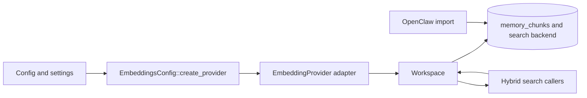

# Axinite embedding integrations

## Front matter

- **Status:** Draft implementation reference for the currently shipped
  embedding integrations.
- **Scope:** The supported embedding providers, the provider abstraction and
  factory path, and the ways embeddings are generated, stored, and consumed in
  axinite.
- **Primary audience:** Maintainers and operators who need to change embedding
  behaviour, add a provider, or understand how semantic retrieval is wired into
  workspace memory.
- **Precedence:** The code in `src/workspace/`, `src/config/`, `src/app.rs`,
  `src/cli/`, and `src/db/` is the source of truth. The operator-facing
  command-line and environment reference remains
  `docs/configuration-guide.md`, and the backend-specific persistence reference
  remains `docs/database-integrations.md`.

## 1. Design scope

Axinite treats embeddings as an optional subsystem layered on top of workspace
memory. The application still supports document storage, chunking, and
full-text search when no embedding provider is active. When a provider is
active, the workspace augments those same documents and chunks with dense
vectors and uses them for semantic ranking.

This document covers the implemented integration, not the intended future one.
It focuses on four questions:

- which embedding providers the current code can instantiate
- which interfaces and adapters separate provider-specific code from the rest
  of the runtime
- how embeddings move from configuration and provider calls into stored memory
  chunks and search requests
- where the current implementation degrades gracefully, falls back, or still
  contains documentation drift

## 2. Integration model

### 2.1 High-level flow

Embeddings enter the runtime through one factory path and leave it through one
main consumer path.

Figure 1. Embedding data flow from configuration to storage and retrieval.

The normal runtime path is:

1. Resolve `EmbeddingsConfig` from environment and persisted settings.
1. Build an `Arc<dyn EmbeddingProvider>` through
   `EmbeddingsConfig::create_provider()`, or return `None`.
1. Attach that provider to `Workspace` with `with_embeddings()`.
1. Use the workspace to generate query embeddings for search and chunk
   embeddings for indexing or backfill.
1. Hand the resulting vectors to the selected database backend for storage or
   ranking.

One import path deliberately bypasses provider generation. OpenClaw memory
import can ingest precomputed embeddings and write them directly into chunk
rows. That means "embedding integration" in axinite includes both generated
vectors and externally supplied ones.

### 2.2 Boundary between generic and provider-specific code

The design is intentionally narrow:

- provider-specific HTTP, auth, and response parsing live in
  `src/workspace/embeddings.rs`
- configuration resolution and provider selection live in
  `src/config/embeddings.rs`
- all normal runtime consumers talk only to `Workspace`, not directly to a
  provider implementation
- database backends receive `Option<&[f32]>` rather than a provider handle

This keeps most of the host agnostic about which provider produced a vector.
The rest of the application only needs to know whether a provider exists and
what vectors to store or query with.

## 3. Provider interfaces and adapters

### 3.1 Core provider contract

The central interface is the `EmbeddingProvider` trait.

Table 1. `EmbeddingProvider` surface and current meaning.

| Method | Purpose | Current use in axinite |
|--------|---------|------------------------|
| `dimension()` | Reports the expected vector width. | Used for configuration coherence and provider metadata. |
| `model_name()` | Reports the upstream model identifier. | Used for diagnostics and logging. |
| `max_input_length()` | Reports the maximum accepted character length. | Enforced before each provider call. |
| `embed(text)` | Generates one embedding for one text input. | Used by query-time search, document reindexing, and background backfill. |
| `embed_batch(texts)` | Generates embeddings for multiple texts. | Implemented by real adapters, but not currently used by the live workspace paths. |

The trait is small on purpose. Axinite does not currently model provider-side
batch sizing rules, token accounting, retry policies, or streaming behaviour as
separate abstractions. The interface expresses only the minimum the workspace
needs: metadata plus a way to turn text into vectors.

### 3.2 Shared error model

All provider adapters normalize failures into `EmbeddingError`.

Table 2. Shared embedding error model.

| Variant | Meaning |
|---------|---------|
| `HttpError(String)` | Transport failure or non-success upstream response that is not promoted into a more specific variant. |
| `InvalidResponse(String)` | The upstream response body did not match the expected schema or shape. |
| `RateLimited { retry_after }` | The upstream service returned a throttling response and optionally exposed `retry-after`. |
| `AuthFailed` | Authentication failed, usually because the upstream returned HTTP `401` or the NEAR AI session token could not be loaded. |
| `TextTooLong { length, max }` | The input exceeded the provider's current maximum accepted character count. |

This shared error model is what lets the workspace treat provider failures as
operational issues rather than as backend-specific control flow. The workspace
logs warnings, stores chunks without vectors when needed, and keeps the rest of
the memory write or search path alive.

### 3.3 Factory adapter

`EmbeddingsConfig::create_provider()` is the other important interface. It is
not the data-plane provider trait; it is the control-plane adapter that bridges
config into a concrete provider instance.

It takes:

- the resolved embedding config
- the NEAR AI base URL
- the shared `SessionManager`

It returns either:

- `Some(Arc<dyn EmbeddingProvider>)` when embeddings are enabled and the chosen
  provider can be constructed
- `None` when embeddings are disabled or the OpenAI path is selected without an
  API key

That `Option` return type is important. The rest of the runtime is written to
operate cleanly without embeddings, so "no provider" is a normal mode rather
than a startup error.

## 4. Supported providers

### 4.1 Provider matrix

Table 3. Supported embedding providers in the current runtime.

| Provider string | Adapter type | Default model | Default dimension | Auth shape | Endpoint shape |
|-----------------|--------------|---------------|-------------------|------------|----------------|
| `openai` | `OpenAiEmbeddings` | `text-embedding-3-small` | `1536` | `OPENAI_API_KEY` bearer token | `POST https://api.openai.com/v1/embeddings` |
| `nearai` | `NearAiEmbeddings` | `text-embedding-3-small` | `1536` | Session token from `SessionManager` | `POST {base_url}/v1/embeddings` |
| `ollama` | `OllamaEmbeddings` | `nomic-embed-text` | `768` | No separate credential in this layer | `POST {base_url}/api/embed` |
| test-only | `MockEmbeddings` | none | caller supplied | none | no external HTTP call |

Only the first three rows are operator-facing runtime providers. The mock
provider exists to support deterministic tests and should not be described as a
user-selectable deployment option.

### 4.2 OpenAI

`OpenAiEmbeddings` is the direct adapter for OpenAI's embeddings API. It uses
bearer authentication from `OPENAI_API_KEY` and posts one or more input texts
to `https://api.openai.com/v1/embeddings`.

The implementation includes built-in constructors for:

- `text-embedding-3-small` at `1536`
- `text-embedding-ada-002` at `1536`
- `text-embedding-3-large` at `3072`

The general `with_model()` constructor permits custom model and dimension
pairings. The adapter explicitly maps HTTP `401` to `AuthFailed` and HTTP `429`
to `RateLimited`, including `retry-after` parsing when the header is present.

### 4.3 NEAR AI

`NearAiEmbeddings` is the NEAR AI adapter. It looks like the OpenAI path in
shape, but not in credential handling. The adapter does not take a dedicated
embedding API key. Instead it reuses the shared `SessionManager` and requests a
bearer token through `get_token()`.

That design has two operational consequences:

- the embedding path shares session state with other NEAR AI-backed provider
  integrations
- credential health is tied to the local session file and onboarding state,
  not to `NEARAI_API_KEY`

The default model and dimension are `text-embedding-3-small` and `1536`. Like
the OpenAI adapter, it treats HTTP `401` as `AuthFailed` and HTTP `429` as
`RateLimited`.

### 4.4 Ollama

`OllamaEmbeddings` is the local adapter for Ollama's embedding endpoint. It
posts to `{base_url}/api/embed`, defaults to `nomic-embed-text` at dimension
`768`, and supports custom model and dimension overrides through
`with_model()`.

This adapter behaves slightly differently from the cloud-backed ones. After it
parses the upstream response, it validates that every returned vector has the
configured dimension. If any vector width differs, it returns
`InvalidResponse` instead of storing potentially incompatible data.

Ollama is also the only currently supported runtime path that does not require
an external credential in the embedding config layer.

### 4.5 Mock provider

`MockEmbeddings` is a deterministic hash-based provider used in tests. It is
useful for exercising chunk storage, search, and embedding call sites without
making network requests or relying on provider-specific response formats.

It matters for maintainers because it proves the provider contract is intended
to be small and swappable, but it is not part of the supported operator-facing
suite.

## 5. Configuration and effective defaults

### 5.1 Resolved configuration surface

The resolved runtime config for embeddings combines persisted settings and
environment variables.

Table 4. Embedding-specific config surface.

| Setting | Meaning |
|---------|---------|
| `EMBEDDING_ENABLED` | Enables or disables embedding generation and query-time vector search. |
| `EMBEDDING_PROVIDER` | Selects `openai`, `nearai`, or `ollama`. |
| `EMBEDDING_MODEL` | Selects the embedding model identifier passed to the adapter. |
| `EMBEDDING_DIMENSION` | Overrides the inferred vector width. |
| `OLLAMA_BASE_URL` | Selects the Ollama base URL, and also serves other Ollama-backed subsystems. |
| `OPENAI_API_KEY` | Supplies the OpenAI credential when the OpenAI path is used. |

For the full CLI and environment reference, including precedence rules, see
`docs/configuration-guide.md`.

### 5.2 Dimension inference

When `EMBEDDING_DIMENSION` is not set, `default_dimension_for_model()` infers
the dimension from a small built-in mapping:

- `text-embedding-3-small` -> `1536`
- `text-embedding-3-large` -> `3072`
- `text-embedding-ada-002` -> `1536`
- `nomic-embed-text` -> `768`
- `mxbai-embed-large` -> `1024`
- `all-minilm` -> `384`
- any other model name -> `1536`

This is a pragmatic compromise rather than a fully provider-aware registry.
When maintainers add a model with a different width, either the environment
must set `EMBEDDING_DIMENSION` explicitly or the code must extend the inference
table.

### 5.3 Effective defaults and default mismatches

There are two default sources worth distinguishing:

- `EmbeddingsSettings` defaults the provider to `nearai`
- `EmbeddingsConfig::default()` defaults the provider to `openai`

In normal runtime flow, `EmbeddingsConfig::resolve()` reads from
`Settings::embeddings`, so the effective default is usually the settings-driven
`nearai` path when embeddings are later enabled. The separate `Default`
implementation still matters for code that constructs `EmbeddingsConfig`
directly, which makes the mismatch worth calling out.

Embeddings are disabled by default in both layers.

### 5.4 Validation behaviour

Configuration validation is intentionally soft:

- if embeddings are disabled, provider creation returns `None`
- if `provider=ollama`, provider creation succeeds without a separate secret
- if `provider=nearai`, provider creation succeeds and defers auth failure until
  the session token is needed
- if the provider string is unknown, the factory falls through to the OpenAI
  branch instead of raising a config error
- if that fallback OpenAI branch has no API key, provider creation returns
  `None` and logs a warning

This makes the runtime resilient, but it also means mistyped provider names
can silently degrade into "embeddings disabled in practice".

## 6. Runtime usage in the application

### 6.1 Startup wiring

`AppBuilder::init_tools()` creates the embedding provider once during startup.
If a database backend is available, it creates a `Workspace`, injects the
provider with `with_embeddings()`, and registers memory tools against that
workspace.

That leads to two important properties:

- embeddings are currently a workspace feature, not a general-purpose service
  passed through the rest of the runtime
- if the application has no database-backed workspace, provider construction
  has no normal consumer path

### 6.2 Query-time search

Search is the main read-side sink for embeddings.

Table 5. Query-time embedding consumers.

| Caller | Path | Behaviour |
|--------|------|-----------|
| `memory_search` tool | Agent tool layer -> `Workspace::search()` | Generates a query vector when a provider exists, otherwise performs Full-Text Search (FTS)-only search. |
| Web memory API | `/api/memory/search` -> `Workspace::search()` | Reuses the same workspace search behaviour as the tool path. |
| Memory CLI | `ironclaw memory ...` -> `Workspace` | Resolves the same provider config and attaches it to a CLI-local workspace. |

The search layer defaults to hybrid retrieval. `SearchConfig::default()`
enables both Full-Text Search (FTS) and vector search, then combines ranked
results through Reciprocal Rank Fusion (RRF). If no provider exists, the query
embedding is `None`, so the backend receives only the FTS side of the request.

### 6.3 Write-side chunk indexing

Embeddings are also used when the workspace writes or mutates documents.
`reindex_document()` chunks the document, then tries to embed each chunk before
storing it. If embedding generation fails for a chunk, the write still
completes and the chunk is inserted with `None` for its embedding.

This is a deliberate fault-containment decision. Axinite treats document
durability as more important than perfect semantic coverage.

### 6.4 Background backfill

After workspace seeding and import, startup spawns `backfill_embeddings()` when
a provider exists. That routine:

1. fetches chunks that still have no embedding
1. embeds them one by one
1. updates the stored chunk rows in place

If no provider exists, `backfill_embeddings()` returns `0` immediately. If
provider calls fail during backfill, the task logs warnings instead of failing
the wider host startup path.

### 6.5 Import and externally supplied embeddings

OpenClaw memory import is the main path that writes embeddings without calling a
provider adapter. It inserts the chunk first and, if the import payload already
contains an embedding, updates the stored chunk with that vector directly.

That means the workspace schema and search paths are not tied exclusively to
vectors generated inside axinite. They can also consume imported embeddings,
subject to backend compatibility.

## 7. Storage and retrieval behaviour

### 7.1 Workspace storage contract

The workspace stores embeddings at the chunk level rather than at the document
level. Query-time retrieval therefore compares the query vector against chunk
vectors, not whole-document summaries.

This matters because:

- retrieval granularity follows chunk boundaries
- reindexing can replace chunk vectors independently of document metadata
- partial embedding coverage is valid, because some chunks may have vectors and
  others may not

### 7.2 Backend-specific search paths

The embedding providers are backend-agnostic, but search backends are not.

Table 6. Backend-specific vector search behaviour.

| Backend | Vector behaviour |
|---------|------------------|
| PostgreSQL with `pgvector` | Uses the query embedding for vector ranking and fuses that ranking with FTS results through RRF. |
| libSQL | Attempts `vector_top_k(...)`, but falls back to FTS-only when the vector index is unavailable after the flexible-dimension migration path. |

The backend-specific details and trade-offs are covered in more depth in
`docs/database-integrations.md`. The important point here is that "provider
configured" does not necessarily mean "vector ranking active" on every backend.

### 7.3 Batching reality

All three real adapters implement `embed_batch()`, but the live workspace paths
still call `embed()` one item at a time for:

- query embeddings
- chunk indexing during reindexing
- background backfill

So the current system is batch-capable at the adapter layer, but not yet
batch-oriented at the application layer.

## 8. Operational caveats and current drift

### 8.1 Setup and settings drift around Ollama

The runtime factory and provider code support `ollama`, but not every adjacent
surface has caught up. The persisted `EmbeddingsSettings` comment still
describes only `openai` and `nearai`, and the onboarding wizard plus setup
documentation expose NEAR AI and OpenAI but not Ollama as a selectable
embedding provider.

That is documentation and setup drift, not a limit in the runtime factory.

### 8.2 Doctor heuristic for NEAR AI

`check_embeddings()` in the doctor CLI does not validate a live NEAR AI token
exchange. It checks whether the default session file exists and is non-empty,
because the runtime adapter ultimately uses `SessionManager::get_token()`
instead of a separate embedding credential.

This is a practical readiness check, not a guarantee that the next embedding
request will succeed.

### 8.3 Provider-specific failure messaging

The backfill warning text is still OpenAI- and Ollama-centric. On auth failure
it suggests checking `OPENAI_API_KEY` or switching to Ollama for local
embeddings. That guidance is incomplete for NEAR AI session failures, where the
real issue is often missing or expired session state.

### 8.4 Older comments and README drift

Some older workspace commentary predates the current backend behaviour, notably
around libSQL vector search and surrounding memory documentation. When there is
conflict, the current code path and this document should win over older module
notes.
