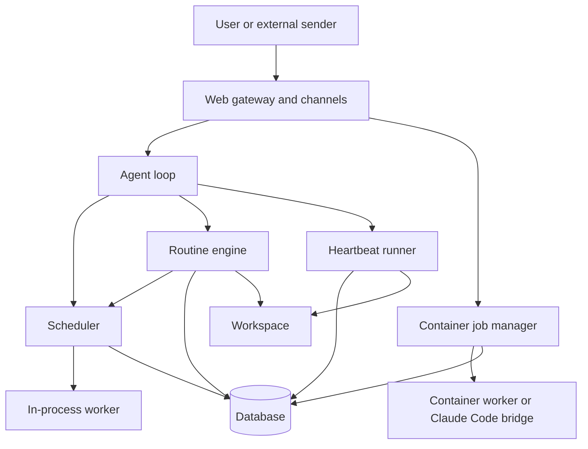

# Axinite jobs and routines

## Front matter

- **Status:** Draft implementation reference for the current scheduling and
  proactive-task system.
- **Scope:** The in-process agent job scheduler, the task model, sandbox job
  touchpoints, the routines engine, the heartbeat runner, and the main
  persistence and gateway surfaces that expose them.
- **Primary audience:** Maintainers and contributors who need to change how
  axinite schedules work, runs background activity, or exposes jobs and
  routines through tools and the web gateway.
- **Precedence:** The code in `src/agent/`, `src/context/`, `src/tools/`,
  `src/channels/web/`, `src/orchestrator/`, and `src/db/` is the source of
  truth. `docs/configuration-guide.md` remains the operator reference for the
  relevant settings and environment variables.

## 1. Design scope

Axinite does not have one generic "task runner". It has four related but
distinct execution families:

- in-process agent jobs, which are scheduler-managed LLM worker runs
- sandbox jobs, which run through the orchestrator and container workers
- routines, which are persistent proactive rules that may run inline or dispatch
  full jobs
- heartbeat, which is a periodic checklist runner for workspace-maintenance and
  attention routing

These families share storage, notification channels, and some web surfaces, but
they do not share one execution engine. This document explains the boundaries
between them, the hand-off points, and the places where the current code still
shows implementation gaps.

## 2. Execution families at a glance

Table 1. Execution families in the current application.

| Family | Primary owner | Persistence model | Main triggers | Tool access |
|--------|---------------|-------------------|---------------|-------------|
| Agent job | `Scheduler` plus `Worker` | `ContextManager` in memory, optionally mirrored into `agent_jobs` and related tables | Commands, built-in tools, gateway restart, routine full-job dispatch | Full agent tool loop |
| Sandbox job | `ContainerJobManager` plus container worker | `sandbox_jobs`, `job_events`, and orchestrator state | `create_job` tool in sandbox mode, gateway restart | Worker or Claude Code inside a container |
| Routine | `RoutineEngine` | `routines`, `routine_runs`, and routine conversation threads | Cron polling, channel-message matches, structured system events, manual fire | Either inline lightweight loop or delegated full job |
| Heartbeat | `HeartbeatRunner` | Workspace `HEARTBEAT.md` plus a dedicated heartbeat conversation | Fixed interval timer, subject to quiet hours | No general tool loop; single checklist-oriented LLM turn |

Figure 1. High-level relationship between jobs, routines, heartbeat, and the
shared gateway.

## 3. In-process agent job system

### 3.1 Job context and state model

The in-process job system revolves around `JobContext` and `ContextManager`.
`ContextManager` owns the live in-memory set of job contexts and a per-job
scratch `Memory`, while `JobContext` carries the durable and runtime metadata
that workers and tools need.

Table 2. Core job state model.

| Type | Role |
|------|------|
| `JobContext` | Holds the job ID, state, user ownership, title and description, cost and token counters, timestamps, metadata, extra environment, trace interceptor, tool-output stash, and default timezone. |
| `ContextManager` | Creates jobs, enforces the active-job limit, updates contexts atomically, tracks per-job memory, lists active jobs, and removes completed jobs from memory. |
| `JobState` | Models `pending`, `in_progress`, `completed`, `submitted`, `accepted`, `failed`, `stuck`, and `cancelled`, with explicit transition rules. |

The important design choice is that context creation and capacity enforcement
are separate from worker spawning. `ContextManager::create_job_for_user()`
creates an in-memory record first, then `Scheduler::dispatch_job()` applies
metadata, persists it if a database is present, and only then schedules a
worker.

### 3.2 Scheduler responsibilities

`Scheduler` is the owner of in-process job execution. It depends on:

- `AgentConfig` for capacity, timeout, and token-budget settings
- `ContextManager` for job lifecycle state
- `LlmProvider` for worker reasoning
- `SafetyLayer` for tool validation and output wrapping
- `ToolRegistry` for actual tool execution
- optional `Database` for persistence
- `HookRegistry` for lifecycle hooks
- optional SSE sender and optional HTTP recording interceptor

Its main responsibilities are:

- create and dispatch new jobs through `dispatch_job()`
- enforce `max_parallel_jobs`
- transition jobs into `in_progress`
- spawn `Worker` tasks and track them in an in-memory map
- expose follow-up control through `stop()`, `send_message()`,
  `running_jobs()`, and `stop_all()`
- spawn lightweight subtasks for tool execution and custom background handlers

`dispatch_job()` is the preferred entry point. It creates the job context,
caps user-supplied `max_tokens` against the configured limit, persists the job
before worker start so foreign-key writes remain valid, and then schedules the
worker.

### 3.3 Task model and subtasks

The scheduler uses `Task` as its internal unit of scheduled work.

Table 3. `Task` variants and where they are used.

| Variant | Meaning | Current use |
|---------|---------|-------------|
| `Task::Job` | Full LLM-driven job | Reserved for scheduler-managed jobs, but rejected from `spawn_subtask()` because full jobs must go through `schedule()` and the full persistence path. |
| `Task::ToolExec` | One tool execution tied to a parent job | Used for lightweight parallel or isolated tool execution. |
| `Task::Background` | Custom async handler with no LLM loop | Mainly a framework extension point and test hook. |

Subtasks are intentionally weaker than full jobs. They:

- do not create a durable job record of their own
- return through a `oneshot` result channel
- are tracked in a separate in-memory `subtasks` map
- can be batched with `spawn_batch()`

Tool subtasks still run through the safety layer, parameter validation, and
approval checks. One current limitation is explicit in the source: subtask
execution does not yet propagate the parent job's `ApprovalContext`, which is
called out as a TODO in `scheduler.rs`.

### 3.4 Worker execution and monitoring

The scheduler's worker path is message-driven. Each scheduled job gets an
`mpsc` channel and a spawned `Worker`, then receives `WorkerMessage::Start`.
The same channel also supports:

- `Stop`
- `Ping`
- `UserMessage(String)` for follow-up prompts

This is how the scheduler and the web gateway can continue interacting with a
running job after initial dispatch.

For sandbox-oriented follow-up visibility, `job_monitor.rs` bridges selected
SSE events back into the main agent loop as synthetic `IncomingMessage`
records. It forwards assistant messages and final job results, but
intentionally skips tool-use and status noise so those events do not flood the
main conversation context.

### 3.5 Persistence and self-repair

The in-process job path persists into the `JobStore` interface and associated
tables such as `agent_jobs`, `job_actions`, and LLM-call records. Both the
PostgreSQL and libSQL backends implement this trait.

That persistence is only a partial mirror of the live `JobContext`. The worker
and scheduler keep the authoritative state in memory, while the current
database update path mainly writes status and failure reason changes after
initial job creation. As a result, some runtime fields such as transition
history, free-form metadata, and the user timezone do not round-trip cleanly
through DB-backed job views today.

The agent loop also starts a background self-repair task. That task:

- periodically checks for jobs already marked `stuck`
- attempts recovery by calling `attempt_recovery()` on the context
- optionally emits user-visible notifications on success, permanent failure, or
  manual intervention
- separately checks for broken tools through the tool-failure store

This is not a full watchdog. In the current implementation, the self-repair
layer detects stuck jobs by looking for the explicit `stuck` state, not by
using elapsed time from `stuck_threshold`. The source marks that time-based
threshold handling as a TODO.

### 3.6 User-facing touchpoints

The in-process job system is reachable from multiple surfaces:

- message intents such as create, list, check status, cancel, and help in
  `commands.rs`
- built-in tools such as `create_job`, `list_jobs`, `job_status`,
  `cancel_job`, `job_events`, and `job_prompt`
- web gateway routes under `/api/jobs`
- gateway restart and cancel handlers for agent-job records

The important operational detail is that the gateway presents agent jobs and
sandbox jobs through one combined jobs surface. The UI and REST API therefore
show a heterogeneous "jobs" view backed by two different runtime systems.

## 4. Sandbox job path

Sandbox jobs are adjacent to the scheduler, not part of it. They are created by
the same `create_job` tool surface when sandbox mode is configured, but the
runtime path changes completely:

- the tool persists a `SandboxJobRecord`
- `ContainerJobManager::create_job()` mints a per-job token and prepares the
  container handle
- the orchestrator starts either a normal worker container or a Claude Code
  bridge container
- status and events flow back through `sandbox_jobs`, `job_events`, the
  orchestrator handle map, and SSE broadcast

The web gateway folds these records into the jobs UI by:

- listing sandbox jobs first
- normalizing `creating` into `pending` and `running` into `in_progress`
- exposing project-file browsing routes for sandbox jobs only
- supporting cancel and restart through the container job manager

This makes sandbox jobs look like part of the same task system from the user's
perspective, but they are an orchestration subsystem with a different worker
runtime, different persistence tables, and different follow-up affordances.

## 5. Routines engine

### 5.1 Routine data model

Routines are persistent, user-owned records with a trigger, an action,
guardrails, notification settings, and runtime state.

Table 4. Routine model components.

| Component | Current implementation |
|-----------|------------------------|
| Trigger | `cron`, `event`, `system_event`, or `manual` |
| Action | `lightweight` or `full_job` |
| Guardrails | `cooldown`, `max_concurrent`, and `dedup_window` |
| Notify config | Channel, user, and per-status notification switches |
| Runtime state | `last_run_at`, `next_fire_at`, `run_count`, `consecutive_failures`, and opaque `state` JSON |
| Run record | `RoutineRun` with trigger detail, status, summary, token count, and optional linked job ID |

Triggers and actions both serialize into a type tag plus JSON config. That is
the main extension seam for new trigger or action kinds: new enum variants must
be reflected in the DB conversion helpers, persistence adapters, and any tool
or API schema that exposes them.

### 5.2 Trigger evaluation model

`RoutineEngine` runs two independent evaluation paths:

- a cron ticker that polls `list_due_cron_routines()` every configured interval
- an in-memory event matcher called synchronously from the agent main loop after
  each handled message

It also exposes `emit_system_event()` for structured, non-message triggers and
`fire_manual()` for explicit user or tool invocation.

Event-driven routines are cached in memory as compiled matchers. That makes the
post-message check cheap, but it also means routine mutations must refresh the
cache explicitly.

### 5.3 Action modes

The routines engine supports two execution modes with very different trade-offs.

Table 5. Routine action modes.

| Mode | Execution path | Capabilities | Trade-offs |
|------|----------------|--------------|------------|
| `lightweight` | Inline in `RoutineEngine` | Workspace context loading, optional lightweight tool loop, direct notification, no scheduler dependency | Small, bounded, and cheap, but deliberately limited |
| `full_job` | Delegated to `Scheduler::dispatch_job_with_context()` | Full worker loop, full job persistence, tool permissions, linked job ID, existing job tooling | Requires a scheduler, returns quickly rather than waiting for final job outcome |

`full_job` routines package the routine's notify target into job metadata and
construct an `ApprovalContext` so explicitly permitted `Always`-gated tools can
run without interactive approval. The run record is linked to the dispatched
job ID after successful dispatch.

`lightweight` routines take a different path. They load workspace context files,
optionally load a routine-specific state file under `routines/<safe-name>/`,
and then either:

- make one plain LLM call, or
- run a simplified tool loop with a hard iteration cap

The lightweight tool loop is intentionally constrained:

- maximum 3 to 5 iterations, capped in config
- sequential tool execution only
- no hooks
- no approval dialogs
- only `ApprovalRequirement::Never` tools are allowed

This is a deliberate safety boundary for externally triggered routines.

### 5.4 Persistence and notifications

Routine definitions live behind `RoutineStore`, which exposes CRUD operations,
queries for event and due-cron routines, runtime-state updates, run tracking,
concurrent-run counts, and run-to-job linking.

Each completed routine run also writes to a dedicated conversation thread via
`get_or_create_routine_conversation()`. Notifications are then routed as
`OutgoingResponse` values with routine metadata and either:

- sent to the configured channel and user, or
- broadcast to all channels if the preferred route fails

### 5.5 User-facing touchpoints

Routines are reachable through:

- seven built-in tools:
  `routine_create`, `routine_list`, `routine_update`, `routine_delete`,
  `routine_fire`, `routine_history`, and `event_emit`
- gateway endpoints under `/api/routines`
- the agent loop's post-message event-trigger check

There is a notable asymmetry here. The tool path refreshes the routine
engine's event cache after create, update, and delete. The web toggle and
delete handlers update the database, but do not refresh the event cache in the
current code. That means the in-memory matcher set can drift from the database
until the next process restart or tool-driven refresh.

## 6. Heartbeat and hygiene

Heartbeat is a separate proactive runner, not a routine special case. It reads
`HEARTBEAT.md` from the workspace at a fixed interval, evaluates quiet hours,
and sends one checklist-focused prompt to the cheap LLM provider.

Its behaviour is intentionally narrow:

- skip entirely when disabled
- skip during configured quiet hours
- skip when `HEARTBEAT.md` is effectively empty
- treat `HEARTBEAT_OK` as the no-action sentinel
- persist findings into a dedicated heartbeat conversation when a database is
  available

Each tick also spawns workspace hygiene as a background side task so cleanup
never blocks the checklist prompt.

Heartbeat is therefore part of the proactive task system, but it does not share
the routine trigger model or the scheduler's worker model. It is a standalone
periodic assistant call with notification routing.

There is also a separate manual heartbeat path through the command layer. The
`/heartbeat` command constructs a fresh runner and calls `check_heartbeat()`
directly, so it does not reuse the background runner's normal notification or
persistence wiring.

## 7. Dependencies and extension points

### 7.1 Major dependencies

Table 6. Core dependencies by subsystem.

| Subsystem | Hard dependencies | Optional dependencies |
|-----------|-------------------|-----------------------|
| Scheduler | `ContextManager`, `LlmProvider`, `SafetyLayer`, `ToolRegistry`, `HookRegistry`, `AgentConfig` | `Database`, SSE sender, HTTP interceptor |
| Routine engine | `Database`, `Workspace`, `LlmProvider`, notification channel, `ToolRegistry`, `SafetyLayer`, `RoutineConfig` | `Scheduler` for `full_job` routines |
| Heartbeat | `Workspace`, `LlmProvider`, `HeartbeatConfig` | notification channel, `Database`, hygiene config |
| Gateway jobs and routines API | `GatewayState` plus DB-backed store | scheduler slot, job manager, routine engine slot, prompt queue |

The scheduler and routines engine both assume a database-backed runtime for
their full feature set. Without a store, routines do not start. Without a
workspace, both routines and heartbeat are disabled even if their config says
otherwise.

### 7.2 Extension points

Table 7. Main extension points in the current design.

| Area | How to extend it |
|------|-------------------|
| New scheduled work kind | Add a new `Task` variant and scheduler handling, or add a new routine action mode if the work is persistent and proactive. |
| New routine trigger | Add a `Trigger` variant, DB serialization support, engine matching logic, and any tool or API schema support needed to create it. |
| New routine action mode | Add a `RoutineAction` variant, persistence conversion, execution logic in `execute_routine()`, and notification semantics. |
| New user surface | Add a built-in tool, gateway handler, or command intent that calls into the existing scheduler or routine engine rather than bypassing them. |
| New notification sink | Extend the channel layer that already consumes `OutgoingResponse` rather than building a second notification pipeline. |
| New background helper | Implement `TaskHandler` and schedule it as `Task::Background` where a full job would be too heavy. |

The code already leans in this direction. Tool registration and gateway slots
make the scheduler and routine engine injectable rather than globally owned.

## 8. Current limitations and caveats

The current implementation has several constraints that matter for maintainers:

- `dedup_window` is part of the routine schema and persistence layer, but the
  live engine does not enforce event deduplication yet.
- lightweight routines are intentionally limited to sequential tool execution,
  a small iteration budget, and `Never`-approval tools only.
- `full_job` routines fail at dispatch time when no scheduler is available.
- the `create_job` tool has a fallback mode when the scheduler slot is still
  empty; it creates a pending in-memory job that is not scheduled.
- subtask execution does not yet inherit the parent job's approval context.
- self-repair only acts on jobs already marked `stuck`; the configured stuck
  threshold is not yet used for time-based detection.
- tool auto-repair wiring is incomplete. The source marks store and builder
  integration as TODOs.
- the jobs gateway intentionally merges sandbox and agent jobs into one surface,
  which is convenient for operators but easy to misread when debugging.
- DB-backed agent-job views only reflect part of the live in-memory context, so
  fields such as transition history, metadata, and timezone can be incomplete
  or reset in persisted views.
- startup explicitly reconciles stale sandbox jobs, but there is no matching
  rehydrate-or-resume path for in-process scheduler jobs.
- the jobs and routines gateway handlers read broad store views, so the current
  admin surfaces behave more like global operator views than strictly
  per-user-scoped dashboards.
- routine event-cache refresh is explicit, not automatic across every mutation
  surface, so gateway toggles and deletes can leave stale in-memory matchers.
- `heartbeat_state` exists in the schema, but the current runtime does not use
  it.
- the routine config surface includes defaults for cooldown and lightweight
  token limits, but the LLM-facing routine-creation tool still hard-codes `300`
  seconds and `4096` tokens when those values are omitted.

Taken together, these constraints mean the current system is usable and fairly
well-factored, but not yet a single unified scheduler. It is a family of
execution subsystems that cooperate through shared storage, tool registration,
notification routing, and the web gateway.
