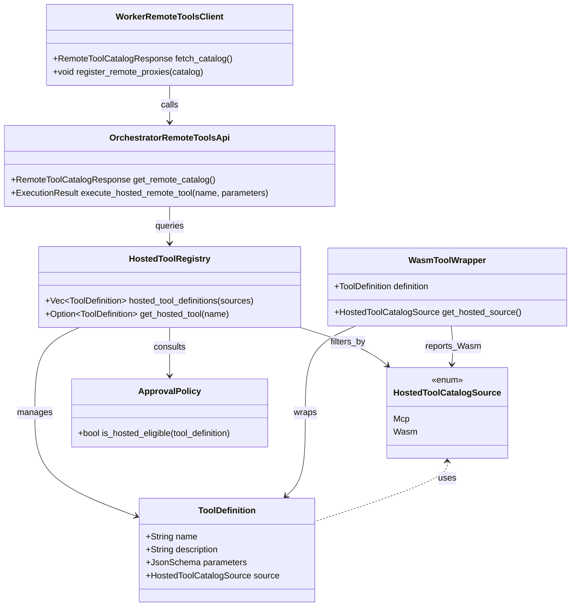
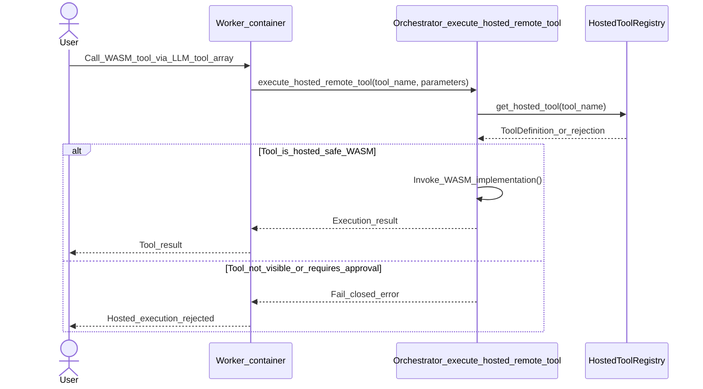

# RFC 0002: Expose WASM tool definitions to LLMs

## Preamble

- **RFC number:** 0002
- **Status:** Proposed
- **Created:** 2026-03-11
- **Implementation status:** Roadmap items `1.2.1` and `1.2.2` are complete.
  Active WASM registration paths now recover guest-exported metadata before
  publication, warn when registration falls back to a placeholder schema, and
  are covered by regression tests for file-loaded, storage-backed, and
  dev-build paths. Hosted workers now receive hosted-visible
  orchestrator-owned WASM definitions through the shared remote-tool catalogue.
  Roadmap items `1.2.3` and `1.2.4` remain open.

## Summary

IronClaw already has the machinery to recover real WebAssembly (WASM) tool
descriptions and schemas from guest exports. The registry can therefore
publish correct `ToolDefinition` values for active WASM tools.

However, the current WASM execution path still carries an older assumption:
schema disclosure is treated as a reactive retry hint on error rather than the
normal interface the large language model (LLM) should receive before its
first call. In
`src/tools/wasm/wrapper.rs`, tool failures still call `description()` and
`schema()` so the model can retry "without us having to include the (large)
schema in every request's tools array."

That assumption is backwards. The model should see the correct schema before it
calls the tool. Error hints should remain supplemental diagnostics, not the
primary contract.

This RFC proposes three changes:

1. Make the proactive `ToolDefinition.parameters` path the normative way WASM
   tool schemas reach the LLM.
2. Treat guest-exported or explicitly overridden WASM schemas as canonical for
   tool advertisement, subject to provider-specific shaping where needed.
3. Relegate schema-bearing error hints to fallback guidance only, and make
   hosted workers receive active orchestrator-owned WASM tool definitions
   through the same remote-tool catalogue proposed for Model Context Protocol
   (MCP) tools.

The LLM-visible interface remains the existing `ToolDefinition` shape:

```json
{
  "name": "github",
  "description": "GitHub integration for repository, issue, PR, and workflow operations.",
  "parameters": {
    "type": "object",
    "properties": {
      "action": {
        "type": "string",
        "enum": ["get_repo", "list_issues", "create_issue"]
      }
    },
    "required": ["action"]
  }
}
```

## Problem

### There are two competing schema surfaces today

IronClaw currently has two different ways a WASM tool schema can reach the
model path:

1. Proactive tool advertisement through `ToolRegistry::tool_definitions()`.
2. Reactive retry hints built from guest `description()` and `schema()` after a
   tool error.

The proactive path is the correct one because it lets the model choose the tool
and format the first call correctly. The reactive path is too late for first-use
success and turns the schema into post-failure recovery data.

### The codebase still encodes the old assumption

The WASM wrapper still says the schema is included on failure so the LLM can
retry without IronClaw having to include the large schema in every request's
tool list. That logic made sense during early bring-up when placeholder metadata
was common and token pressure was the dominant concern.

It no longer matches the intended system contract:

- real WASM metadata can already be recovered at registration time
- `ToolRegistry::tool_definitions()` already emits `tool.parameters_schema()`
- LLM providers already expect schemas in `ToolDefinition.parameters`

The stale assumption is now harmful because it frames accurate WASM schema
disclosure as optional overhead rather than as the core tool-calling interface.

### Hosted mode compounds the problem

Hosted workers build a local tool list and currently do not automatically
receive the canonical orchestrator-owned dynamic tool catalogue. That means
orchestrator-owned WASM tools can be missing from hosted LLM tool definitions
even if their schema is available in the main process.

As a result, hosted mode can still behave as if the only reliable way to teach
the model about a WASM tool's parameters is to let a call fail first and attach
the schema to the error.

## Current State

### What already works

The registration path is much healthier than it used to be:

- `WasmToolWrapper::exported_metadata()` can recover guest `description()` and
  `schema()` exports
- registration can apply real guest metadata before the tool is published
- explicit registration overrides can still win when needed
- `ToolRegistry::tool_definitions()` emits `description` and `parameters` from
  the active tool implementation
- file-loaded, storage-backed, and dev-build registration paths now have
  regression tests that fail if the GitHub WASM fixture regresses back to a
  placeholder schema

This means IronClaw does not need a new schema format for WASM tools. It
already has the right outward-facing structure.

### What is still wrong

The remaining problem is contractual, not structural:

- the code still treats schema-in-error-hint as a normal LLM guidance path
- there is no explicit guarantee that active WASM tools are always advertised
  with their schema before first use
- hosted mode does not yet have a unified remote-tool catalogue for
  orchestrator-owned dynamic tools, including WASM tools

Roadmap items `1.2.1` and `1.2.2` close the first two gaps for in-process and
hosted WASM tools. The remaining work is now to demote schema-bearing retry
hints and add the end-to-end first-call regression coverage tracked under
`1.2.3` and `1.2.4`.

## Goals

1. Ensure active WASM tools are proactively advertised to the LLM with their
   correct parameter schema.
2. Ensure the first call to a WASM tool has the same schema context as any
   built-in tool call.
3. Preserve explicit schema overrides where IronClaw intentionally provides
   host-authored metadata instead of guest metadata.
4. Ensure hosted workers can expose orchestrator-owned WASM tools to the LLM.
5. Keep error hints as supplemental recovery data rather than the primary
   schema-delivery mechanism.

## Non-goals

1. Replacing the WASM WIT interface.
2. Replacing `ToolDefinition` with a WASM-specific tool schema type.
3. Removing all retry hints from WASM tool failures.
4. Solving arbitrary token-budget issues by inventing a second-class schema
   interface for WASM tools.
5. Changing actual WASM execution semantics beyond how tool definitions are
   exposed to the model.

## Design Principles

1. The LLM must see the correct schema before the first call, not only after a
   failure.
2. A WASM tool should look like any other tool at the LLM boundary:
   `name`, `description`, `parameters`.
3. Registration-time schema recovery or override selection is the correct place
   to determine the outward-facing schema.
4. Hosted mode should reuse the canonical orchestrator-owned tool catalogue, not
  reconstruct WASM tool metadata inside the worker.
5. Error hints should help recovery, not compensate for missing normal tool
   metadata.

## Proposal

### 1. Define a single canonical LLM-facing schema path for WASM tools

For every active WASM tool, IronClaw should determine one canonical advertised
schema before the tool is made visible to the LLM.

That canonical schema comes from the first applicable source in this order:

1. explicit host override supplied at registration
2. guest-exported `schema()` recovered from the WASM component
3. placeholder schema only as a last-resort failure fallback, never as the
   intended steady-state advertisement

The selected schema is then published through `ToolDefinition.parameters` on
every tool-completion request.

### 2. Treat retry hints as fallback diagnostics only

The existing hint path in `WasmToolWrapper::execute()` should remain available,
but its role changes:

- good role: explain a failure and help a second attempt
- bad role: act as the main way the model learns the tool contract

Recommended behaviour:

1. Keep the hint path for tool-level errors.
2. Shorten it to a concise recovery message where possible.
3. Avoid assuming the hint must contain the only copy of the schema.
4. Prefer pointing back to the already advertised tool contract instead of
   embedding large schemas in every failure payload.

Example failure message:

```text
GitHub rejected the request because required field `action` was missing.
Retry using the advertised tool schema for `github`.
```

The detailed schema can still be attached when diagnostics warrant it, but that
is now a fallback choice rather than the primary design.

### 3. Guarantee schema advertisement in `ToolRegistry::tool_definitions()`

The system should explicitly guarantee that any WASM tool returned by
`ToolRegistry::tool_definitions()` exposes the same schema IronClaw expects the
LLM to use for its first call.

That guarantee should be documented and tested for:

- file-loaded WASM tools
- storage-backed WASM tools
- explicitly overridden schemas
- hosted-visible remote WASM tools

This changes the contract from "best effort if registration recovered metadata"
to "required interface guarantee."

### 4. Reuse the remote-tool catalogue for orchestrator-owned WASM tools

The companion RFC [0001-expose-mcp-tool-definitions.md](0001-expose-mcp-tool-definitions.md)
proposes a worker-authenticated hosted tool catalogue plus generic remote tool
execution endpoint.

That same mechanism now covers orchestrator-owned active WASM tools.
Roadmap item `1.1.2` is the specific prerequisite that moves hosted-visible
catalogue filtering into the canonical `ToolRegistry` or policy layer. Roadmap
item `1.2.2` explicitly consumes that same canonical hosted-visible
filter seam, extending its eligibility rules to include orchestrator-owned WASM
tools, rather than reconstructing hosted visibility in a second WASM-specific
adapter path.

Figure 1. Hosted remote-tool catalogue flow for MCP and orchestrator-owned
WASM tools.



Figure 2. Hosted worker execution flow for an advertised orchestrator-owned
WASM tool.



Suggested hosted catalogue response:

```json
{
  "tools": [
    {
      "name": "github",
      "description": "GitHub integration for repository and issue operations.",
      "parameters": {
        "type": "object",
        "properties": {
          "action": {
            "type": "string"
          },
          "owner": {
            "type": "string"
          },
          "repo": {
            "type": "string"
          }
        },
        "required": ["action"]
      }
    }
  ],
  "catalog_version": 12
}
```

Hosted workers should not infer this schema from error strings. They should
receive the real `ToolDefinition` before the first call, register a proxy
wrapper locally, and execute through the orchestrator.

### 5. Preserve provider-specific shaping without hiding the contract

Some providers impose stricter schema rules than raw guest exports permit.
IronClaw already has provider-bound schema validation and normalization logic
for OpenAI-compatible tool calling.

The correct pattern for WASM tools is:

1. recover the canonical schema
2. validate or normalize it for the active provider
3. expose the resulting provider-safe schema in `ToolDefinition.parameters`

What should not happen:

1. omit the schema from normal tool advertisement
2. rely on a later tool error to reveal the contract
3. force the LLM to infer call structure from prose alone

If IronClaw needs both a canonical guest schema and a provider-safe advertised
schema, it should track both internally. The LLM still needs the advertised one
up front.

### 6. Keep WASM tools first-class at the LLM boundary

The model should not need to know or care that a tool is backed by WASM. A
WASM tool should be represented exactly like any other tool:

| Field | Meaning | Source |
| --- | --- | --- |
| `name` | Stable tool name | wrapper/registration |
| `description` | Human-readable contract | explicit override or guest export |
| `parameters` | Schema | override or guest export, then provider shaping |

That is the only interface the model should need for first-call correctness.

## Why This Is The Correct Boundary

This boundary lines up with how IronClaw already works:

- WASM registration decides the visible metadata
- `ToolRegistry` already knows how to emit `ToolDefinition`s
- providers already accept structured tool schemas
- error hints are already ancillary data, not the main tool-registration path

The change is therefore a contract cleanup and propagation fix, not a new WASM
subsystem.

It also avoids bad alternatives:

- do not teach the model WASM schemas only through failures
- do not special-case WASM tools into a prose-only interface
- do not keep a hidden belief that large schemas are optional for first use
- do not force hosted mode to rediscover schemas from execution-time errors

## Detailed Interface

### In-process LLM interface

No new LLM-facing structure is required. Every active WASM tool should appear in
the tool list as:

```rust
pub struct ToolDefinition {
    pub name: String,
    pub description: String,
    pub parameters: serde_json::Value,
}
```

### Hosted worker interface

Use the same remote-tool catalogue and execution transport as the MCP RFC:

```text
GET  /worker/{job_id}/tools/catalog
POST /worker/{job_id}/tools/execute
```

The catalogue includes hosted-visible active WASM tools alongside other
orchestrator-owned tools.

### Error interface

Tool-level failures may still return a recovery hint, but that hint should be
documented as supplemental.

Suggested shape:

```text
<tool-specific failure message>
Recovery hint: check the advertised schema for `<tool-name>`.
```

Full schema embedding in the hint should be optional diagnostic behaviour, not a
design requirement.

## Testing Strategy

This change needs both interface tests and behavioural tests.

### Unit tests

1. Active file-loaded WASM tools expose guest or override schema through
   `ToolRegistry::tool_definitions()`.
2. Active storage-backed WASM tools expose the correct precedence-selected
   schema through `ToolRegistry::tool_definitions()`.
3. Hosted tool catalogue construction includes active hosted-visible WASM tools
   with their advertised schema.
4. Retry hints remain available on tool failure but are no longer the only
   place the schema can be observed.

### Behavioural tests

1. A reasoning request including an active WASM tool sends a non-placeholder
   `parameters` schema to the provider before any call is made.
2. A hosted worker can see and call an orchestrator-owned WASM tool without
   requiring an initial schema-bearing error.
3. A malformed first call still returns a helpful hint, but that hint matches
   the already advertised schema rather than replacing it.

### Regression target

The key regression to lock down is:

> An active WASM tool's parameter schema is visible in the tool definitions sent
> to the LLM before first execution, and not only after a tool failure.

That is the contract that removes first-call guesswork.

## Migration Plan

1. Document the normative rule that active WASM tool schemas must be exposed in
   `ToolDefinition.parameters`.
2. Audit registration paths to ensure they all satisfy that rule.
3. Extend the hosted remote-tool catalogue to include orchestrator-owned WASM
   tools, reusing both:
   - the shared worker-orchestrator transport contract introduced for RFC 0001
   - the canonical hosted-visible filter seam introduced by roadmap item `1.1.2`

   Do not define a second hosted-catalogue boundary or a parallel WASM-only
   eligibility pass.
4. Reframe WASM retry hints as supplemental diagnostics in code comments,
   behaviour, and tests.
5. Add explicit end-to-end tests for proactive schema exposure.

## Alternatives Considered

### Alternative 1: Keep schema-in-error-hint as the main WASM contract

Rejected. This guarantees a bad first call whenever the model needs the schema
to format arguments correctly.

### Alternative 2: Expose only a compact prose summary for large WASM schemas

Rejected. Prose summaries are useful secondary guidance, but they are not a
replacement for machine-readable argument structure.

### Alternative 3: Hide complex WASM schemas from some providers to save tokens

Rejected. Token concerns are real, but the right fix is better cataloguing,
provider-specific shaping, or summarization alongside the schema, not removing
the schema from the normal tool interface.

## Open Questions

1. Should full schema-bearing retry hints remain enabled for all WASM tools, or
   only for parse/validation failures?
2. Should IronClaw store both canonical guest schema and provider-normalized
   advertised schema explicitly for observability?
3. Should hosted workers fetch the remote tool catalogue only at startup, or also
   after dynamic tool activation events involving WASM tools?
4. Should UI diagnostics show whether a WASM tool's advertised schema came from
   a guest export or an explicit host override?

## Recommendation

Treat proactive WASM schema advertisement as the contract and retry hints as a
backup.

That means:

- active WASM tools must expose `parameters` before first use
- hosted workers must receive orchestrator-owned WASM tool definitions through
  the remote-tool catalogue using the same shared transport boundary as MCP tools
- provider shaping may adjust the schema, but it must still be present
- execution-time hints should help recovery, not teach the tool for the first
  time

That is the correct fix because it aligns WASM tools with every other
first-class tool in IronClaw: the model gets the contract up front.
