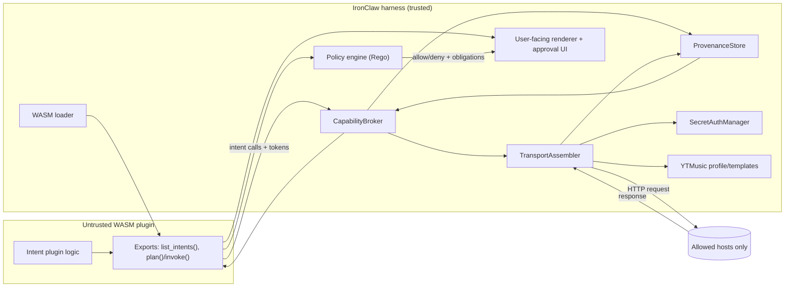
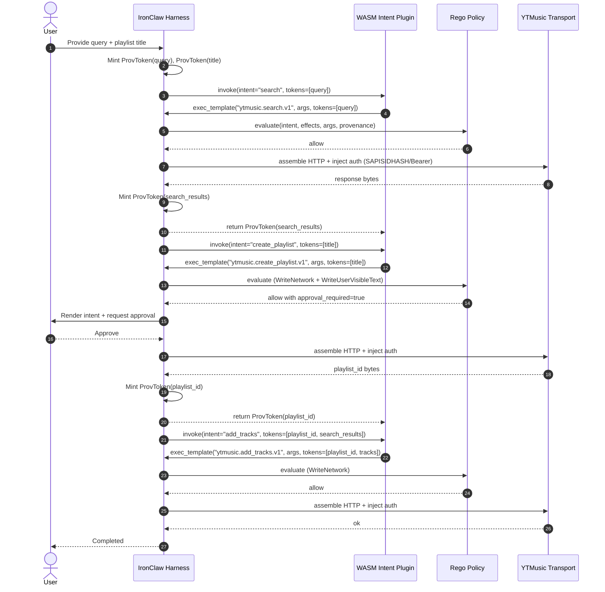

# RFC 0006: Provenance-based, zero-knowledge intent plugins for axinite

## Preamble

- **RFC number:** 0006
- **Status:** Proposed
- **Created:** 2026-03-13

## Executive summary

You can use WIT to declare “intents” in a way that lets a WASM plugin “call its shots” while the harness retains exclusive control of network I/O and secret material. WIT is explicitly a contract language for component interfaces and worlds, and it supports handle-like “resources” that map neatly to opaque provenance tokens. citeturn6search0turn6search1

In Axinite’s IronClaw harness today, the WASM boundary already enforces a deny-by-default capability model: tools call WIT-imported host functions such as `host.http-request`, and the host validates an allowlist, injects credentials at the boundary, and runs a leak detector before/after requests. That gives you a strong base to extend into an intent-first model, but you must change two things to hit “zero-knowledge plugin” semantics reliably:

1) **Stop plugin-controlled secret placement.** IronClaw currently supports placeholder substitution (`{TOKEN}`-style) inside URLs/headers, and separately supports host-based credential injection. The placeholder mechanism weakens non-exfiltration guarantees because a malicious plugin can choose *where* secrets land (URL, body fields, user-visible text, etc.). In a ZK intent mode you should **disable placeholder substitution entirely** and restrict secret injection to harness-owned sinks (typically specific headers).  
2) **Add provenance-aware policy over “semantic operations”.** If a plugin can read account data (search results, playlist IDs) and can also write user-visible/account-persistent fields (playlist names, descriptions), you want the harness to enforce a noninterference-like constraint: secret-derived or remote-derived values must not flow into public sinks without explicit approval. This is not a purely static problem; you need runtime provenance/taint plus a policy engine.

For policy evaluation, entity["organization","Open Policy Agent","rego policy engine"]’s Rego fits the “deny by default, data-in/data-out” model better than Starlark: Rego was purpose-built for expressing policy over structured inputs, and OPA supports compiling policy to WebAssembly for embedding. citeturn5search2turn4search2 Starlark is deterministic and hermetic by design, and works well as a configuration language, but it is still a general-purpose language that tends to produce less auditable “policy-as-code” in practice. citeturn6search4 I recommend **Rego for enforcement**, optionally **Starlark for authoring convenience** (rendered to JSON policy inputs/constraints).

On the YouTube Music side: YTMusic’s unofficial interface commonly uses internal `music.youtube.com/youtubei/v1/*` endpoints (e.g. `browse`, `next`). citeturn13search7turn13search1 Authentication in the ytmusic ecosystem often relies on browser-derived cookies plus a derived `SAPISIDHASH` header: `SAPISIDHASH {ts}_{sha1(ts + " " + SAPISID + " " + origin)}` (origin e.g. `https://music.youtube.com`). citeturn12search3turn12search2turn13search0 If you use OAuth instead, Google’s documentation recommends sending access tokens via `Authorization: Bearer …` headers and using standard refresh flows. citeturn9search1turn9search0

## Current IronClaw components and APIs relevant to an intent model

This section enumerates the Axinite components you will end up touching. I reference paths and symbols so you can jump straight to them in the repo; GitHub web access is not available in this environment, so I cannot attach line-precise citations for repo code, but the identifiers below match current source.

### Current WIT world and host function surface

IronClaw defines a single tool world in `wit/tool.wit`:

- Package: `near:agent@0.3.0`
- World: `sandboxed-tool`
- Imports: `interface host`
- Exports: `interface tool`

The **host interface** includes `log`, `now-millis`, `workspace-read`, `http-request`, `tool-invoke`, and `secret-exists`. The **tool interface** exposes `execute(req) -> response`, plus `schema()` and `description()`.

This is already close to what you need: intents will become *another exported interface/world*, and intent execution will become *either* a host-imported capability (plugin emits “plans”; host executes) *or* a host-owned RPC interface that the plugin calls (plugin requests semantic ops; host executes).

### WASM wrapper, lifecycle, and boundary enforcement

The “hard boundary” lives in `src/tools/wasm/wrapper.rs`:

- It uses `wasmtime::component::bindgen!` against `wit/tool.wit` and instantiates `world: "sandboxed-tool"`.
- Runtime enforcement includes:
  - Fuel metering (`store.set_fuel(...)`) and epoch deadline trap (hard timeout) to pre-empt infinite loops.
  - A **leak detector** invoked on outbound URL/headers/body and on response body prior to returning to WASM.
  - **Allowlist validation** before executing requests.
  - **SSRF / DNS rebinding defence** via `reject_private_ip(&url)` before the request executes (and again for OAuth refresh token URLs).

Important detail for a ZK design: `StoreData::inject_credentials` currently performs **placeholder substitution** over strings (e.g. `{GOOGLE_ACCESS_TOKEN}`), and `http_request` calls it on the URL and header values prior to allowlist checks and leak scanning. Host-based injection happens *after* that, based on host pattern matches.

This is precisely the mechanism you should disable (or gate behind `execution_model != ZK`) because it allows the plugin to control where secret material gets placed.

### Allowlist and HTTP transport security

- `src/tools/wasm/allowlist.rs` implements `AllowlistValidator` over `(host pattern, optional path prefix, optional methods)` and rejects:
  - non-HTTP(S) schemes,
  - URLs with userinfo (`user:pass@host`),
  - URL schemes other than HTTP/HTTPS (and can require HTTPS),
  - path traversal / ambiguous path encodings (via path normalisation and percent-decoding checks).

This is strong groundwork for “permitted hosts only”.

### Credential injection and shared registry

- `src/tools/wasm/credential_injector.rs` defines:
  - `SharedCredentialRegistry` (append-only mapping aggregator)
  - `CredentialInjector` (resolves secret mappings from a `SecretsStore`)
  - `InjectedCredentials` (headers + query params)

In `src/tools/registry.rs`, when registering a WASM tool, IronClaw extracts credential mappings from the tool’s capabilities and adds them to the shared registry. That already gives you a “capability broker” shape, but it is not provenance-aware and it does not distinguish “ZK tools” from “legacy tools”.

### Secrets storage and redaction

- `src/secrets/types.rs` defines:
  - encrypted secret storage (`Secret`)
  - `DecryptedSecret` using a secrecy wrapper (never prints plaintext in `Debug`)
  - credential location types (`CredentialLocation`) including a `UrlPath` placeholder option
- `src/safety/leak_detector.rs` provides pattern-based secret detection (block/redact/warn). It targets API keys and bearer tokens, plus some high-entropy heuristics. This is relevant but **insufficient alone** for provenance-based noninterference; it prevents literal token exfiltration, not “derived” data flows.

### Runtime and sandbox constraints

- `src/tools/wasm/runtime.rs` configures the Wasmtime engine:
  - fuel consumption for deterministic interruption,
  - epoch interruption (timeout backstop),
  - component model enabled,
  - wasm threads disabled.

On the Wasmtime side, deterministic fuel is specifically called out as deterministic and designed for interruption. citeturn4search4 Epoch interruption has had at least one notable historical safety issue when combined with externrefs (CVE-2022-24791); keep your Wasmtime version current and track advisories. citeturn4search1turn4search10

## Design target: WIT-based intent ABI with provenance tokens

### Intent definition goals

An “intent” exists to decouple **plugin authorship** from **side-effect execution**:

- The plugin defines *what it wants to do* in a structured form (intent ID, inputs, semantic template).
- The harness:
  - renders it for user understanding,
  - rejects it if it violates policy,
  - executes it by assembling concrete HTTP requests,
  - injects authentication only at send-time and only into harness-controlled sinks,
  - returns results with provenance metadata.

This matches the confinement intuition in Lampson’s confinement problem: control the channels through which information can flow, and treat non-obvious side channels as part of the threat model. citeturn7search1 It also connects to the noninterference framing (public outputs should not depend on secret inputs). citeturn8search1turn7search48turn8search41

### Why WIT fits

WIT defines contracts (interfaces and worlds) for the component model and supports “resources” that represent non-copyable handles crossing the boundary. citeturn6search0turn6search1 That gives you an ergonomic mechanism for opaque tokens:

- The host can mint a provenance token as a resource handle.
- The guest can store/pass it, but cannot introspect it into a string unless you explicitly provide host calls to do so.
- The host can validate that a given token belongs to a particular provenance class and that using it in a sink is permitted.

### Proposed WIT packages/worlds

You should introduce a **new WIT package version**, rather than mutating `near:agent@0.3.0` in-place, because this change becomes semver-significant for tool components.

A concrete approach:

- Keep `near:agent/tool@0.3.x` for “legacy” tools.
- Add `near:agent/intent@0.1.0` for intentful tools.

At minimum:

- `world intentful-tool` exports an `intent` interface that lets the host enumerate intents and invoke the plugin’s orchestrations.
- The host imports an `intent-host` interface that provides only capability-safe operations (e.g. “execute template X with args Y”) rather than raw `http-request`.

A key design decision: **do you allow plugins to emit new templates, or only reference known ones?** The prompt asks for “symbolic template IDs”, which strongly suggests: the plugin references template IDs, and the host owns the template implementations.

To address your earlier objection (“the harness author must know plugins in advance”), you can still keep template IDs generic: e.g. `http+json.post.v1`, `http+json.get.v1`, plus a “service profile” constraint. The host doesn’t need to know *the plugin*, but it does need to know the *template vocabulary*. That is the stable contract that replaces “knowing plugins”.

### Component interaction diagram



## Concrete code-level changes to implement a provenance-based intent model

I’ll describe changes in terms of: new modules, modifications to existing code, the core types/functions, and why each change matters.

### Add an execution model switch and forbid placeholder substitution in ZK tools

**Problem:** `StoreData::inject_credentials` allows `{PLACEHOLDER}` substitution anywhere the plugin controls strings (URL, headers). That breaks the “harness-only secret sink” rule.

**Change:**
- Extend capabilities schema (`src/tools/wasm/capabilities_schema.rs`) to include:
  - `execution_model: "legacy" | "intent_zk" | "intent_declarative"` (exact names open).
- Thread this into runtime capabilities (`src/tools/wasm/capabilities.rs`) or wrapper config, so the wrapper knows which model applies.

**Implementation sketch:**
- In `src/tools/wasm/wrapper.rs`:
  - Add `execution_model: ExecutionModel` to `StoreData` and to `WasmToolWrapper`.
  - In `http_request`, gate the placeholder substitution:

    - Legacy:
      - `injected_url = inject_credentials(url)`
      - `headers = inject_credentials(header values)`
    - ZK:
      - `injected_url = url` (no substitution)
      - `headers = raw headers` (no substitution)
      - Reject any string containing `{...}` if you want to fail closed.

**Security rationale:** This restores a strict invariant: only the harness can place secrets, and it can only place them into specific sinks (headers) at send time.

### Introduce a WIT intent world and intent manifest schema

You need *both*:
- A runtime ABI (WIT) for **enumerating** and **invoking** intents.
- A static manifest for **preflight review** and **deterministic rendering**.

**New WIT file(s):**
- Add `wit/intent.wit` (new package) containing:
  - `interface intent` (exported by plugin)
  - `interface intent-host` (imported by plugin)
  - `world intentful-tool` (exports intent, imports intent-host)

**Key WIT types:**
- `type template-id = string` (symbolic template name)
- `resource prov-token` (opaque provenance handle)
- `record intent-def { id, title, description, template-id, params, effects }`
- `record intent-call { template-id, args, input-tokens, output-shape }`
- `variant effect { read-network, write-network, write-user-visible, write-account-data, ... }`

The “effects” field makes rendering legible without trusting plugin prose.

**Manifest schema:**
- Extend or complement `<tool>.capabilities.json` with `<tool>.intent.json` or add an `intent` section:
  - `intents: [ {id, title, description, template_id, param_schema, effects, approval_required?} ]`
  - `template_bindings` if you want plugin-supplied bindings (see below).

**Loader changes:**
- In `src/tools/wasm/loader.rs`, on load:
  - Parse intent manifest alongside capabilities.
  - Validate that manifest template IDs exist (known vocabulary).
  - Store manifest in tool metadata for UI rendering.

**Security rationale:** Deterministic rendering requires a stable, host-validated description of what an intent means; otherwise the plugin can present benign text while executing something else.

### Add ZkWasmToolWrapper and disable direct http-request capability for ZK intent tools

Right now, the world `sandboxed-tool` gives the plugin raw `host.http-request`. In a ZK intent model, you want a smaller surface:

- The plugin should call `intent-host.exec_template(template_id, args, tokens)` rather than `http-request`.
- The host should implement templates and verify policy for each call.

**New wrapper type:**
- `src/tools/wasm/zk_wrapper.rs` (new):
  - `struct ZkWasmToolWrapper { … }` implementing `Tool`
  - Instantiates `world intentful-tool` instead of `sandboxed-tool`

You will likely keep `WasmToolWrapper` for legacy tools.

**Registry changes:**
- In `src/tools/registry.rs` and `src/tools/wasm/loader.rs`:
  - Choose wrapper based on `execution_model`.

**Security rationale:** Removing raw HTTP from plugin space is the single biggest reduction in exfiltration surface. You can still support “declarative HTTP templates”, but the host owns translation into raw HTTP.

### Implement ProvenanceStore and taint types

**New module:**
- `src/provenance/mod.rs`
- `src/provenance/store.rs`

**Core types:**

```rust
pub type ProvId = u128; // random, non-guessable

#[derive(Clone, Debug)]
pub enum ProvKind {
    UserInput,
    NetworkResponse { host: String, path: String },
    AccountObject { service: String, object_type: String },
    Derived { from: Vec<ProvId>, rule: String },
}

#[derive(Clone)]
pub struct ProvValue {
    pub kind: ProvKind,
    pub bytes: Vec<u8>,
    pub mime: Option<String>,
}

pub struct ProvenanceStore {
    // maps opaque ids to values + metadata
}
```

**Operations:**
- `mint_user_text(String) -> ProvId`
- `mint_network_response(RequestMeta, bytes) -> ProvId`
- `read_text(ProvId) -> Result<String, ...>` (guarded; see policy)
- `combine(new_kind, inputs) -> ProvId`

**Guest-visible representation:**
- In WIT: `resource prov-token`
- In host: map resource handles to `ProvId`

**Security rationale:** Leak detector catches literal secrets but not higher-level flows. Provenance lets you enforce constraints such as: “a value derived from network responses must not appear in user-visible text sinks without approval”.

### Add CapabilityBroker and TransportAssembler

You need a trusted coordinator that:

- validates template usage,
- consults policy,
- mints/consumes provenance tokens,
- executes network requests through allowlisted routes,
- injects auth only at send time.

**New modules:**
- `src/intents/broker.rs` — `CapabilityBroker`
- `src/intents/templates/mod.rs` — template registry
- `src/intents/transport.rs` — `TransportAssembler`

**Template shape:**
A template should be *interpretable*, not executable. For example:

```rust
pub struct HttpJsonTemplate {
    pub id: TemplateId,
    pub method: HttpMethod,
    pub host: HostId,
    pub path: PathTemplate,              // fixed or parameterized (but validated)
    pub headers: Vec<HeaderTemplate>,    // no secret-bearing placeholders
    pub body: JsonTemplate,              // values can come from tokens
    pub auth_scheme: Option<AuthScheme>, // e.g. YtMusicSapisidHash
    pub effects: Effects,
}
```

**Transport assembler responsibilities:**
- Resolve templates into concrete requests given:
  - non-secret args,
  - provenance tokens for data-bearing fields,
  - service profile rules.
- Enforce:
  - allowlist host/path/method,
  - request size limits,
  - rate limits,
  - “no placeholder substitution” (in ZK mode),
  - deterministic header canonicalization.
- Invoke secret injection via `SecretAuthManager` as the last step before send.

**Security rationale:** This is your “only sink” for secrets and your choke point for policy enforcement.

### Add YTMusic profile/templates and SecretAuthManager

#### SecretAuth storage options and injection timing

You asked specifically how to store/manage SecretAuth and inject `SAPISIDHASH`/Bearer.

**Cookie/SAPISID model:**
- Store cookie material as secrets in IronClaw’s secrets store:
  - minimal: `SAPISID` (or `__Secure-3PAPISID` depending on observed headers)
  - possibly also the full `Cookie:` header blob, if required for stable sessions (but minimise scope).
- At send time:
  - compute `SAPISIDHASH` from `(timestamp, SAPISID, origin)`; typical reverse-engineered form:  
    `SAPISIDHASH {ts}_{sha1(ts + " " + SAPISID + " " + origin)}` citeturn12search3turn12search2
  - set `Origin` and/or `X-Origin` consistently with `https://music.youtube.com` citeturn12search3turn13search0
  - attach cookie header (if you store it) *only for the YTMusic allowlisted host*.

**OAuth model:**
- Use standard Google OAuth 2.0, store:
  - access token (with expiry)
  - refresh token
  - client credentials if needed
- Inject as `Authorization: Bearer …` at send time. citeturn9search1turn9search0

Google’s docs emphasise correct flow selection (installed apps with PKCE, etc.) and explain token acquisition/refresh patterns. citeturn9search0turn9search1

#### Allowed hosts and paths

For the YTMusic internal API, the best-supported minimal allowlist is:

- Host: `music.youtube.com`
- Path prefix: `/youtubei/v1/`
- Typical endpoints:
  - `/youtubei/v1/browse` (often POST, commonly with `prettyPrint=false`) citeturn13search7
  - `/youtubei/v1/next` (used to retrieve playback-related metadata in ytmusicapi investigations) citeturn13search1

Keep the path prefix narrow and explicitly exclude other Google hosts unless the profile needs them.

#### YTMusic module layout

**New modules:**
- `src/integrations/ytmusic/mod.rs`
- `src/integrations/ytmusic/auth.rs`
- `src/integrations/ytmusic/templates.rs`
- `src/integrations/ytmusic/rpc.rs` (optional; if you want typed semantic ops)

**AuthScheme:**
```rust
pub enum AuthScheme {
    YtMusicSapisidHash { origin: String, cookie_secret: String },
    OAuthBearer { token_secret: String },
}
```

**Security rationale:** Service-specific injection belongs in a service profile. It keeps generic HTTP templates simple and avoids “credential location explosion” in global types.

### Disable placeholder substitution and URL-path credential locations for ZK tools

This matters enough to call out explicitly.

- For ZK intent tools:
  - Reject `CredentialLocation::UrlPath` mappings.
  - Reject `CredentialLocation::QueryParam` for auth (URLs leak into logs, error strings, caches).
  - Allow only header injection (and ideally only `Authorization`/`Cookie` for YTMusic).

This aligns with the older reverse-engineering guidance that `SAPISIDHASH` flows often require `Authorization` and `X-Origin`, not query string credentials. citeturn12search3turn13search0

## Rust API sketch for a harness-facing intentful YTMusic plugin interface

Below is a concrete, implementable sketch for the host side. It assumes:

- The plugin exports intents via WIT.
- The host drives the plugin via a wrapper that exposes typed Rust methods.
- Provenance tokens remain opaque and do not stringify.

### Core types

```rust
/// Stable identifier for an intent known to a plugin.
#[derive(Clone, Debug, PartialEq, Eq, Hash)]
pub struct IntentId(pub String);

/// Stable identifier for a host-known template vocabulary.
#[derive(Clone, Debug, PartialEq, Eq, Hash)]
pub struct TemplateId(pub String);

/// Opaque provenance handle. The plugin never sees the underlying bytes unless allowed.
#[derive(Clone, Copy, Debug, PartialEq, Eq, Hash)]
pub struct ProvToken(pub u128);

#[derive(Clone, Debug)]
pub struct IntentDef {
    pub id: IntentId,
    pub title: String,
    pub description: String,      // plugin-provided text
    pub template: TemplateId,     // symbolic template ID
    pub effects: Vec<Effect>,     // machine-renderable
    pub param_schema: serde_json::Value, // for UI + validation
}

#[derive(Clone, Debug)]
pub enum Effect {
    ReadNetwork,
    WriteNetwork,         // mutates service state
    WriteUserVisibleText, // e.g. playlist title/description
}

#[derive(Clone, Debug)]
pub struct IntentInvocation {
    pub id: IntentId,
    pub args: serde_json::Value,
    pub input_tokens: Vec<ProvToken>,
}
```

### Wrapper trait for intentful tools

```rust
#[async_trait::async_trait]
pub trait IntentTool {
    fn name(&self) -> &str;
    fn list_intents(&self) -> anyhow::Result<Vec<IntentDef>>;

    /// Execute an intent plan step; the host enforces policy before calling this.
    async fn invoke(&self, call: IntentInvocation) -> anyhow::Result<ProvToken>;
}
```

### Example WASM plugin flow

A typical “search → create playlist → add tracks” orchestration, where the harness mints/consumes provenance:

1) User enters search query and playlist title.
2) Harness mints `ProvToken`s for those user inputs (`ProvKind::UserInput`).
3) Plugin requests `ytmusic.search` using the query token.
4) Harness executes HTTP calls with injected auth and returns a search-results token.
5) Plugin selects track IDs (either directly, or using host-provided extractors) and calls `ytmusic.create_playlist` and then `ytmusic.add_tracks`.
6) Harness gates “write” intents behind user approval, rendering effects and concrete target hosts/paths in a canonical form.



## Exfiltration mitigations and noninterference testing strategy

### Mitigations that matter in practice

Leak detection blocks a class of direct, literal token exfiltration (API keys, bearer tokens). That is necessary, but not sufficient.

To make the “zero-knowledge” claim credible, implement a layered defence:

- **Hard prohibition of placeholder substitution in ZK mode.** This eliminates *plugin-chosen* secret placement.
- **Strict egress allowlist** at the transport layer (host + path prefix + methods), plus DNS rebinding checks. This reduces “echo server” attacks.
- **Sink typing + approval gates**:
  - Treat account-mutating operations (create playlist, edit metadata) as “write” effects and require explicit user approval.
  - Render both the plugin’s description and the host’s canonical interpretation (template ID, host, path prefix, method).
- **Length/charset constraints on user-visible sinks** (open parameters):
  - playlist titles/descriptions: cap length; restrict to a conservative printable subset if you can tolerate it.
  - explicitly reject substrings resembling `{PLACEHOLDER}` or long base16/base64 blobs.
- **Rate limiting** at multiple layers:
  - per execution (already exists in `HostState`)
  - per time window per tool (capabilities rate limit)
  - per intent type (e.g. “no more than N playlist creations per hour”).
- **Deterministic rendering checks**:
  - canonicalise JSON and headers before showing the user.
  - ensure the displayed intent matches what the assembler will actually send (no “stringly typed” surprises).
- **Redaction before any user-facing UI**:
  - even if you expect no secrets, treat all error text as untrusted; scrub any host-injected secret values.

These steps align with the broader literature: confinement/noninterference is not purely about “no read-access”; it’s about eliminating covert channels and controlling observable outputs. citeturn7search1turn8search1turn7search48

### Testing for noninterference-like properties

You cannot *prove* full noninterference for a rich, stateful, networked system, but you can build strong evidence with the right tests.

I recommend organising tests into three layers:

1) **Transport-level property tests**
   - For each intent template, fuzz args and verify:
     - requests never include `{...}` placeholders,
     - requests never include secret bytes in any header/body except the specific auth headers,
     - host/path/method always match allowlist.
   - Differential test: run the same intent with *two different* secret values against a mock server that returns identical responses; assert that plugin-visible outputs remain identical (you’re testing “secret string noninterference”, not “account data noninterference”).

2) **Provenance policy tests**
   - Model “tainted” tokens (network-derived) flowing into “user-visible text sinks”.
   - Property: if `ProvKind::NetworkResponse` contributes to a `WriteUserVisibleText` field, policy must either deny or require explicit approval.

3) **End-to-end fuzzing**
   - Randomly generate sequences of intents and ensure:
     - policy never permits a disallowed host,
     - secret material never appears in outputs/logs,
     - rate limits are enforced,
     - denial paths do not leak secrets via error strings.

As an implementation note: because IronClaw uses fuel + epoch interruption, include regression tests that validate the harness continues to pre-empt infinite loops deterministically. citeturn4search4 Keep a security regression test suite around known Wasmtime advisory conditions (e.g. epoch interruption + reference types). citeturn4search1turn4search10

## Policy language choice: Rego vs Starlark

Both can work, but they optimise for different priorities.

| Criterion | Rego (OPA) | Starlark |
|---|---|---|
| Primary design goal | Policy over structured input (authorisation, admission, filtering) citeturn5search2 | Deterministic, hermetic configuration/scripting citeturn6search4 |
| Evaluation model | Declarative, Datalog-inspired; “what should hold” citeturn5search2 | General-purpose language (Python-like) albeit constrained citeturn6search4 |
| Embedding story | OPA can compile policies to WASM; also in-process interpreters exist (e.g. Regorus) citeturn4search2turn4search5 | Multiple implementations; embedding typically straightforward |
| Auditability | Usually high (rules read like constraints) | Varies; tends to drift into ad-hoc logic |
| Safety against DoS | Needs time/memory controls; OPA WASM helps with bounded execution citeturn4search2 | Also needs step limits; loops/recursion risks depend on implementation |
| Best fit for IronClaw intents | **Strong** | Medium (better as config) |

**Recommendation:** Use **Rego for enforcement** (deny/allow + obligations like “require approval”), and optionally use Starlark as an authoring layer *only if* you compile/translate it into a restricted data form consumed by Rego. Rego’s existing WASM compilation path is especially attractive if you want policy evaluation to run inside the same sandboxing machinery you already trust. citeturn4search2turn4search4

## Migration checklist and prioritised plan

I’m using small/medium/large as relative engineering effort within the Axinite codebase.

### Migration checklist

- Add `execution_model` to capabilities schema and propagate it through loader and registry.
- Implement `intent.wit` and generate bindings.
- Add `ZkWasmToolWrapper` and wrapper selection plumbing.
- Disable placeholder substitution for ZK tools and reject `UrlPath` credential locations.
- Implement `ProvenanceStore` and `ProvToken` resources.
- Implement template registry + transport assembler.
- Implement YTMusic templates and `SecretAuthManager`:
  - cookie/SAPISID mode with `SAPISIDHASH` derivation citeturn12search3turn12search2
  - optional OAuth bearer mode citeturn9search1turn9search0
- Implement policy engine integration (Rego):
  - policy inputs: intent def + invocation args + provenance classes + target host/path + effects
  - outputs: allow/deny + approval requirement + redaction obligations
- Add tests (property + fuzz + integration).
- Add UI rendering hooks for intents and approvals.

### Prioritised implementation plan

| Task | Size | Why it comes first |
|---|---|---|
| Add `execution_model` and gate placeholder substitution | Small–Medium | Removes the most dangerous current mechanism for secret placement (fast risk reduction). |
| Add intent WIT world + loader support | Medium | Establishes ABI so plugins can declare intents and host can enumerate them. |
| Add template registry + transport assembler | Medium–Large | Core of “host assembles every HTTP request”. |
| Add ProvenanceStore + prov-token resources | Large | Enables provenance-based policy and noninterference-style enforcement. |
| Policy engine integration (Rego) | Medium | Converts provenance + intents into enforceable decisions; OPA/rego tooling is mature. citeturn5search2turn4search2 |
| YTMusic integration (templates + auth schemes) | Medium | Service-specific glue; derive `SAPISIDHASH` at send time. citeturn12search3turn13search7 |
| Exfiltration hardening (approval UI, constraints, rate limits) | Medium | Completes the user-facing “legible intent” loop and closes practical attack avenues. |
| Fuzzing + differential tests for secret noninterference | Medium–Large | Produces confidence that you actually achieved “zero-knowledge” for secrets. citeturn7search48turn7search1 |

## Closing assessment: can WIT declare intents realistically?

Yes—WIT not only can declare them, it is one of the cleanest ways to do it in a component-model architecture because:

- it gives you versioned, language-agnostic contracts (`world`s and `interface`s), citeturn6search0
- it supports resource handles that map directly to opaque provenance tokens, citeturn6search1
- it gives you a stable ABI surface that plugin authors can target while you evolve the harness internally.

The hard part isn’t “can WIT express it?”—it can. The hard part is agreeing a template vocabulary that remains (a) expressive enough for plugin authors, (b) legible for users, and (c) restrictable by policy. That’s why splitting “template IDs” (stable vocabulary) from “policy rules” (site-specific constraints) and “service profiles” (YTMusic auth/allowlist) makes the model realistic instead of brittle.
