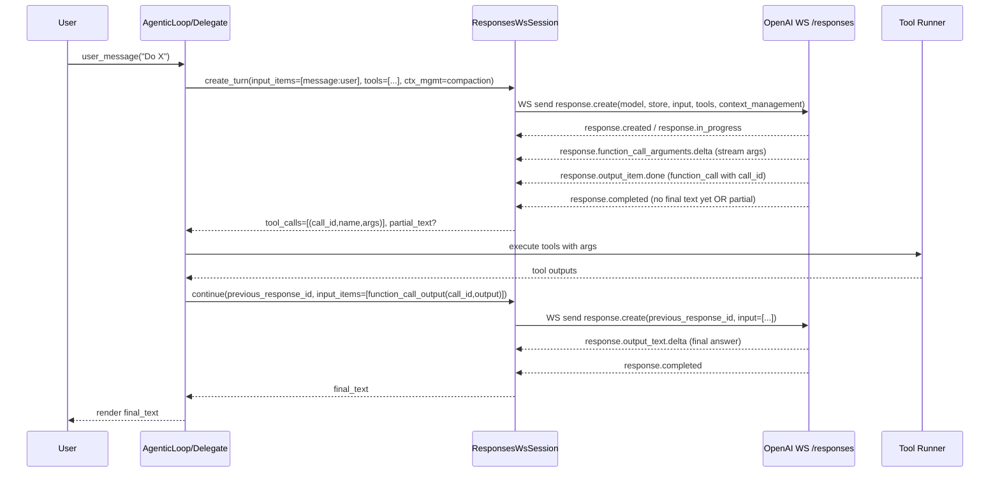
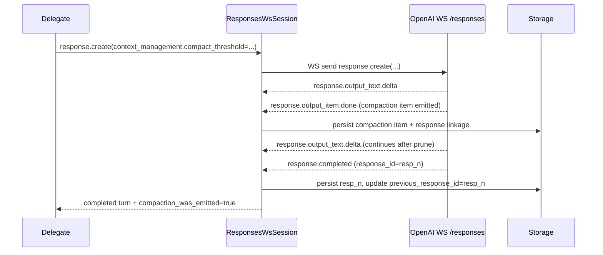
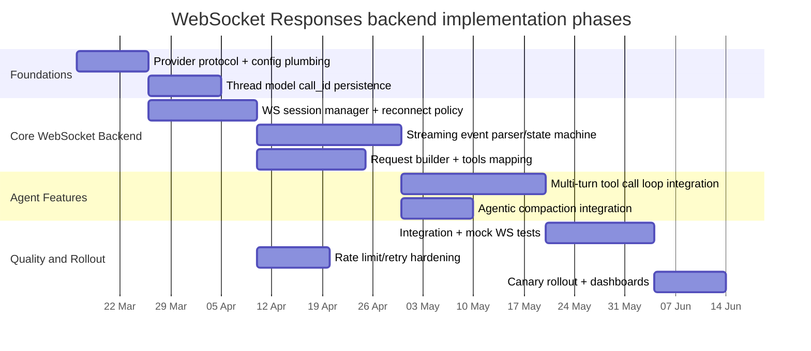

# RFC 0008: Implement the WebSocket Responses API in axinite with
# agentic compaction and multi-turn tool calling

## Preamble

- **RFC number:** 0008
- **Status:** Proposed
- **Created:** 2026-03-13

## Executive summary

Axinite currently integrates “OpenAI-compatible” providers through a Chat Completions–style protocol (`open_ai_completions`), configured in `providers.json` (the `openai` provider defaults to `https://api.openai.com/v1` and a default model `gpt-5-mini`). citeturn6view4turn41view1 This pathway is built around Axinite’s `LlmProvider` trait, which exposes synchronous request/response methods (`complete`, `complete_with_tools`) but no streaming interface. citeturn10view2

Axinite does have “context compaction” today, but it is Axinite-native: it summarises or truncates old turns (and optionally writes a summary to workspace) before continuing, i.e. it does *not* use OpenAI’s encrypted “compaction item” mechanism. citeturn4view0turn21view0 Concretely, Axinite’s compactor generates a summary by making an LLM call with a system summarisation prompt and then rewrites the thread history. citeturn21view0

OpenAI’s WebSocket Responses API introduces three capabilities that don’t fit cleanly into Axinite’s current “Chat Completions–shaped” adapter:

- A persistent WebSocket transport (`wss://api.openai.com/v1/responses`) where each turn begins by sending a `response.create` event whose payload mirrors `POST /responses` (excluding transport-only fields like `stream`). citeturn24view0turn24view3
- Stateful continuation via `previous_response_id`, including explicit error semantics (`previous_response_not_found`) and a WebSocket-local cache that only retains the most recent previous-response state for low-latency continuation (no multiplexing; one in-flight response per connection; 60-minute connection lifetime). citeturn24view3turn24view5
- Server-side (agentic) compaction via `context_management` + `compact_threshold`, which emits an opaque encrypted compaction item into the response stream/output and allows the conversation to continue with fewer tokens. citeturn29view0turn24view3

To add a *first-class* WebSocket Responses backend that supports GPT‑5.4 agentic compaction and multi-turn tool calling, Axinite needs a new provider protocol and a new set of abstractions around:

- “Input items” (Responses API) rather than only `ChatMessage[]`. citeturn22search6turn31view2
- Streaming event handling (WebSocket mode emits the same event model used for streaming Responses). citeturn24view3turn28view2
- Durable state: storing `previous_response_id`, optional durable `conversation` IDs, and encrypted compaction items to support restarts/reconnects without silently losing context. citeturn33view0turn29view0turn24view3

## Repository audit

Axinite is written in Rust (so “language/runtime unspecified” does not reflect the current implementation reality in this repo), but the design constraints below remain language-agnostic. citeturn7view0

Axinite’s existing provider stack and agent loop are organised around a small set of load-bearing modules:

| Area | What it does today | Why it matters for Responses WS |
|---|---|---|
| `src/llm/provider.rs` | Defines `ChatMessage`, tool call representation and sanitation; defines the `LlmProvider` trait (`complete`, `complete_with_tools`) used by the reasoning engine. citeturn10view1turn10view2 | The Responses WS backend needs either (a) a new provider trait that supports streaming + input items, or (b) a compatibility shim that projects Responses into Axinite’s current `complete[_with_tools]` contract. |
| `src/llm/rig_adapter.rs` | Bridges Axinite tool definitions into a rig-core model interface; normalises JSON Schema to comply with OpenAI “strict mode” function calling; converts Axinite messages into rig messages; extracts tool calls from completion responses. citeturn11view2turn11view3turn12view2 | This adapter targets “Chat Completions shape” tool calls, not Responses input items/events. Reuse is limited to tool schema normalisation logic. |
| `src/llm/reasoning.rs` | Builds system prompts, constructs `ToolCompletionRequest`s from `ReasoningContext`, calls `llm.complete_with_tools`, and returns either text or `ToolCalls` to the agentic loop. citeturn36view3turn36view0 | This component assumes the LLM call returns complete results (not streamed) and assumes tool calls come back as a list of `ToolCall`s in one response turn. |
| `src/agent/agentic_loop.rs` | Unified iteration engine that delegates “call LLM”, “execute tool calls”, and “auto-compaction/cost/rate-limit concerns” to a `LoopDelegate`. citeturn34view2turn34view3 | This is a good insertion point: the delegate can own a stateful Responses WS session and can hide streaming/continuations behind its `call_llm` implementation. |
| `src/agent/session.rs` | Persistent “thread/turn” model; `Thread.messages()` serialises turns into an OpenAI-style message sequence including `assistant_with_tool_calls` then `tool_result` messages. citeturn39view2turn40view1 | Multi-turn tool calling with Responses requires preserving OpenAI `call_id` values; Axinite currently synthesises tool IDs when serialising (`turn{n}_{i}`), which is incompatible with Responses tool outputs unless extended. citeturn39view5turn31view1 |
| `src/agent/compaction.rs` | Axinite-native compaction: truncate, summarise, and optionally write summaries to workspace; summary generation is an LLM call with a summarisation prompt. citeturn21view0turn21view1 | This compaction can conflict with server-side compaction. A Responses WS backend should usually disable Axinite summarisation in favour of `context_management` compaction, or apply it only as a fallback. citeturn29view0turn21view0 |
| `providers.json` + `src/llm/registry.rs` | Declares provider protocols and selection; `openai` uses `protocol: open_ai_completions` and model/env settings; registry deserialises built-ins and provides selection helpers. citeturn6view4turn41view1turn41view2 | Adding a WebSocket Responses backend likely means adding a new `ProviderProtocol` and new provider config keys (e.g., enable `store`, compaction settings, conversation strategy). |

Axinite’s own feature parity matrix indicates it already supports “Context compaction” (marked as “Auto summarization”) and implements an “OpenAI protocol” gateway at `/v1/chat/completions`, but it does not claim Responses/WebSocket support. citeturn4view0

Practical extension points in-repo:

- Add a new provider protocol enum variant (e.g. `OpenAiResponsesWebSocket`) alongside the existing `OpenAiCompletions` mapping. citeturn41view2turn41view1
- Create a new provider implementation that speaks WebSocket Responses (do not try to wedge this into `RigAdapter` unless you accept losing native streaming/event semantics). citeturn24view3turn28view2
- Extend the `Thread`/`TurnToolCall` model to store provider-native call identifiers required by the Responses tool lifecycle (`call_id`). citeturn39view5turn31view1
- Implement compaction strategy selection at the agent-loop delegate layer (delegate `call_llm` explicitly mentions it should handle “rate limiting, auto-compaction, cost tracking”). citeturn34view2turn34view3

## Feature gap analysis

### Current vs required capability matrix

| Capability | Axinite today | Required for WebSocket Responses backend | Primary gap driver |
|---|---|---|---|
| Transport | HTTP-style request/response (provider-specific); no provider streaming interface in `LlmProvider`. citeturn10view2 | Maintain a persistent WebSocket connection to `wss://api.openai.com/v1/responses`; send `response.create` events; consume streaming server events; enforce “one in-flight response” constraint. citeturn24view0turn24view3 | LlmProvider contract is non-streaming and stateless. citeturn10view2 |
| Stateful continuation | Axinite persists context by replaying/summarising `ChatMessage[]` from `Thread.turns`. citeturn39view2turn21view0 | Use `previous_response_id` (and optionally `conversation`) to carry state; handle connection-local cache semantics and `previous_response_not_found` on reconnect in ZDR/store=false mode. citeturn24view3turn24view5turn33view0 | Responses API state model differs from Axinite’s transcript replay model. citeturn33view1turn22search6 |
| Tool calling | Axinite expects tool calls as `ToolCall{id,name,args}` from `complete_with_tools`; serialises tool calls into an “assistant tool_calls” message preceding tool results. citeturn10view1turn39view2 | Responses uses `function_call` output items with a `call_id`; tool outputs are `function_call_output` input items referencing that `call_id`. citeturn31view1turn24view3 | Axinite does not persist provider-owned `call_id` values (it synthesises IDs later). citeturn39view5turn31view1 |
| Multi-turn tool calling loop | Supported at application level: agentic loop iterates, executes tools, appends tool results, calls LLM again. citeturn34view1turn34view2 | Same loop, but “call next turn” becomes “send a new `response.create` with `previous_response_id` + new `function_call_output` items (and possibly user input)”. citeturn24view3turn31view0 | The loop must own a stateful Responses session and must translate tool lifecycle semantics. citeturn24view3turn31view2 |
| Agentic compaction | Axinite supports “auto summarization” (LLM summarises transcript) and/or truncation. citeturn4view0turn21view0 | Enable server-side compaction via `context_management` + `compact_threshold`; preserve opaque compaction items and avoid manual pruning when using `previous_response_id`. citeturn29view0turn24view3 | Compaction item is encrypted and not representable as a simple `ChatMessage`. citeturn29view0 |
| Streaming events | No first-class streaming interface in provider API; internal reasoning assumes full response. citeturn10view2turn36view3 | Parse and act on streaming events (e.g. `response.output_text.delta`, `response.function_call_arguments.delta`, `response.completed`, `error`). citeturn28view2turn24view5 | Need streaming event state machine and buffering. citeturn28view2 |
| Conversation IDs | Axinite has internal `Session`/`Thread` IDs. citeturn39view0 | Optionally bind an Axinite thread to an OpenAI `conversation` ID for durable storage across sessions/devices/jobs. citeturn33view1 | Requires new persistence + configuration and changes to retention semantics. citeturn33view0 |
| Auth | Axinite uses per-provider env vars and may supply extra headers. citeturn6view4turn41view2 | WebSocket handshake must include `Authorization: Bearer …` header; optionally support org/project scoping headers in a provider-independent way. citeturn24view0 | Need a WS client that supports headers and renewals. citeturn24view0 |
| Rate limits & retries | Axinite has retry/circuit breaker modules, but provider-specific behaviour varies. citeturn8view0turn43view1 | Explicitly handle 429/5xx; respect rate limit headers; apply exponential backoff with jitter; avoid retry storms. citeturn43view0turn43view1 | WebSocket adds new failure modes (disconnects, connection lifetime limits). citeturn24view3turn24view5 |

### Prioritized gaps and how they map to OpenAI Responses features

Axinite’s abstractions line up best with Responses if you treat the Responses WS backend as a *stateful session object* owned by the agent-loop delegate (not as a “pure function” provider).

Priority order:

- **State ownership (highest priority):** WebSocket mode supports `previous_response_id` chaining and keeps the most recent response cached in-memory on the connection. If Axinite calls providers in a stateless way, it will frequently hit `previous_response_not_found` in `store=false` mode after any reconnect, because there is no persisted fallback. citeturn24view3turn24view5  
  This pushes design toward: one WS connection per active Axinite thread (or per worker that handles that thread), plus explicit policy for reconnect+resume. citeturn24view3

- **Tool lifecycle fidelity:** Responses uses `call_id` as the join key for `function_call_output`. Axinite currently reconstructs tool-call messages and invents tool IDs when serialising turns, which works for Chat Completions (because Axinite controls both sides) but fails for Responses because OpenAI validates the `call_id` linkage. citeturn31view1turn39view5  
  You need to store OpenAI call IDs per tool call, not synthesise them later.

- **Compaction item persistence:** Server-side compaction emits an opaque encrypted compaction output item; for stateless chaining you must append outputs “as usual” and you may drop items before the latest compaction item to keep requests smaller, but if you use `previous_response_id` you must not manually prune. citeturn29view0  
  Axinite must (a) detect compaction items in streamed outputs, and (b) persist them to support fallback stateless replay if you lose the WS cache.

- **Streaming event processing:** WebSocket mode says “server events and ordering match the existing Responses streaming event model.” citeturn24view3  
  The platform reference enumerates relevant event types including `response.output_text.delta`, `response.function_call_arguments.delta`, `response.output_item.added/done`, and `error`. citeturn28view2  
  Axinite needs an event-driven parser that can build: final assistant text, function-call argument buffers, and a list of emitted output items.

- **Conversation ID support (policy choice):** Storing responses (`store=true`) enables hydration of older response IDs; conversations persist items without the 30-day TTL applied to response objects, which is attractive for durability but changes data retention properties. citeturn24view3turn33view0turn33view1  
  Axinite needs explicit configuration: ZDR-ish ephemeral mode vs durable mode.

## Requirements

### Functional requirements

Axinite should implement a new provider backend that supports the following end-to-end behaviours.

**Provider selection and configuration**

- A new provider protocol (e.g. `open_ai_responses_ws`) selectable via Axinite’s provider registry and `providers.json` conventions. citeturn6view4turn41view2
- Configuration for:
  - `base_url` (default `https://api.openai.com/v1`, but WS URL must resolve to `wss://…/v1/responses`). citeturn6view4turn24view0
  - `api_key` env var, plus optional extra headers (Axinite already supports `extra_headers_env` concept at registry level). citeturn41view2turn6view4
  - State strategy: `previous_response_id` chaining vs stateless input-array chaining vs Conversations API binding. citeturn33view1turn29view0
  - Retention policy: `store=true/false` (and how that interacts with WS cache/hydration). citeturn24view3turn33view0
  - Compaction settings: whether to enable `context_management` compaction and what thresholds to use (per model/worker). citeturn29view0turn24view3

**WebSocket session management**

- Establish a WS connection with `Authorization: Bearer …` header. citeturn24view0
- Enforce one in-flight response per connection; no multiplexing; either queue turns or maintain a pool of connections (one per active thread). citeturn24view3
- Handle connection lifetime limit (60 minutes): reconnect and recover according to storage strategy. citeturn24view3
- Support “warmup” (`response.create` with `generate:false`) as an optimisation if Axinite can predict tools/instructions for upcoming turns. citeturn24view3

**Responses request construction**

- Construct a `response.create` payload that mirrors `POST /responses` (excluding streaming flags). citeturn24view3
- Include:
  - `model` (e.g. `gpt-5.4` when configured).
  - `input` as an array of Responses input items; at minimum `message` items for user/system messages and `function_call_output` items for tool results during continuation. citeturn24view3turn31view0
  - `tools` definitions (function tools) derived from Axinite tool registry; preserve JSON schema constraints consistent with OpenAI function calling. citeturn31view5turn11view2
  - `tool_choice`, `parallel_tool_calls` mapping from Axinite’s notions (`auto/required/none`). citeturn31view4turn31view3
  - `previous_response_id` when continuing. citeturn24view3turn33view0
  - `context_management: [{type:"compaction", compact_threshold: …}]` when agentic compaction enabled. citeturn29view0

**Streaming response handling**

- Consume WS events and build a coherent “turn result”:
  - Buffer `response.output_text.delta` to form final user-visible text. citeturn28view2
  - Buffer `response.function_call_arguments.delta` to form complete JSON arguments for tool calls. citeturn28view2
  - Capture output items (`response.output_item.added` / `done`) including:
    - `function_call` items (tool call requests) with `call_id`. citeturn31view1turn28view2
    - Compaction items emitted during generation when `context_management` triggers. citeturn29view0
  - Terminate on `response.completed` / `response.failed` / `response.incomplete` and handle `error` events as hard failures (or retryable where appropriate). citeturn28view2turn24view5

**Multi-turn tool calling lifecycle**

- When the model emits one or more `function_call` items:
  - Map each tool call to Axinite `ToolCall` objects.
  - Execute each tool (possibly in parallel, subject to Axinite’s approvals/sandbox constraints).
  - Send a subsequent `response.create` event containing:
    - `previous_response_id` = last response id,
    - `input` includes `function_call_output` items, each referencing the original `call_id`, and optionally a follow-up user message depending on Axinite’s loop semantics. citeturn24view3turn31view0
- Preserve any “reasoning items” required for multi-turn tool calling in stateless mode (OpenAI notes that reasoning models may require returning reasoning items alongside tool outputs). citeturn31view2  
  In `previous_response_id` mode, the server-side chain should already retain these, but Axinite should not assume that unless validated in integration tests.

**Conversation identifiers**

- Support two modes:
  - `previous_response_id` chaining (ephemeral, WS-cache-sensitive). citeturn24view3turn33view0
  - Durable conversation mode: create and store an OpenAI conversation ID, pass it on subsequent responses, and persist the binding in Axinite thread metadata. citeturn33view1turn33view0

### Non-functional requirements

**Reliability and error handling**

- Implement structured retry policies:
  - 429: respect pacing; use exponential backoff with jitter; consider per-project token/request budgets. citeturn43view0turn43view1
  - 5xx / 503: retry with backoff; treat as transient. citeturn43view1
  - WS-specific: on `websocket_connection_limit_reached`, reconnect and continue according to strategy. citeturn24view5
  - On `previous_response_not_found`, fall back to: (a) start a new chain with full stateless input, or (b) hydrate via `store=true`, or (c) refuse with an actionable error if configured for ZDR strictly. citeturn24view3turn24view5

**Security**

- Keep API keys in env/secret manager; never store raw keys in thread/session records.
- Ensure tool outputs passed into `function_call_output.output` don’t leak secrets unnecessarily (Axinite already truncates tool results for context size; apply similar hygiene for outputs sent back to the model). citeturn39view5turn24view3

**Telemetry and observability**

- Emit structured spans/metrics per response:
  - Response id, previous_response_id, model, token usage, compaction triggered, number of tool calls, retries, WS reconnects.
- Surface rate limit headers (HTTP) where applicable; for WS, capture rate limits via any events/metadata you receive and treat them as signals to throttle. citeturn43view0turn24view3

**Performance and scalability**

- Use connection reuse: one WS per active thread to exploit the “most recent response” cache for low-latency continuation. citeturn24view3
- Avoid sending full transcripts per turn in `previous_response_id` mode; send only new input items. citeturn24view3turn29view0
- If you must operate statelessly, drop input items before the latest compaction item to keep payloads smaller (but never prune when using `previous_response_id`). citeturn29view0

**Testing**

- Unit tests for:
  - Event parser (delta assembly, output item reconstruction, compaction item detection).
  - Call-id preservation and tool output formatting.
  - Reconnect behaviours and error-to-fallback mapping.
- Integration tests with a mock WS server that replays a deterministic event trace resembling OpenAI’s event model. citeturn28view2turn24view3
- End-to-end tests gated in CI that run against OpenAI in a “sandbox project” (if feasible) with strict cost/rate limiting. citeturn43view0turn43view1

## Technical design

### Architecture overview

The core design choice: implement a **stateful Responses session** owned by the agent-loop delegate, and keep Axinite’s generic reasoning loop unchanged (it still calls `delegate.call_llm()` and then dispatches tool execution). citeturn34view2turn24view3

Mermaid overview:

```mermaid
graph TD
  A[AgenticLoop] --> B[LoopDelegate.call_llm()]
  B --> C[ResponsesWsSession]
  C --> D[WS Client: wss /v1/responses]
  D --> C
  C --> E[Event Parser / State Machine]
  E --> F[TurnResult: text + tool_calls + output_items]
  B --> G[Tool Runner / Sandbox]
  G --> C
  C --> H[(DB / Persistence)]
  B --> I[Axinite Thread/Turn Model]
```

Design intent:

- `ResponsesWsSession` encapsulates:
  - WS connection lifecycle
  - last `previous_response_id`
  - optional OpenAI `conversation` id
  - compaction configuration
  - output-item log (including compaction items) for persistence and replay citeturn24view3turn33view1turn29view0
- The delegate translates between Axinite’s `ReasoningContext` (messages/tools) and Responses’ `input` + `tools` payloads. citeturn36view3turn24view3turn31view5

### Sequence diagram for multi-turn tool calling

This sequence assumes `previous_response_id` mode (preferred), and matches WebSocket mode guidance: send next `response.create` with only new items. citeturn24view3turn29view0turn31view0



### Sequence diagram for agentic compaction

Server-side compaction triggers when the rendered token count crosses the configured threshold; the server emits a compaction output item in the same response stream and prunes context before continuing inference. citeturn29view0



### Data model mapping

Axinite currently models conversations as a sequence of `ChatMessage` objects derived from turns, including “assistant tool_calls” messages and “tool result” messages. citeturn39view2turn10view1 Responses uses an “input items / output items” model. citeturn22search6turn31view2

A practical mapping for compatibility:

| Axinite concept | Responses API representation | Notes |
|---|---|---|
| System/user/assistant message | `{"type":"message","role":"user|assistant|system","content":[{"type":"input_text","text":...}]}` | WebSocket examples show `message` items inside `input`. citeturn24view3 |
| Tool call request from model | Output item `{"type":"function_call","call_id":...,"name":...,"arguments":"{...}"}` | `call_id` is the join key for outputs. citeturn31view1 |
| Tool output back to model | Input item `{"type":"function_call_output","call_id":...,"output":"..."}` | WebSocket docs demonstrate this in continuation. citeturn24view3turn31view0 |
| Axinite compaction summary | Prefer: Responses “compaction item” emitted by server when `context_management` triggers | Compaction item is opaque and should be stored, not interpreted. citeturn29view0 |

### Schema examples

**Client → server (`response.create` event)**  
(Example shape; fields shown in OpenAI docs. WebSocket mode indicates you send this as a WebSocket message with `"type":"response.create"`.) citeturn24view3turn29view0turn31view4

```json
{
  "type": "response.create",
  "model": "gpt-5.4",
  "store": false,
  "previous_response_id": "resp_123",
  "context_management": [{ "type": "compaction", "compact_threshold": 200000 }],
  "tools": [
    {
      "type": "function",
      "function": {
        "name": "search_docs",
        "description": "Search internal docs",
        "parameters": { "type": "object", "properties": { "q": { "type": "string" } } }
      }
    }
  ],
  "tool_choice": "auto",
  "parallel_tool_calls": true,
  "input": [
    {
      "type": "function_call_output",
      "call_id": "call_abc",
      "output": "{\"hits\": 5}"
    },
    {
      "type": "message",
      "role": "user",
      "content": [{ "type": "input_text", "text": "Continue." }]
    }
  ]
}
```

**Server → client events (selected)**  
Event types in the Responses streaming model include `response.output_text.delta`, `response.function_call_arguments.delta`, `response.output_item.added/done`, `response.completed`, and `error`. citeturn28view2turn24view5

### Persistence schema

Axinite already persists session/thread state and compaction summaries in its own model. citeturn39view0turn39view3turn21view0 To support Responses WS robustly, add a small provider-specific persistence layer that captures the minimum recovery set:

1. **Thread binding state**
   - `openai_previous_response_id` (nullable)
   - `openai_conversation_id` (nullable; only if using Conversations API) citeturn33view1turn33view0
   - `store_flag` and compaction configuration

2. **Response log**
   - `openai_response_id`, timestamps, model
   - raw/filtered output items (including compaction items)
   - derived tool calls with `call_id` citeturn31view1turn29view0

3. **Compaction item ledger**
   - store the opaque compaction item JSON blob exactly as received
   - index by thread + emitted-at response id
   - mark as “last_compaction_item” for stateless replay trimming citeturn29view0

A relational sketch (names illustrative):

```sql
-- Conversations/threads are Axinite concepts; store OpenAI linkage in thread metadata or a side table.
CREATE TABLE thread_openai_state (
  thread_id UUID PRIMARY KEY,
  openai_conversation_id TEXT NULL,
  openai_previous_response_id TEXT NULL,
  store_enabled BOOLEAN NOT NULL,
  compaction_enabled BOOLEAN NOT NULL,
  compaction_threshold INTEGER NULL,
  updated_at TIMESTAMP NOT NULL
);

CREATE TABLE openai_response_log (
  id UUID PRIMARY KEY,
  thread_id UUID NOT NULL,
  openai_response_id TEXT NOT NULL,
  previous_response_id TEXT NULL,
  model TEXT NOT NULL,
  status TEXT NOT NULL,
  created_at TIMESTAMP NOT NULL,
  response_json JSONB NOT NULL
);

CREATE TABLE openai_response_item (
  id UUID PRIMARY KEY,
  openai_response_log_id UUID NOT NULL,
  item_type TEXT NOT NULL,          -- message|function_call|function_call_output|compaction|...
  call_id TEXT NULL,                -- for function_call / function_call_output
  item_json JSONB NOT NULL,
  output_index INTEGER NULL,
  created_at TIMESTAMP NOT NULL
);
```

### Migration strategy

Axinite’s thread model currently stores tool calls without preserving provider-native IDs (it synthesises stable IDs during `Thread.messages()` rendering). citeturn39view5turn39view2 For Responses WS, you need to preserve OpenAI `call_id` long enough to send `function_call_output` items in the next turn. citeturn31view1turn24view3

Minimal-impact migration approach:

- Extend `TurnToolCall` to include `provider_call_id: Option<String>` (or a generic `call_id`) and populate it when the Responses backend returns tool calls.
- Update `Thread.messages()` so that:
  - if `provider_call_id` is present, use it rather than generating `turn{n}_{i}` IDs when constructing tool call messages (for any adapters that still rely on message replay). citeturn39view5turn10view1
- Preserve backwards compatibility by treating missing IDs as legacy and continuing to synthesise.

## Implementation plan

Effort estimates are coarse (low/med/high) because runtime/language constraints were specified as open-ended, even though Axinite is Rust. citeturn7view0

### Stepwise tasks

| Task | Effort | Key outputs |
|---|---|---|
| Add new provider protocol for Responses WS | Med | `ProviderProtocol` enum update; `providers.json` schema extension; configuration plumbing. citeturn41view2turn6view4 |
| Implement `ResponsesWsSession` connection manager | High | WS connect/auth header support; reconnection policy; sequential in-flight enforcement; 60-minute rotation. citeturn24view0turn24view3 |
| Implement streaming event parser/state machine | High | Correct handling of event types and deltas; output item reconstruction; error framing. citeturn28view2turn24view5 |
| Implement request builder for `response.create` | Med | Map Axinite message/tool state into Responses `input` + `tools`; map `tool_choice`/`parallel_tool_calls`; insert `context_management`. citeturn24view3turn31view4turn29view0 |
| Tool call lifecycle integration | High | Translate `function_call` items into Axinite `ToolCall`s; preserve `call_id`; emit `function_call_output` on continuation; support multiple tool calls per turn and parallelism config. citeturn31view1turn31view3turn24view3 |
| Integrate agentic compaction | Med | Enable `context_management.compact_threshold`; detect compaction items; persist them; ensure the delegate disables Axinite summarisation compaction when enabled. citeturn29view0turn21view0turn34view2 |
| Extend thread/turn persistence for call IDs and OpenAI state | Med | Add `call_id` storage and per-thread OpenAI linkage (`previous_response_id`, optional `conversation` id). citeturn31view1turn33view1 |
| Add robust retries, throttling and backoff | Med | Respect rate limit headers (HTTP); handle 429/5xx; ensure WS retries don’t create retry storms. citeturn43view0turn43view1 |
| Tests + CI | High | Deterministic mock WS traces; integration tests that exercise tool loops and compaction; regression tests for legacy compaction. citeturn21view0turn28view2turn24view3 |
| Rollout plan with feature flags | Low/Med | Per-provider opt-in; fallback to `open_ai_completions` on failure; operational dashboards. citeturn6view4turn24view5 |

### Test cases

**Unit tests**

- Event parsing:
  - Assemble text from `response.output_text.delta` and terminate at `response.output_text.done`/`response.completed`. citeturn28view2
  - Assemble tool arguments from `response.function_call_arguments.delta` and emit a parsed JSON object on `.done`. citeturn28view2
  - Detect and persist compaction items whenever `context_management` compaction triggers. citeturn29view0
- Tool lifecycle:
  - Ensure tool outputs reference the exact `call_id` observed in `function_call`. citeturn31view1turn31view0
  - Validate behaviour when the model calls multiple tools in one turn (and when `parallel_tool_calls=false`). citeturn31view3

**Integration tests (mock WS server)**

- Happy path: user → tool call → tool output → final answer, with correct `previous_response_id` chaining. citeturn24view3turn31view0
- Compaction path: server emits a compaction item mid-turn; session persists it and continues. citeturn29view0
- Failure path:
  - `previous_response_not_found` triggers fallback strategy.
  - `websocket_connection_limit_reached` forces reconnect and recovery behaviour. citeturn24view5turn24view3

**End-to-end tests (real OpenAI project, optional)**

- Exercise a long multi-tool task that triggers compaction at least once.
- Force reconnect mid-chain and verify recovery semantics under both `store=true` and `store=false`. citeturn24view3turn33view0

### CI checks and rollout checklist

- Add a feature flag: `OPENAI_RESPONSES_WS_ENABLED` (or provider config knob) default off.
- Add “contract tests” that compare the tool call loop semantics against existing Chat Completions backend (for equivalent prompts).
- Rollout:
  - Canary enable for a subset of sessions/threads or only for GPT‑5.4 model selection.
  - Add dashboards for: WS reconnect rate, `previous_response_not_found` incidence, compaction trigger frequency, tool-call latency, 429 rate-limit errors. citeturn24view5turn43view1turn29view0

Mermaid Gantt for an illustrative phased timeline (durations indicative):



## Risks, mitigations, and backward compatibility

### Double-compaction risk

If Axinite enables server-side compaction (`context_management`) and also runs its own summarisation compaction, it will effectively “compress twice” and can lose important state, especially around tool usage and intermediate reasoning that OpenAI’s compaction item intends to preserve in an opaque format. citeturn29view0turn21view0

Mitigation:

- When the provider is Responses WS and compaction is enabled, disable Axinite’s summarisation compaction strategy for that thread, or restrict it to a fallback used only after a hard “cannot continue chain” event. citeturn29view0turn24view5

### Loss of continuity on reconnect in `store=false` mode

WebSocket mode keeps only the most recent response state in a connection-local cache. If the connection drops and responses aren’t stored, continuing with an older `previous_response_id` returns `previous_response_not_found`. citeturn24view3turn24view5turn33view0

Mitigation options (make explicit in configuration):

- **Durable mode:** set `store=true` so the server can hydrate older response IDs, at the cost of storing response objects for up to 30 days by default. citeturn24view3turn33view0
- **Conversation mode:** use a `conversation` ID so items persist beyond the response TTL (note: this changes retention semantics materially). citeturn33view0turn33view1
- **Stateless fallback:** persist compaction items and enough of the recent transcript to restart a new chain without the full history (drop items before the latest compaction item). citeturn29view0

### Tool call ID mismatch

Axinite currently synthesises tool call IDs (`turn{n}_{i}`) when building `ChatMessage` tool call sequences from stored turns. That will not match OpenAI’s `call_id` values for Responses tool calls. citeturn39view5turn31view1

Mitigation:

- Store provider-native `call_id` and use it when generating tool output items.
- Keep synthetic IDs only for legacy compatibility paths. citeturn31view0turn39view2

### Concurrency and head-of-line blocking

A single WebSocket connection runs `response.create` sequentially; it does not support multiplexing, and you must use multiple connections to run parallel responses. citeturn24view3

Mitigation:

- Bound WS connections by Axinite “active thread” count (pool per worker).
- Queue per-thread messages and enforce backpressure to avoid OOM when tools are slow.

### Rate limiting and retry storms

OpenAI rate limits apply at organisation and project level; headers expose current limits/remaining/reset. citeturn43view0 Over-aggressive retry can worsen 429s because failed requests still count against per-minute limits. citeturn43view0turn43view2

Mitigation:

- Global token/request budgeter per project and per worker.
- Exponential backoff with jitter; cap retries; respect reset headers. citeturn43view0turn43view1

## Recommended libraries, concurrency model, and pseudocode

### Recommended libraries

Because the language/runtime was specified as open-ended, choose libraries per deployment environment:

- **Rust (Axinite-native):** `tokio` + a WS client that supports custom headers (e.g. `tokio-tungstenite`), `serde_json` for event decoding, and Axinite’s existing retry/circuit breaker modules for resilience. citeturn7view0turn8view0turn24view0
- **Python:** use a WS client that supports headers and async iteration; OpenAI’s examples show the `websocket` module usage for WebSocket mode, but production implementations typically prefer an asyncio-native library. citeturn24view0turn24view3
- **TypeScript/Node:** `ws` or equivalent; implement an explicit event decoder and backpressure handling.

### Concurrency model

Use a **single-reader / multi-producer** model per WS session:

- One task reads from the socket, decodes JSON events, and pushes typed events into an internal channel/queue.
- Callers send “commands” (create response, continue with tool outputs) into a command queue; the session serialises them, enforcing one in-flight request.
- Tool execution occurs outside the WS task; when tool results are available, they enqueue a “continue” command that sends a new `response.create` with `previous_response_id` + `function_call_output`. citeturn24view3turn31view0turn34view2

### Sample pseudocode: streamed compaction items + `previous_response_id` chaining

Python-like pseudocode (illustrative; do not treat as an exact API surface):

```python
class ResponsesWsSession:
    def __init__(self, api_key, model, store=False, compaction_threshold=None):
        self.api_key = api_key
        self.model = model
        self.store = store
        self.compaction_threshold = compaction_threshold
        self.ws = None
        self.previous_response_id = None

    async def connect(self):
        # Connect to wss://api.openai.com/v1/responses with Authorization header
        self.ws = await ws_connect(
            url="wss://api.openai.com/v1/responses",
            headers={"Authorization": f"Bearer {self.api_key}"},
        )

    async def run_turn(self, new_user_text=None, tool_outputs=None, tools=None):
        input_items = []

        # Tool outputs from prior tool calls
        for out in tool_outputs or []:
            input_items.append({
                "type": "function_call_output",
                "call_id": out.call_id,   # MUST match model-emitted call_id
                "output": out.output_text,
            })

        # New user message (incremental)
        if new_user_text is not None:
            input_items.append({
                "type": "message",
                "role": "user",
                "content": [{"type": "input_text", "text": new_user_text}],
            })

        payload = {
            "type": "response.create",
            "model": self.model,
            "store": self.store,
            "tools": tools or [],
            "input": input_items,
        }

        if self.previous_response_id:
            payload["previous_response_id"] = self.previous_response_id

        if self.compaction_threshold is not None:
            payload["context_management"] = [{
                "type": "compaction",
                "compact_threshold": self.compaction_threshold,
            }]

        await self.ws.send_json(payload)

        # Streaming state
        text_buf = []
        pending_tool_calls = {}   # call_id -> {name, args_buf}
        compaction_items = []

        async for event in self.ws:
            t = event["type"]

            if t == "response.output_text.delta":
                text_buf.append(event["delta"])

            elif t == "response.function_call_arguments.delta":
                call_id = event["call_id"]
                pending_tool_calls.setdefault(call_id, {"args_buf": "", "name": None})
                pending_tool_calls[call_id]["args_buf"] += event["delta"]

            elif t == "response.output_item.done":
                item = event["item"]
                if item["type"] == "function_call":
                    call_id = item["call_id"]
                    pending_tool_calls.setdefault(call_id, {"args_buf": item["arguments"], "name": item["name"]})
                    pending_tool_calls[call_id]["name"] = item["name"]
                    pending_tool_calls[call_id]["args_buf"] = item["arguments"]
                elif item["type"] == "compaction":
                    # Opaque encrypted item; persist as-is
                    compaction_items.append(item)

            elif t == "response.completed":
                resp = event["response"]
                self.previous_response_id = resp["id"]  # chain to next turn
                break

            elif t == "error":
                raise RuntimeError(event["error"])

        final_text = "".join(text_buf).strip()

        tool_calls = []
        for call_id, st in pending_tool_calls.items():
            if st["name"] is None:
                continue
            tool_calls.append({
                "call_id": call_id,
                "name": st["name"],
                "arguments_json": st["args_buf"],
            })

        return {
            "text": final_text,
            "tool_calls": tool_calls,
            "compaction_items": compaction_items,
            "previous_response_id": self.previous_response_id,
        }
```

This pseudocode directly reflects:

- WebSocket mode: connect to `wss://api.openai.com/v1/responses`, send `response.create`, continue with `previous_response_id` and only new input items. citeturn24view0turn24view3
- Tool outputs: `function_call_output` items reference `call_id`. citeturn31view0turn24view3
- Compaction: server-side compaction emits an encrypted compaction item in the response stream when the threshold is crossed. citeturn29view0
- Streaming events: key event types include output text deltas, function call argument deltas, output item lifecycle events, completion/error events. citeturn28view2turn24view5
