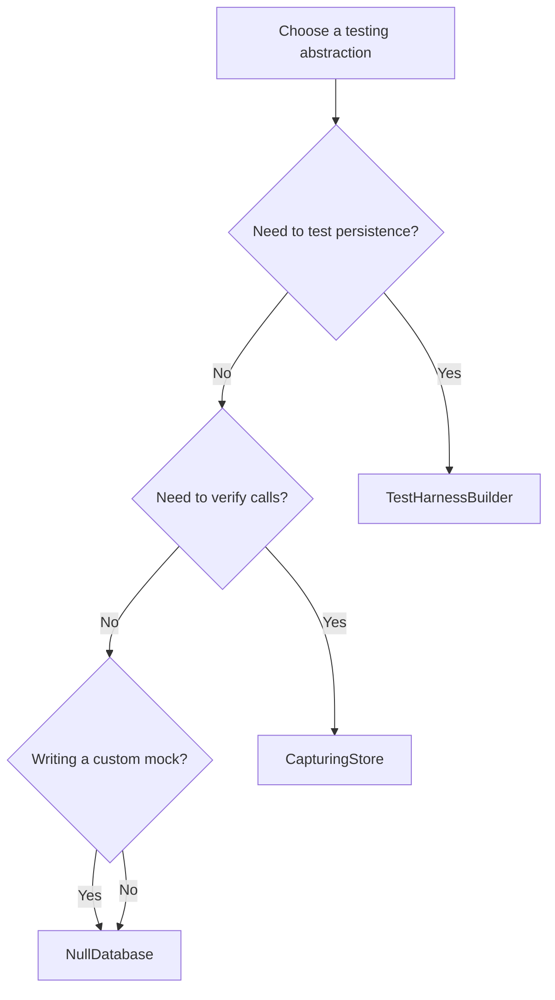

# Testing abstractions guide

This document describes the crate-wide testing abstractions available in the
`ironclaw::testing` module and when to use each one.

Note: `ironclaw::testing` and all of its re-exports are test-only surfaces.
They are compiled only when `#[cfg(test)]` is active, so these symbols are
unavailable in non-test builds and will fail with unresolved import or
visibility errors if used from production code or library consumers. Use the
`ironclaw::testing` module and its re-exports only from tests or
`#[cfg(test)]`-gated helper crates.

## Overview

The testing module provides several complementary abstractions for different
testing scenarios:

Table: Testing abstractions and recommended use cases

| Abstraction | Purpose | Use when |
| ----------- | ------- | -------- |
| `TestHarnessBuilder` | Full integration testing with real database | Testing actual persistence with a real database |
| `CapturingStore` | Unit testing without database | Verifying interactions without a real database |
| `NullDatabase` | Baseline test double | Creating baseline test doubles or custom mocks |

## Test harness builder (`TestHarnessBuilder`)

Located in: `crate::testing::TestHarnessBuilder`

The `TestHarnessBuilder` constructs a fully-wired `AgentDeps` with a real
libSQL-backed database (when the `libsql` feature is enabled). This is the
correct choice for integration-style tests that need to verify actual
persistence behaviour.

```rust
use ironclaw::testing::TestHarnessBuilder;

#[tokio::test]
async fn test_something() {
    let harness = TestHarnessBuilder::new().build().await;
    // use harness.deps, harness.db, etc.
}
```

**When to use:** Choose `TestHarnessBuilder` to verify actual database
persistence or to test components that require a real `Database` trait
implementation.

**Do not mix with:** `CapturingStore`. The harness uses its own database
internally; mixing it with `CapturingStore` will cause confusing behaviour.

## Capturing store (`CapturingStore`)

Located in: `crate::testing::CapturingStore`

`CapturingStore` is a decorator wrapper around `NullDatabase` that records all
status updates and events for later inspection. It implements the `Database`
trait and can be used anywhere a database is required.

```rust
use std::sync::Arc;

use ironclaw::testing::CapturingStore;

#[tokio::test]
async fn captures_calls() {
    let store = Arc::new(CapturingStore::new());
    // Pass Arc::clone(&store) to components that need a Database
    // ... exercise the system under test ...

    // Later, inspect captured calls:
    let _status = store.calls().last_status.lock().await.clone();
}
```

**Related types:**

- `StatusCall` / `StatusCallWithId` — Captured status update calls
- `EventCall` / `EventCallWithId` — Captured event calls with full history

**When to use:** Choose `CapturingStore` for unit tests that must not hit a
real database but need to verify that persistence calls were made correctly.

**Do not mix with:** The full `TestHarnessBuilder`. Use `CapturingStore` with
manually-constructed components, not the full harness.

## Null database (`NullDatabase`)

Located in: `crate::testing::NullDatabase`

`NullDatabase` is a no-op database implementation that mostly returns empty
defaults (`Ok(None)`, `Ok(vec![])`, and similar) and serves as a baseline for
test doubles that need to override only specific methods. There are important
exceptions: `NullWorkspaceStore` document reads return
`NullDatabase::doc_not_found(...)`, which constructs the concrete
`WorkspaceError::DocumentNotFound` variant, and chunk insertion synthesizes
stable Universally Unique Identifiers (UUIDs) instead of returning a trivial
default.

```rust
use ironclaw::testing::NullDatabase;

fn example() {
    let db = NullDatabase::new();
    // Most operations return empty defaults, but workspace reads return
    // NullDatabase::doc_not_found(...) / WorkspaceError::DocumentNotFound,
    // and insert_chunk synthesizes IDs.
    let _ = db;
}
```

**When to use:** Use `NullDatabase` as a base for custom mocks that require
fine-grained control over specific database operations.

## Worker harness

Located in: `crate::testing::worker_harness`

The worker harness provides helpers for constructing `Worker` instances in
tests, including:

- `make_worker()` — Build a Worker with the given tools
- `make_worker_with_capturing_store()` — Build a Worker with a CapturingStore
- `TerminalMethod` — Helper enum for driving terminal state transitions

```rust
#[tokio::test]
async fn test_terminal_completed() -> anyhow::Result<()> {
    use ironclaw::testing::worker_harness::{make_worker, TerminalMethod};

    let worker = make_worker(vec![]).await?;
    TerminalMethod::Completed.apply_transition(&worker).await?;
    Ok(())
}
```

**When to use:** Use the worker harness when testing `Worker` behaviour
specifically.

## Choosing the right abstraction

This flowchart guides maintainers to the right testing abstraction by first
checking whether the test needs real persistence, then whether it only needs
to inspect captured calls, and finally whether it needs a bespoke mock.



Figure: Choosing the right testing abstraction

## Additional resources

- `crate::testing::TestHarnessBuilder` — Full harness builder
- `crate::testing::null_db::{NullDatabase, CapturingStore, EventCall,
  StatusCall}` — Database test doubles
