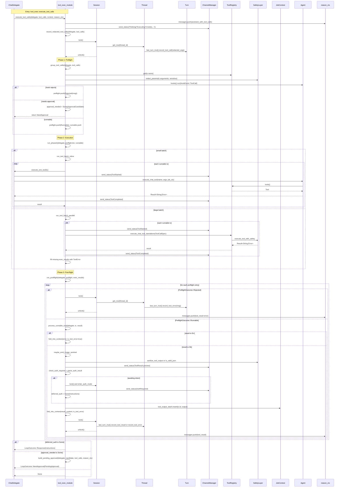
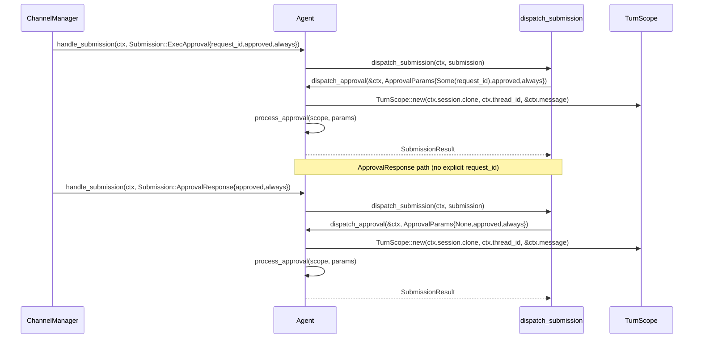

# Tool-calling architecture

This document summarizes the chat tool-calling path centred on the module-level
function `tool_exec::execute_tool_calls`, which takes `&ChatDelegate` as its
first parameter. It is intended as a compact reference for reviewers and
maintainers who need to understand how preflight checks, execution, approvals,
and post-flight folding interact. It also captures the submission path used
when a user answers an approval prompt.

**Figure 1. Tool-calling sequence from the module-level
`tool_exec::execute_tool_calls` entry through preflight, execution, post-flight
folding, and loop-outcome selection. The flow records redacted tool calls on
the active turn, checks hooks and approvals before execution, runs tools inline
or in parallel depending on batch size, sanitizes and records outputs, and may
return either a deferred auth response, a pending approval, or no special loop
outcome.**

In Figure 1, `Rejected` refers to `PreflightOutcome::Rejected`, not to a
distinct `LoopOutcome` variant. `LoopOutcome`, from
`src/agent/agentic_loop.rs`, contains only `Response`, `Stopped`,
`MaxIterations`, and `NeedApproval`. Hook rejections are pushed into the
preflight list, then handled during post-flight by recording and folding them
into the context as tool-result errors. They are not returned as a separate
loop outcome.

**Figure 2. Approval-submission sequence for both explicit approval requests
and implicit approval responses. The flow enters through channel submission
handling, routes through `dispatch_submission`, constructs a `TurnScope`, and
then calls `process_approval`, with the only behavioural distinction being
whether the submission carries an explicit `request_id`.**

