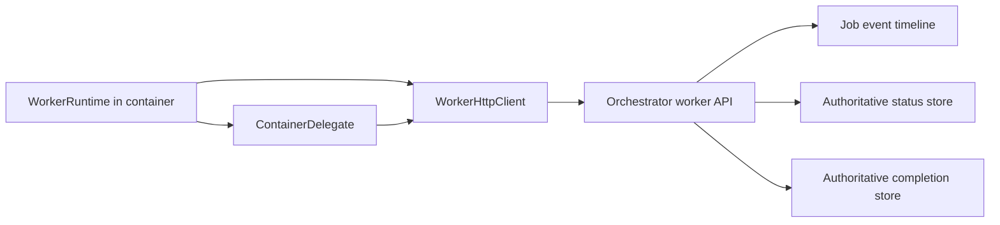

# Worker-orchestrator contract

This document is for maintainers who need to change the hosted worker path
without breaking the orchestrator boundary. It explains the current transport
contract, the dependency-injection seams used for tests and production, and the
event-reporting split between authoritative state and best-effort visibility.

## 1. Scope and source of truth

The worker runtime runs inside a container and talks back to the orchestrator
over HTTP. The shared transport contract lives in
[the worker API module](../src/worker/api.rs) and
[its shared types](../src/worker/api/types.rs). The orchestrator side imports
the same route constants and payload types from that module instead of
re-declaring them.

This document is descriptive for the current implementation. The code remains
the authoritative source of truth for the wire format.

## 2. Boundary model

The worker and orchestrator have distinct responsibilities:

- The orchestrator owns job lifecycle, credential issuance, event ingestion,
  and proxied external access.
- The worker owns local reasoning, tool execution inside the sandbox, and
  periodic reporting back to the orchestrator.
- The shared HTTP boundary exists so the worker can stay isolated from the
  host process while still using the host's approved network, credential, and
  observability surfaces.

Figure 1. Worker-orchestrator boundary and reporting channels.

## 3. Shared route constants

All worker endpoints are declared once in `src/worker/api/types.rs` as paired
`*_PATH` and `*_ROUTE` constants. The design intent is:

- `*_PATH` is the relative suffix used by `WorkerHttpClient`.
- `*_ROUTE` is the fully scoped Axum route used by the orchestrator router.
- Both sides derive their concrete URLs from the same source strings.

The current contract includes:

Worker-orchestrator HTTP endpoints and their purposes.

| Endpoint | Purpose |
| --- | --- |
| `GET /worker/{job_id}/job` | Fetch the sandboxed job description |
| `GET /worker/{job_id}/credentials` | Deliver job-scoped credentials for child-process injection |
| `POST /worker/{job_id}/status` | Persist authoritative progress state |
| `POST /worker/{job_id}/complete` | Persist authoritative terminal outcome |
| `POST /worker/{job_id}/event` | Append user-visible timeline events |
| `GET /worker/{job_id}/prompt` | Poll orchestrator-injected follow-up prompts |
| `POST /worker/{job_id}/llm/complete` | Proxy plain language model (LLM) completion |
| `POST /worker/{job_id}/llm/complete_with_tools` | Proxy tool-capable language model (LLM) completion |
| `GET /worker/{job_id}/tools/catalog` | Fetch hosted-visible remote tool definitions |
| `POST /worker/{job_id}/tools/execute` | Execute a hosted remote tool through the orchestrator |

Compile-time assertions in the worker API tests lock the canonical route values
so accidental path drift fails the build before runtime tests execute.

## 4. Dependency injection and construction

`WorkerRuntime` uses two constructors with distinct roles:

- `WorkerRuntime::new(config, client)` is the primary constructor. It is used
  by tests and by any caller that already owns a prepared `WorkerHttpClient`.
- `WorkerRuntime::from_env(config)` is the production convenience wrapper. It
  reads `IRONCLAW_WORKER_TOKEN` and then delegates to `new`, which builds the
  HTTP client with the shared timeout and error mapping.

This split exists so tests can validate runtime behaviour without relying on
ambient environment state. It also gives construction-time validation one
obvious home: `new` checks that `WorkerConfig` and `WorkerHttpClient` agree on
job identity and orchestrator base URL before the runtime starts.

`WorkerHttpClient::new(...)` follows the same pattern for tests, while
`WorkerHttpClient::from_env(...)` is reserved for production bootstrap.

## 5. Authoritative reports versus best-effort events

The worker emits two classes of outbound signal:

- Authoritative reports:
  - `report_status`
  - `report_complete`
- Best-effort timeline events:
  - `post_event`
  - `report_status_lossy`

The distinction matters:

- Status and completion calls define the durable job record. If they fail at a
  point where correctness depends on them, the worker treats that as a real
  error.
- Event posting exists for operator visibility. It enriches the browser and
  audit timeline, but it must not be allowed to block or invalidate terminal
  completion reporting.

`ContainerDelegate` therefore, uses a background task and bounded queue for
event posting. `shutdown()` closes the queue and waits for the event worker, so
buffered events flush before the delegate disappears.

`WorkerRuntime::post_event(...)` also uses a bounded timeout around terminal
event publication, so the final `report_complete(...)` call remains the
authoritative acknowledgement path.

## 6. Credential handling

Credentials are fetched through `GET /worker/{job_id}/credentials` and
deserialized into `CredentialResponse`. The worker runtime does not write them
into global process environment variables. Instead:

1. `WorkerRuntime::hydrate_credentials()` fetches the granted credentials.
2. The runtime stores them in `extra_env`.
3. Tool execution passes `extra_env` through `JobContext` into child processes.

This keeps credential scope limited to the worker execution path and avoids
cross-test or cross-job global environment mutation.

## 7. Prompt polling and hosted tool context

The worker loop polls `GET /worker/{job_id}/prompt` before LLM calls. The
orchestrator can use that channel to inject operator prompts or follow-up work
without restarting the worker process.

Hosted remote tools use a parallel mechanism:

1. The worker fetches the hosted tool catalogue from the orchestrator.
2. The worker registers local proxy wrappers using the orchestrator-provided
   canonical `ToolDefinition` values.
3. The runtime merges those definitions into the reasoning context alongside
   container-local tools.

The orchestrator-owned portion of that hosted catalogue is now source-agnostic
at the wire level. Hosted-visible Model Context Protocol (MCP) tools and
hosted-visible orchestrator-owned WebAssembly (WASM) tools travel through the
same `GET
/worker/{job_id}/tools/catalog` route and execute through the same `POST
/worker/{job_id}/tools/execute` route, while the registry-owned hosted
visibility policy continues to filter out protected, approval-gated, and other
ineligible tools before advertisement.

For hosted-visible WASM tools, the advertised `ToolDefinition.parameters`
payload is the canonical contract. Any later execution failure hint is a
supplemental fallback diagnostic and must not become a second schema transport
path across the worker boundary.

The shared route constants and transport types are what keep that hosted tool
surface consistent across the sandbox boundary.
